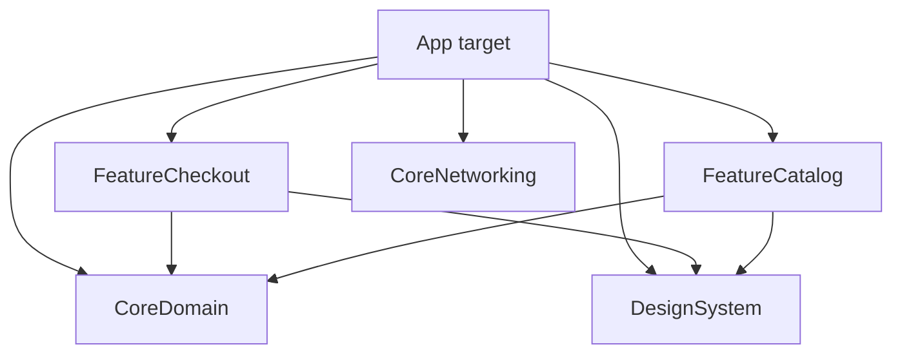

# Modularization

## Materials

## Apple docs

- [Organizing your code with local packages](https://developer.apple.com/documentation/xcode/organizing-your-code-with-local-packages) — SPM inside the workspace.
- [PackageDescription](https://developer.apple.com/documentation/packagedescription) — targets, products, dependencies.
- [Creating a standalone Swift package](https://developer.apple.com/documentation/xcode/creating-a-standalone-swift-package-with-xcode) — library boundaries.
- [Improving the speed of incremental builds](https://developer.apple.com/documentation/xcode/improving-the-speed-of-incremental-builds) — modules and build graph.
- [Library evolution](https://www.swift.org/documentation/server/guides/library-evolution.html) — `@frozen`, resilience (when shipping binary frameworks).
- [Testing imported modules](https://developer.apple.com/documentation/xcode/testing-imported-modules) — test targets and visibility.

## In 30 seconds

**Modularization** splits an app into **SPM packages** (or Xcode frameworks) with explicit **dependencies** and **API surfaces**. Feature modules depend **inward** on domain/interfaces; the app target is the **composition root**. Public API stays minimal (`public`/`package`); internals are `internal`. **`@testable import`** is for unit tests in the same package—not a license to break boundaries in production. Goal: faster incremental builds, parallel ownership, and compile-time enforcement of layer rules.

## 🎯 Focus vs Defer

### Focus

- **SPM layout:** `App` → `Features/*` → `Core/*` → `Shared` / `DesignSystem`; acyclic graph.
- **Feature module:** screens + feature VM; depends on domain protocols, not other features’ concrete types.
- **API boundaries:** `public` protocols and models in `*API` or `Core/Domain`; hide UIKit/SwiftUI in implementation targets.
- **`@testable import`:** test target in same package accesses `internal` for white-box tests; production importers use `import Module` only.
- **Build times:** one module change recompiles dependents only; watch for “god modules” and `@_exported import`.

### Defer

- **Micro-packages** (dozens of tiny targets) before measuring compile graph pain.
- Dynamic frameworks everywhere “for speed” without profiling—often hurts launch and signing complexity.
- Binary XCFrameworks for internal code until API is stable.
- Full **Clean Architecture** folder taxonomy before team agrees on dependency rules.

## Key concepts

| Term | Meaning |
|------|---------|
| **Target / product** | SPM unit of compilation; `.library`, `.executable`, `.testTarget`. |
| **Module boundary** | `import FeatureAuth` sees only `public` API; breaking changes require semver discipline. |
| **Feature module** | Vertical slice (UI + feature logic) with narrow exports. |
| **Core / Domain** | Models, use cases, protocols—no SwiftUI imports. |
| **Composition root** | App target wires concrete types, coordinators, and DI. |
| **Access control** | `public` / `package` / `internal` / `private`—default `internal` in packages. |
| **`@testable import`** | Test bundle in same package; not for app target crossing boundaries. |
| **Incremental build** | Compiler rebuilds changed module + reverse dependencies; huge modules = slow feedback. |

**Dependency rules (typical)**



```text
App
 ├─ FeatureCheckout
 ├─ FeatureCatalog
 └─ CoreNetworking, CoreDomain, DesignSystem

FeatureCheckout → CoreDomain, DesignSystem
FeatureCheckout ↛ FeatureCatalog   (no cross-feature imports)
```

**When to extract a module**

- Third team owns the code, or
- Compile time of one area dominates, or
- API is stable enough to enforce with `import` only.

## 🏋️ Exercises

1. **Graph audit:** Draw current targets and imports; mark any feature→feature edge. **Expected:** list of edges to break with protocols in Core.
2. **Extract package:** Move `NetworkClient` + models to `CoreNetworking` SPM; app depends on product `.networking`. **Expected:** feature modules import protocol from Core, not URLSession details.
3. **Public surface:** For one feature, list every `public` symbol; remove unnecessary exports. **Expected:** ≤1 factory/coordinator + protocols for other layers.
4. **`@testable` scope:** Add test that uses `internal` initializer; confirm app target cannot call it. **Expected:** compile error from app, green test target.
5. **Build impact:** Change one file in largest module vs smallest; compare incremental build time (Xcode build timing summary). **Expected:** quantitative reason to split hot module.

## WWDC & resources

- [Swift packages: Resources and localization (WWDC20)](https://developer.apple.com/videos/play/wwdc2020/10169/)
- [Build scalable enterprise apps (WWDC21)](https://developer.apple.com/videos/play/wwdc2021/102364/) — modular workflows
- [Demystify parallelization in Xcode builds (WWDC22)](https://developer.apple.com/videos/play/wwdc2022/110364/)

## Artifacts

- Notes: `notes/`
  - [spm-common-services-features-cheatsheet.md](notes/spm-common-services-features-cheatsheet.md)
- Exercises: `exercises/`
- Assets: `assets/`
- Playgrounds: `playgrounds/`

---

## Interview Q&A (Knowledge cards)

### Q1
- **Question:** Why extract SPM modules if a single Xcode target already works?

- **Answer:** A monolith compiles together and allows hidden coupling. Modules enforce boundaries, shorten incremental builds, and clarify ownership—worth it as team size and compile time grow.

### Q2
- **Question:** How do you prevent Feature A from importing Feature B?

- **Answer:** Shared protocols live in Core; cross-feature navigation goes through the app shell router, not direct imports. CI grep rules catch forbidden edges.

### Q3
- **Question:** When is `@testable import` appropriate?

- **Answer:** Same-package tests for internal details—not a production escape hatch. Frequent external `@testable` use signals a boundary smell; expose a protocol instead.

### Q4
- **Question:** Does modularization always improve build times?

- **Answer:** Not automatically—tiny modules add overhead; huge ones rebuild too much. Profile incremental builds and split hot, frequently edited code with stable public APIs.

## Resources

### AppSell — SPM Common / Services / Features

- **Type:** article (digest)

- **URL:** https://appsell.su/blog/den-apps-1/swift-razrabotka/modulyarizaciya-ios-prilozheniy-cherez-spm-kak-navesti-poryadok-v-zavisimostyah-489

- **Tags:** `spm`, `modularization`, `architecture`, `swiftui`

- **Note:** [notes/spm-common-services-features-cheatsheet.md](notes/spm-common-services-features-cheatsheet.md)

- **Added:** 2026-06-19
