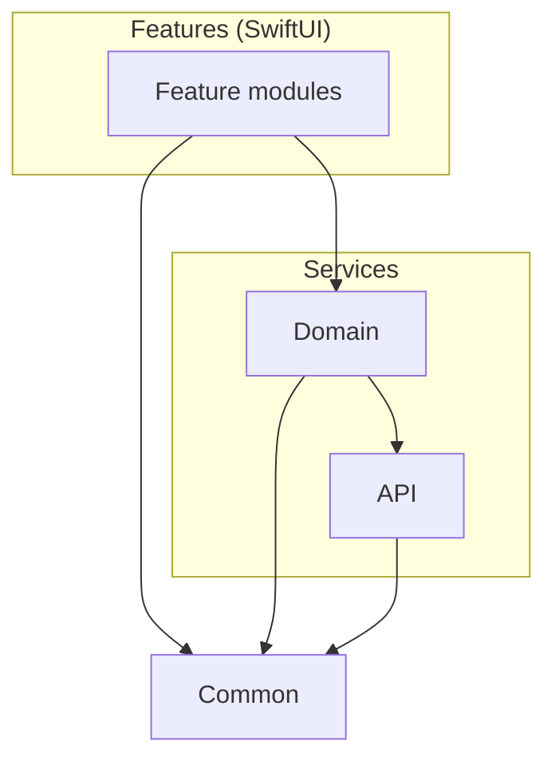
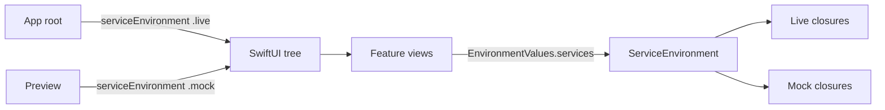

# SPM: Common → Services → Features (cheatsheet)

- **Источник (digest):** [AppSell — модуляризация через SPM](https://appsell.su/blog/den-apps-1/swift-razrabotka/modulyarizaciya-ios-prilozheniy-cherez-spm-kak-navesti-poryadok-v-zavisimostyah-489) (обзор чужой статьи, 2026-05)
- **Статус:** практическая шпаргалка для **новых и растущих** проектов; не заменяет [Modularization README](../README.md) и Apple docs
- **Связь:** [Organizing code with local packages](https://developer.apple.com/documentation/xcode/organizing-your-code-with-local-packages)

---

## In 30 seconds


_English summary — expand «По-русски» for the full Russian text._


<details class="lang-ru">
<summary>По-русски</summary>

Локальные **SPM-пакеты** + **однонаправленный граф** = компилятор ловит нарушения слоёв, быстрее incremental build, параллельная работа (UI на моках, сеть отдельно). Три уровня: **Common** (утилиты) → **Services** (**API** + **Domain**) → **Features** (SwiftUI). Фичи **не** импортируют **API**.

---

</details>


## When to use this layout

_English summary — expand «По-русски» for full text (Когда брать этот расклад)._

<details class="lang-ru">
<summary>По-русски</summary>

| Подходит | Не подходит |
|----------|-------------|
| Монолит > ~20–30 файлов, сборка/CI боль | Прототип на один экран |
| Нужны жёсткие границы без «на честном слове» в review | Команда не готова поддерживать Package.swift |
| SwiftUI-фичи + превью на моках | Legacy UIKit без плана по слоям |
| Несколько разработчиков на одной кодовой базе | «Clean ради Clean» без метрик build time |

---

</details>

## Layer graph

_English summary — expand «По-русски» for full text (Граф слоёв)._

<details class="lang-ru">
<summary>По-русски</summary>



```text
Features → Domain, Common  (✗ API)
Domain   → API, Common
API      → Common
Common   → (no internal deps)
```

**Правило:** модуль зависит только от того, что **ниже** него. Циклы и «feature → API» — ошибка сборки, не стиль.

---

</details>

## What lives in each package

_English summary — expand «По-русски» for full text (Что лежит в каждом пакете)._

<details class="lang-ru">
<summary>По-русски</summary>

### Common

- Расширения, логгер, мелкие хелперы.
- **Без** доменных моделей и **без** UIKit/SwiftUI, если можно.
- Нулевые зависимости на остальные пакеты проекта.

### API

- Модели ответа сервера (DTO), типизированные эндпоинты, HTTP-клиент.
- Знает JSON/URLSession, **не** знает экраны.
- **Не** отдаёт DTO наружу в Features — маппинг в Domain.

### Domain

- Domain-модели, маппинг `API → Domain`.
- **Сервисы** (в digest — closure-based structs, без протоколов на каждый сервис).
- **Моки** здесь же: возвращают **domain**-типы, не DTO.
- Unit-тесты домена без SwiftUI.

### Features

- Views, feature-specific UI state.
- `import Domain`, `import Common` — **не** `import API`.
- Previews: `.mock` из Domain.

---

</details>

## Package.swift (idea)

_English summary — expand «По-русски» for full text (Package.swift (идея))._

<details class="lang-ru">
<summary>По-русски</summary>

Зависимости таргетов объявляются **явно** в манifest — dot-синтаксис по продуктам пакета:

```swift
// swift-tools-version: 5.9
import PackageDescription

let package = Package(
    name: "MyAppModules",
    products: [
        .library(name: "Common", targets: ["Common"]),
        .library(name: "API", targets: ["API"]),
        .library(name: "Domain", targets: ["Domain"]),
        .library(name: "FeatureHome", targets: ["FeatureHome"]),
    ],
    targets: [
        .target(name: "Common"),
        .target(name: "API", dependencies: ["Common"]),
        .target(name: "Domain", dependencies: ["API", "Common"]),
        .target(name: "FeatureHome", dependencies: ["Domain", "Common"]),
    ]
)
```

Попытка `import API` из `FeatureHome` → не соберётся, если таргет FeatureHome не объявляет зависимость на API.

---

</details>

## ServiceEnvironment (bulk injection)

_English summary — expand «По-русски» for full text (ServiceEnvironment (массовая инъекция))._

<details class="lang-ru">
<summary>По-русски</summary>

Когда сервисов > 2, собрать их в одну структуру и прокинуть в SwiftUI **одной** строкой:



```swift
struct ServiceEnvironment {
    var loadUser: () async throws -> User
    var loadPosts: (User) async throws -> [Post]

    static let live = ServiceEnvironment(
        loadUser: { try await UserService.live.load() },
        loadPosts: { user in try await PostService.live.load(for: user) }
    )

    static let mock = ServiceEnvironment(
        loadUser: { .preview },
        loadPosts: { _ in [.preview] }
    )
}

private struct ServiceEnvironmentKey: EnvironmentKey {
    static let defaultValue = ServiceEnvironment.mock
}

extension EnvironmentValues {
    var services: ServiceEnvironment {
        get { self[ServiceEnvironmentKey.self] }
        set { self[ServiceEnvironmentKey.self] = newValue }
    }
}

extension View {
    func serviceEnvironment(_ env: ServiceEnvironment) -> some View {
        environment(\.services, env)
    }
}
```

- **App:** `.serviceEnvironment(.live)` на корне.
- **Preview:** `.serviceEnvironment(.mock)`.
- Альтернатива в больших проектах: протоколы + composition root в app target ([Modularization README](../README.md)).

---

</details>

## Migration order (legacy)

_English summary — expand «По-русски» for full text (Порядок миграции (legacy))._

<details class="lang-ru">
<summary>По-русски</summary>

1. **Domain** — контракты и модели, минимум зависимостей.
2. **API** — сеть за Domain (DTO + клиент).
3. **Common** — если ещё не вынесен.
4. **Features** — по одной фиче, не «big bang».
5. На каждом шаге: зелёная сборка + тесты пакета.

---

</details>

## What you gain

_English summary — expand «По-русски» for full text (Что это даёт)._

<details class="lang-ru">
<summary>По-русски</summary>

| Эффект | Механизм |
|--------|----------|
| Быстрее incremental build | Изменение в Feature → пересборка feature + app |
| Границы не на review | `import` только разрешённых модулей |
| Параллельная работа | UI на `.mock`, API меняется отдельно |
| Onboarding | Дерево пакетов = карта приложения |

---

</details>

## Trade-offs (honest)

_English summary — expand «По-русски» for full text (Trade-offs (честно))._

<details class="lang-ru">
<summary>По-русски</summary>

| Выбор в digest | Плюс | Минус vs «классический Clean» |
|----------------|------|-------------------------------|
| Closure-based services без протоколов | Меньше файлов, быстрый старт | Сложнее подменять в тестах без `ServiceEnvironment`; протоколы в Domain — привычнее для крупных команд |
| Features ↛ API | UI не тянет DTO и URLSession | Нужен явный маппинг в Domain; лишний слой, если фича «только читает JSON» (редко оправдано) |
| Моки в Domain | Previews и тесты без сети | Дублирование форм с live-логикой — следить за синхронизацией |

На собесе: «жёсткий SPM-граф — про **compile-time boundaries**; протоколы vs closures — про **команду и тестируемость**, не религия».

---

</details>

## Oral summary (30 sec)

_English summary — expand «По-русски» for full text (Устная заготовка (30 сек))._

<details class="lang-ru">
<summary>По-русски</summary>

«Делю монолит на локальные SPM: **Common** внизу, **API** и **Domain** в Services, **Features** только UI. Фича импортирует Domain, не API — DTO не просачиваются в SwiftUI. Зависимости в Package.swift, нарушение не компилируется. Сервисы собираю в **ServiceEnvironment** — `.live` в app, `.mock` в previews. Миграция: Domain → API → фичи по одной; меряю build time и CI».

---

</details>

## Interview mini Q&A

_English summary — expand «По-русски» for full text (Interview mini Q&A)._

<details class="lang-ru">
<summary>По-русски</summary>

**Q:** Зачем Features не видят API?  
**A:** Чтобы UI зависел от domain-моделей и use cases, а смена транспорта (REST → gRPC) не трогала SwiftUI. DTO остаются в API.

**Q:** Модуляризация всегда ускоряет сборку?  
**A:** Нет — слишком мелкие пакеты добавляют overhead; слишком жирный Domain пересобирает половину графа. Профилировать Build Timing Summary.

**Q:** Closure services vs protocols?  
**A:** Closures — меньше бойлерплейта для малой/средней команды; protocols + DI — когда много реализаций и жёсткие unit-тests без Environment.

---

</details>

## Links


- Digest: [AppSell](https://appsell.su/blog/den-apps-1/swift-razrabotka/modulyarizaciya-ios-prilozheniy-cherez-spm-kak-navesti-poryadok-v-zavisimostyah-489)
- Apple: [Local packages in Xcode](https://developer.apple.com/documentation/xcode/organizing-your-code-with-local-packages)
- В базе: [Modularization](../README.md) · [MVVM → TCA / слои](/architecture/patterns/)
