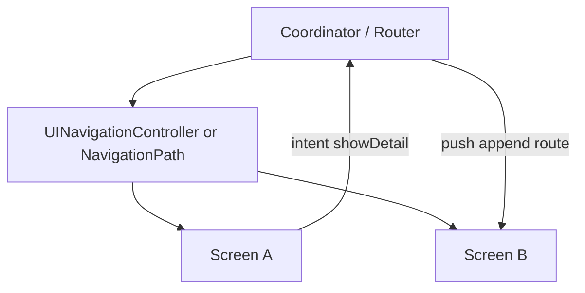
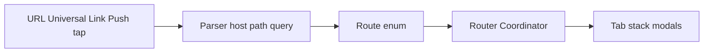

# Navigation & Deep Links

## Apple docs

- [UINavigationController](https://developer.apple.com/documentation/uikit/uinavigationcontroller) — stack-based navigation in UIKit.
- [NavigationStack](https://developer.apple.com/documentation/swiftui/navigationstack) — path-driven navigation in SwiftUI (iOS 16+).
- [NavigationPath](https://developer.apple.com/documentation/swiftui/navigationpath) — type-erased stack for programmatic push/pop.
- [navigationDestination(for:destination:)](https://developer.apple.com/documentation/swiftui/view/navigationdestination(for:destination:)) — map value types to screens.
- [Universal Links](https://developer.apple.com/documentation/xcode/supporting-universal-links-in-your-app) — HTTPS deep links into the app.
- [Custom URL schemes](https://developer.apple.com/documentation/xcode/defining-a-custom-url-scheme-for-your-app) — `myapp://` entry points.
- [UIApplicationDelegate application(_:open:options:)](https://developer.apple.com/documentation/uikit/uiapplicationdelegate/1623112-application) — URL / activity delivery at launch and foreground.

## In 30 seconds

Navigation is **who owns the stack** and **how screens are composed**. UIKit uses `UINavigationController` + push/pop; SwiftUI uses `NavigationStack` + `NavigationPath` or value-based destinations. **Coordinators** (or routers) keep view controllers / views dumb: they emit intents (“user picked item 42”), and a navigation layer decides push, modal, or tab switch. **Deep links** parse an incoming URL or `NSUserActivity` into a route, then the same router builds the stack—never duplicate routing logic in every screen.

## 🎯 Focus vs Defer

### Focus

- **Coordinator / Router pattern:** one place owns transitions; screens expose callbacks or intents, not `navigationController?.push`.
- **UIKit stack:** root → push → pop, `setViewControllers`, modal vs push semantics, back-button behavior.
- **SwiftUI `NavigationStack`:** `NavigationPath`, `navigationDestination`, programmatic pop to root, binding path to state.
- **Deep link routing at nav layer:** parse URL → `Route` enum → coordinator builds stack; cold start vs warm link.
- **Single source of truth:** tab + stack + modal state lives above feature modules.

### Defer

- Full **VIPER** ceremony on every screen before basic coordinator extraction.
- Custom transition animations and interactive pop gesture tuning until flows are stable.
- **Universal Links** server setup (AASA file) before in-app route model exists.
- Third-party routing frameworks until native `NavigationStack` + a small router type is insufficient.

## Key concepts

| Term | Meaning |
|------|---------|
| **Coordinator** | Object that starts flows, creates VCs/views, and performs transitions; child coordinators for subtrees. |
| **Router / Navigator** | Thin API over “go to route X”; often protocol injected into view models. |
| **Route** | Serializable destination (`case profile(id: UUID)`, `case settings`) shared by UI and deep links. |
| **NavigationPath** | SwiftUI stack storage; append/pop/clear for programmatic navigation. |
| **Modal vs push** | Push keeps hierarchy in nav stack; modal (`sheet`, `fullScreenCover`, `present`) is separate branch—deep links must pick correctly. |
| **Cold start link** | App not running: URL arrives in `scene(_:openURLContexts:)` or delegate; router must build stack after root is ready. |
| **Deferred deep link** | Store pending route until auth/onboarding completes, then flush once. |

**UIKit vs SwiftUI**

- UIKit: coordinator holds `UINavigationController`, factory methods return configured VCs.
- SwiftUI: coordinator (or `@Observable` router) mutates `NavigationPath` / presentation bindings; views stay declarative.

### Coordinator owns the stack



**Deep link flow**



```text
URL / Universal Link / Push payload
  → Parser (host, path, query)
  → Route enum
  → Router / Coordinator
  → Stack + tab + modal state
```

## 🏋️ Exercises

1. **Extract coordinator:** Take one screen that calls `pushViewController` directly; move navigation to a `HomeCoordinator` with `showDetail(id:)`. **Expected:** VC only calls `coordinator.showDetail(id:)`.
2. **SwiftUI path:** Build two-level flow with `NavigationStack` and `NavigationPath`; add “Back to root” button that clears path. **Expected:** single path binding, no hidden stack state in child views.
3. **Route enum:** Define `enum AppRoute: Hashable` with tab + stack cases; map `myapp://orders/123` to `.ordersDetail(id: 123)`. **Expected:** parser unit-testable without UIKit.
4. **Cold start:** Simulate launch with URL in scene delegate; defer navigation until root `TabView` appears. **Expected:** no crash, no lost link after login gate.
5. **Modal from link:** Same URL opens detail as push when logged in, login sheet when not. **Expected:** router chooses presentation style from auth state.

## WWDC & resources

- [Navigate with SwiftUI (WWDC22)](https://developer.apple.com/videos/play/wwdc2022/10054/)
- [What's new in SwiftUI (WWDC23)](https://developer.apple.com/videos/play/wwdc2023/10148/) — navigation refinements
- [Meet AsyncSequence (WWDC21)](https://developer.apple.com/videos/play/wwdc2021/10058/) — optional: async route streams

## Artifacts

- Notes: `notes/`
- Exercises: `exercises/`
- Assets: `assets/`
- Playgrounds: `playgrounds/`

---

## Interview Q&A (Knowledge cards)

### Q1
- **Question:** Why use a Coordinator when `UINavigationController` already exists?

- **Answer:** `UINavigationController` is a stack container, not app-wide flow logic. A coordinator owns transitions, module assembly, and child lifecycle; view controllers report intents instead of pushing unrelated screens.

### Q2
- **Question:** How does SwiftUI `NavigationStack` compare to UIKit navigation?

- **Answer:** SwiftUI treats navigation as state (`NavigationPath` + destinations); UIKit mutates a controller stack. Both need a central router so deep links and buttons use the same route model.

### Q3
- **Question:** Where should deep links be handled—app delegate or individual screens?

- **Answer:** Parse at the app boundary, map to routes in a router/coordinator, defer until root/auth is ready. Screens never parse URLs; one pipeline for universal links, custom schemes, and notification taps.

### Q4
- **Question:** How do you test navigation without UI-testing every transition?

- **Answer:** Inject a spy router; view models assert `open(route)` calls. Mock factories for coordinators. Reserve UI tests for critical E2E paths; unit-test route parsing and deferred navigation.
