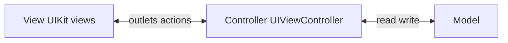
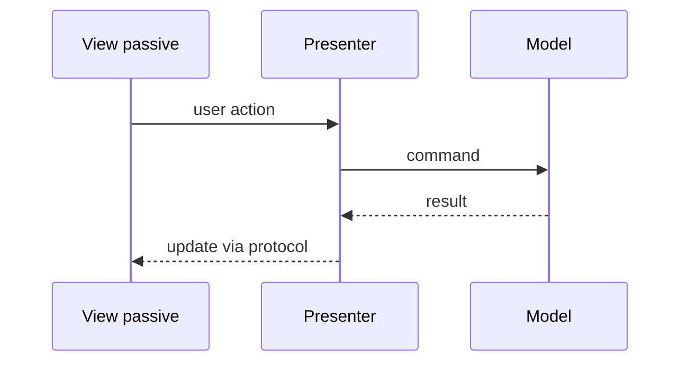
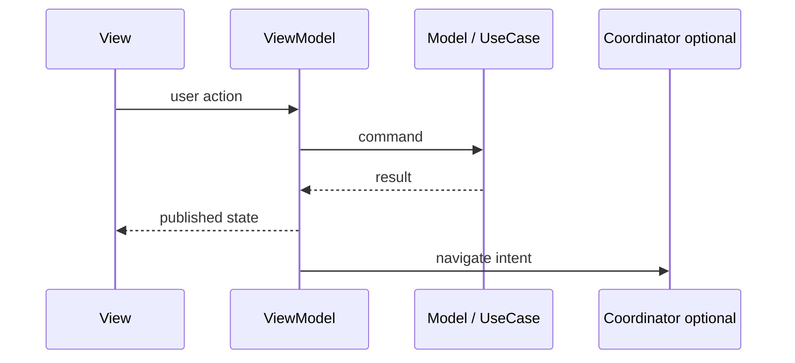
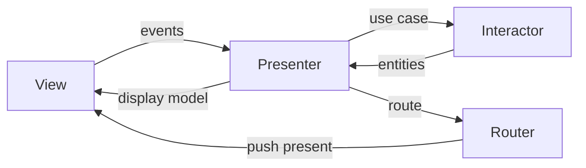
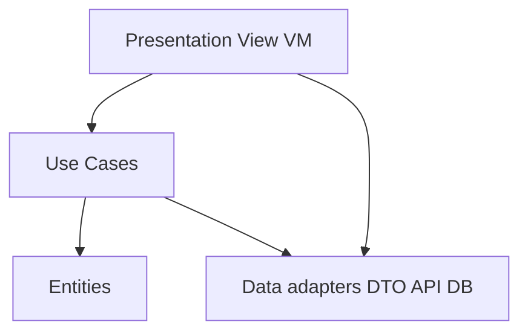

# MVVM → TCA

## Apple docs

- UIKit: [MVC in UIKit](https://developer.apple.com/documentation/uikit), [App and environment](https://developer.apple.com/documentation/uikit/app_and_environment).

## 🎯 Focus vs Defer

### Focus

### Defer

## 📚 Key terms (Q&A)

## Pattern flows (diagrams)

### MVC (UIKit reality)



### MVP (passive View)



### MVVM (+ Coordinator)



### VIPER (one scene)



### Clean Architecture (app layers)



### TCA (unidirectional)

```mermaid
flowchart LR
    V[View] -->|Action| Red[Reducer]
    Red --> St[State]
    Red --> Eff[Effect]
    Eff -->|Action| Red
    St --> V
```## Market prevalence (interview guide)

### Brief descriptions (notes)

#### MVVM (~41%) — leader

#### MVC (~34%) — second place (often legacy)

#### VIPER + Clean (~18%) — enterprise / heavy modules

#### TCA (~5%) — niche

### Oral summary (30 sec, with numbers)

## 🏋️ Exercises

## 🌟 Senior+ (strategic)

## Artifacts

- Notes: `notes/`
- Exercises: `exercises/`
- Assets: `assets/`
- Playgrounds: `playgrounds/`

### Recent notes

- `notes/immh-service-vs-repository.md` — [immh](https://immh.tech/blog/system-design-service-vs-repository), finalized stub; [BACKLOG](/reference/curated/BACKLOG.md)

---

## TL;DR

## Why a monolith slows the team

### Goal of modularization

## Proposed module structure

### 1) Domain

### 2) API

### 3) Features

## Key dependency rules

## Legacy monolith migration: practical order

## Practical takeaways

## Mini checklist

---## Interview Q&A (Knowledge cards)

Interview Q&A below.

<!-- knowledge-cards-canonical:start -->

### Q35
- **Question:** MVVM vs Clean Architecture trade-offs?

- **Answer:** MVVM ships fastest; enterprise Clean isolates domain app-wide with more upfront structure. **Clean Swift (VIP)** splits one screen into View / Interactor / Presenter / Entity / Router—unidirectional scene flow, more files than MVVM, clearer roles than a fat ViewModel; boilerplate-heavy for trivial screens.

### Q36
- **Question:** Constructor injection vs service locator?

- **Answer:** Constructors expose dependencies explicitly; locators hide them behind runtime lookup—harder to test and reason about unless strictly bounded.

### Q39
- **Question:** What do you check first on a senior code review?

- **Answer:** Correctness first (concurrency/state, errors, contracts, tests for behavior); formatting/naming last.

### Q40
- **Question:** Summarize SOLID in one line per principle. What is LSP and a classic Swift violation?

    ```swift
    class Bird {
        func fly() {}
    }

    class Penguin: Bird {
        override func fly() {
            fatalError("Penguins cannot fly")
        }
    }
    ```

    ```swift
    protocol Bird {}
    protocol FlyingBird: Bird { func fly() }

    struct Sparrow: FlyingBird { func fly() {} }
    struct Penguin: Bird {}
    ```

- **Answer:** SOLID is five separate type-boundary rules. **LSP** says: any code working against the supertype must keep working when given a subtype — same preconditions (or weaker), same postconditions (or stronger), same invariants. The classic Swift violation is `Penguin: Bird` overriding `fly()` with `fatalError`: code that takes a `Bird` reasonably expects `fly()` to behave, the subclass breaks it. Fix is interface segregation: split `Bird` and `FlyingBird` instead of pushing the problem into runtime.

    1. **SOLID = five small rules**, each about a different boundary.
    2. **LSP**: subtypes must honor the supertype contract.
    3. Don’t fix LSP violations with `fatalError`/empty overrides — split the protocol.

### Q41
- **Question:** How is OCP different from LSP at the Swift code level?

- **Answer:** OCP is structural — extend behavior by adding a new conforming type, don’t modify existing code (`ApplePay`, `CardPay`, then `CryptoPay`). LSP is semantic — that new type must honor the protocol’s contract at runtime. You can satisfy OCP and still violate LSP if the new conformer silently breaks expectations callers had on the protocol.

    1. OCP — extend without editing old code.
    2. LSP — the new type must keep the contract.
    3. They’re orthogonal: passing OCP doesn’t imply passing LSP.

### Q42
- **Question:** What is a Singleton? Trade-offs and iOS examples?

- **Answer:** One instance per process with global access—good for true platform globals; bad for hidden dependencies, testability, mutable shared state, and implicit coupling. Prefer protocol + injection for app services.

### Q43
- **Question:** Which architecture patterns have you used on iOS—why and trade-offs?

- **Answer:** Same stack, always state **ownership** (who retains whom) and call direction: MVP weak view from presenter; MVVM view owns VM (`@StateObject`); Coordinator owns flows; Clean dependency rule inward; VIPER View→Presenter→Interactor, Router for navigation; SwiftUI `@StateObject` vs `@ObservedObject` ownership.

### Q44
- **Question:** What is VIPER—layers, calls, ownership; when is it overkill on iOS?

- **Answer:** VIPER = View, Interactor, Presenter, Entity, Router; View→Presenter→Interactor, Presenter→Router; thin layers + boilerplate; often overkill vs MVVM+Coordinator for small features.

### Q45
- **Question:** What is Clean Architecture—Uncle Bob layers and iOS Domain/Data/Presentation?

### Q46
- **Question:** What is MVVM and MVVM-C—roles, ownership, navigation?

- **Answer:** MVVM splits UI and state; View usually owns VM (`@StateObject`); View subscribes to VM; VM must not retain View. MVVM-C adds Coordinator for navigation/DI.

### Q47
- **Question:** Who owns data in MVVM—SwiftUI vs UIKit; imperative vs declarative wiring?

- **Answer:** Screen state lives in ViewModel; domain behind use cases. SwiftUI: declarative subscription to VM. UIKit: imperative UI updates driven by VM events/subscriptions.

### Q48
- **Question:** Differences between MVC and MVVM—roles, fat layers, testability?

- **Answer:** MVC on iOS often means a fat UIViewController mixing concerns. MVVM extracts screen state/logic into a ViewModel; views/controllers stay thinner; VM is easier to unit test.

### Q49
- **Question:** Redux on iOS—store, actions, reducers; example; when it fits; common alternatives?

- **Answer:** Redux is unidirectional data flow: a single store holds state; UI dispatches actions; a pure reducer computes the next state. Good for predictable transitions, testing, and replay; on iOS, global Redux is often heavy—MVVM, Observation, or TCA (typed reducers + effects) are common alternatives.

### Q50
- **Question:** What is TCA (The Composable Architecture) in interview terms?

- **Answer:** TCA is Point-Free’s library for composable, testable SwiftUI apps: typed state/actions, reducers that return `Effect` for async work, `Store` to send actions and drive UI—Redux-like flow with first-class effects and tooling.

### Q51
- **Question:** Explain dependency injection to a junior.

- **Answer:** Pass collaborators in from outside (initializer/properties/factory) instead of constructing concrete services inside a type—enables tests, swapping implementations, and clear boundaries.

### Q52
- **Question:** KISS, DRY, YAGNI—meaning and boundary vs overengineering?

- **Answer:** KISS favors simplest maintainable design; DRY removes real duplication of behavior without forcing premature abstraction; YAGNI avoids speculative features.

### immh — Service vs Repository

- **Type:** article

- **URL:** https://immh.tech/blog/system-design-service-vs-repository

- **Author:** immh

- **Tags:** `architecture`, `repository`, `clean`, `immh`

- **Note:** [notes/immh-service-vs-repository.md](notes/immh-service-vs-repository.md)

- **Added:** 2026-06-19

<!-- knowledge-cards-canonical:end -->

## Resources
