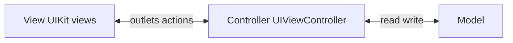
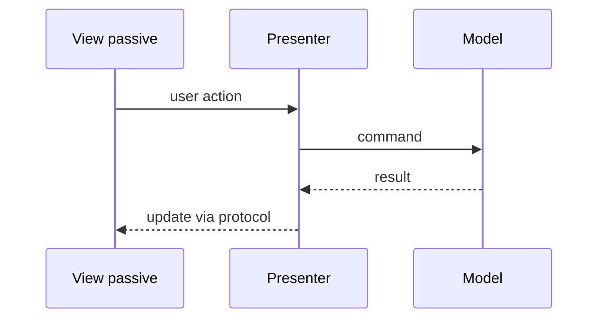
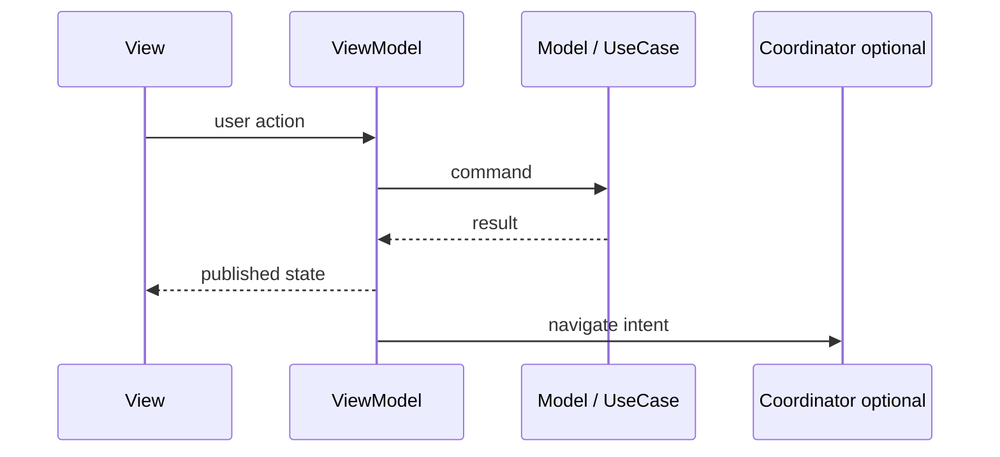
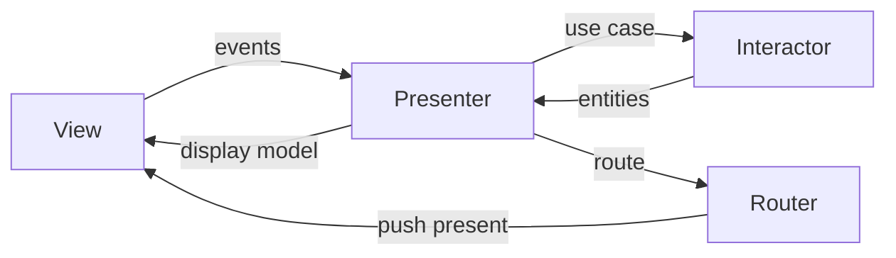
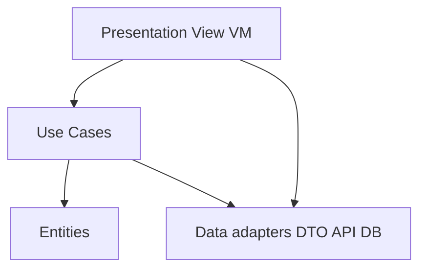

# MVVM → TCA

## Apple docs


<details class="lang-ru">
<summary>По-русски</summary>

- Swift: [The Swift Programming Language](https://docs.swift.org/swift-book/documentation/the-swift-programming-language/) — протоколы, обобщения, доступность типов (границы модулей).

</details>
- UIKit: [MVC in UIKit](https://developer.apple.com/documentation/uikit), [App and environment](https://developer.apple.com/documentation/uikit/app_and_environment).
<details class="lang-ru">
<summary>По-русски</summary>

- SwiftUI: [Model data](https://developer.apple.com/documentation/swiftui/model-data) — однонаправленный поток состояния и разделение view / state.

</details>

## 🎯 Focus vs Defer


### Focus

<details class="lang-ru">
<summary>По-русски</summary>

<details class="lang-ru">
<summary>По-русски</summary>

<details class="lang-ru">
<summary>По-русски</summary>

- Архитектурные границы модулей и направленный граф зависимостей.


</details>


</details>


</details>

### Defer

<details class="lang-ru">
<summary>По-русски</summary>

<details class="lang-ru">
<summary>По-русски</summary>

<details class="lang-ru">
<summary>По-русски</summary>

- «Enterprise Clean» на экранах из трёх состояний без роста команды и сроков.


</details>


</details>


</details>

## 📚 Key terms (Q&A)


<details class="lang-ru">
<summary>По-русски</summary>

- **MVC (Model–View–Controller):** разделение данных, UI и посредника; в UIKit `UIViewController` часто раздувается — собеседник ждёт осознанности, не догмы.
- **MVVM (Model–View–ViewModel):** состояние и команды для View; тестируемость через VM и инъекцию сервисов.
- **VIPER / Clean Swift:** сцена как View / Interactor / Presenter / Entity / Router; явные роли, больше файлов.
- **Clean Architecture (Uncle Bob):** слои Entities → Use Cases → Interface Adapters; не путать с VIPER-«Clean» одного экрана.
- **Composition root:** единственное место сборки графа зависимостей (DI container / AppDelegate / `@main`).

</details>

## Pattern flows (diagrams)


### MVC (UIKit reality)



<details class="lang-ru">
<summary>По-русски</summary>

На iOS `View` и `Controller` часто сливаются в одном **UIViewController** → Massive View Controller.

</details>

### MVP (passive View)



<details class="lang-ru">
<summary>По-русски</summary>

View **пассивна** — только события и отрисовка. **View владеет** Presenter (strong); Presenter держит View по **протоколу weak**. Навигацию часто выносят в **Coordinator** (MVP-C), как в MVVM-C.

</details>

### MVVM (+ Coordinator)



<details class="lang-ru">
<summary>По-русски</summary>

View **владеет** ViewModel; VM **не** держит strong на View.

</details>

### VIPER (one scene)



### Clean Architecture (app layers)



<details class="lang-ru">
<summary>По-русски</summary>

Зависимости **внутрь** — UI и инфраструктура зависят от домена, не наоборот.

</details>

### TCA (unidirectional)

```mermaid
flowchart LR
    V[View] -->|Action| Red[Reducer]
    Red --> St[State]
    Red --> Eff[Effect]
    Eff -->|Action| Red
    St --> V
```## Market prevalence (interview guide)

<details class="lang-ru">
<summary>По-русски</summary>

Типичное распределение по ответам iOS-команд / опросам (не «канон Apple», а **что реально встречается в проде**):

| Паттерн / подход | Доля | Как говорить на собесе |
|------------------|------|-------------------------|
| **MVVM** (+ часто Coordinator) | **~41%** | «Дефолт» для новых фич: SwiftUI/UIKit, тестируемый ViewModel, навигация снаружи |
| **MVC** (UIKit, в т.ч. Apple MVC) | **~34%** | Legacy и простые экраны; осознанно про **Massive View Controller**, не «MVC плохой» |
| **VIPER** + **Clean Architecture** (слои / модули) | **~18%** | Крупные команды, тяжёлые экраны, SDK, строгие границы; VIPER — **сцена**, Clean — **приложение** |
| **TCA** (и близкий Redux/MVI-поток) | **~5%** | Ниша: предсказуемый state, reducer-тесты; реже в enterprise, чаше в SwiftUI-продуктах с Point-Free-стеком |

**Как использовать цифры:** не спорить «какой паттерн правильный», а **сопоставить с контекстом** — размер команды, legacy UIKit, SwiftUI, тестируемость, онбординг. На Senior+: «выбор архитектуры = договорённость команды + измеримый эффект (сборка, тесты, конфликты в общих файлах)», не мода.

**Карточки в этом файле:** MVC/MVVM — **Q43, Q46–Q48** · VIPER — **Q44** · Clean — **Q45** · TCA/Redux — **Q49–Q50** · сравнение MVVM vs Clean/VIP — **Q35**.

</details>

### Brief descriptions (notes)

#### MVVM (~41%) — leader

<details class="lang-ru">
<summary>По-русски</summary>

- **Суть:** **Model** (домен / use cases / сервисы) · **View** (UI) · **ViewModel** (состояние экрана + команды).
- **Поток:** View → события в VM → модель/use case → VM обновляет state → View перерисовывается (SwiftUI `body` / UIKit подписка).
- **Владение:** View владеет VM (`@StateObject` в SwiftUI); VM **не** держит strong на View.
- **Плюсы:** быстрый старт, мало файлов, **unit-тесты VM** без UI, хорошо ложится на SwiftUI + Combine/Observation.
- **Минусы:** «толстая ViewModel» без use case-границ; навигация в VC, если нет **Coordinator (MVVM-C)**.
- **Когда:** типичный продуктовый экран, средняя сложность, mixed UIKit/SwiftUI.

</details>

#### MVC (~34%) — second place (often legacy)

<details class="lang-ru">
<summary>По-русски</summary>

- **Суть:** **Model** · **View** · **Controller** — посредник между данными и UI.
- **iOS-реальность:** `UIViewController` часто **= View + Controller** → **Massive View Controller** (сеть, парсинг, data source, навигация в одном классе).
- **Плюсы:** нативный паттерн Apple, минимум абстракций, ок на **маленьких** экранах.
- **Минусы:** слабая тестируемость без выноса логики; связность и retain cycles в VC.
- **Когда:** legacy, прототипы, простые CRUD; на собесе — «знаю MVC и **почему** уезжаем в MVVM/Clean при росте».

</details>

#### VIPER + Clean (~18%) — enterprise / heavy modules

<details class="lang-ru">
<summary>По-русски</summary>

**VIPER (уровень экрана):**

- **V**iew · **I**nteractor · **P**resenter · **E**ntity · **R**outer.
- **Поток:** View → Presenter → Interactor → Presenter → View; навигация → Router.
- **Плюсы:** жёсткие роли, отдельный Router, проще не раздуть один класс.
- **Минусы:** много файлов/протоколов; **overkill** на формах из трёх полей.

**Clean Architecture (уровень приложения):**

- **Правило:** зависимости **внутрь** — Entities → Use Cases → Adapters → Frameworks (UI, HTTP, DB).
- **iOS-укладка:** **Domain** (entity, use case, протоколы репозиториев) · **Data** (DTO, API, маппинг в entity) · **Presentation** (View + VM, только use cases).
- **Плюсы:** смена UI/транспорта, тесты домена, feature-модули ([SPM](../../XI.%20Резюме/Глоссарий/Glossary.md#glossary-spm)).
- **Минусы:** дорогой вход, больше типов; «Clean» на каждый экран без нужды = overengineering.

</details>

#### TCA (~5%) — niche

<details class="lang-ru">
<summary>По-русски</summary>

- **Суть:** библиотека Point-Free — **State** · **Action** · **Reducer** · **Effect** · **Store**; однонаправленный поток как Redux, но с **типизированными эффектами** и `TestStore`.
- **Плюсы:** предсказуемые переходы state, тесты reducer без UI, композиция фич (`Scope`, `combine`).
- **Минусы:** кривая обучения, шаблонность; для простых экранов чаще **MVVM + `@Observable`**.
- **Когда:** сложный feature-state, много синхронных переходов, команда уже на TCA; не «дефолт рынка».

</details>

### Oral summary (30 sec, with numbers)

<details class="lang-ru">
<summary>По-русски</summary>

«На рынке чаще всего встречаю **MVVM** (~40%) и **UIKit-MVC** (~35%) — legacy и простые экраны. **VIPER и Clean** — порядка **20%**, обычно в крупных продуктах и модулях с жёсткими границами. **TCA** — около **5%**, нишевый стек под reducer и тесты. Я не привязываюсь к аббревиатуре: смотрю на **тестируемость, онбординг и цену бойлерплейта** — для типичного экрана MVVM (+ Coordinator), для тяжёлого домена — Clean/use cases, VIPER — когда нужно разнести сцену по ролям.»

</details>

## 🏋️ Exercises


<details class="lang-ru">
<summary>По-русски</summary>

1. Нарисовать граф зависимостей одного фича-модуля (кто от кого зависит) и отметить циклы.
2. Сравнить MVVM и VIPER на одном экране списка: где граница use case vs presenter.

</details>

## 🌟 Senior+ (strategic)


<details class="lang-ru">
<summary>По-русски</summary>

- Архитектура платится временем команды: договорённости важнее «каноничного» паттерна.
- Измеряй эффект: время сборки, размер модулей, частота конфликтов в общих файлах.
- Согласуй границу «тонкий UI / толстый домен» и закрепи тестами use cases, а не верстку.

</details>

## Artifacts


- Notes: `notes/`
- Exercises: `exercises/`
- Assets: `assets/`
- Playgrounds: `playgrounds/`

### Recent notes

<details class="lang-ru">
<summary>По-русски</summary>

- [Modularization — SPM шпаргалка](/architecture/modularization/notes/spm-common-services-features-cheatsheet.md) — Common / Services / Features

</details>
- `notes/immh-service-vs-repository.md` — [immh](https://immh.tech/blog/system-design-service-vs-repository), finalized stub; [BACKLOG](/reference/curated/BACKLOG.md)

---

## TL;DR


<details class="lang-ru">
<summary>По-русски</summary>

- При росте iOS-монолита главные боли — время сборки, связность зависимостей и сложность параллельной разработки.
- Базовая структура: `Common` → `Services` (`API`, `Domain`) → `Features`. Подробнее: [Modularization — SPM шпаргалка](/architecture/modularization/notes/spm-common-services-features-cheatsheet.md).
- В legacy-проекте лучше идти поэтапно: сначала `Domain`, потом `API`, затем выносить feature-модули.

</details>

## Why a monolith slows the team


<details class="lang-ru">
<summary>По-русски</summary>

Когда весь код в одном таргете, обычно появляются:

- медленные инкрементальные и clean-сборки;
- неочевидные и часто скрытые зависимости;
- “эффект домино” при изменениях;
- сложность параллельной работы нескольких разработчиков.

</details>

### Goal of modularization

<details class="lang-ru">
<summary>По-русски</summary>

Не “идеальная теория”, а ускорение практической разработки:

- быстрее собирать и тестировать;
- проще изолировать изменения;
- понятнее onboarding для новых разработчиков;
- стабильнее CI при росте кодовой базы.

</details>

## Proposed module structure


### 1) Domain

<details class="lang-ru">
<summary>По-русски</summary>

- Чистые модели, протоколы, use cases.
- Без UI-фреймворков и инфраструктурных деталей.
- Domain задаёт контракты, на которые опираются остальные слои.

</details>

### 2) API

<details class="lang-ru">
<summary>По-русски</summary>

- Сеть, remote data sources, DTO/маппинг.
- Зависит от `Domain`, реализует его контракты.
- Должен быть изолирован от UI-деталей.

</details>

### 3) Features

<details class="lang-ru">
<summary>По-русски</summary>

- Экраны и UI-состояние фичи.
- Зависимости: **`Domain` + `Common` только** — **не** `API` (DTO и транспорт остаются ниже).
- Каждая фича как самостоятельный пакет с тестами и previews на domain-моках.

</details>

## Key dependency rules


<details class="lang-ru">
<summary>По-русски</summary>

- Публичные протоколы живут в `Domain` и работают как contracts между слоями.
- Циклические зависимости запрещены.
- Каждый пакет имеет собственные unit-тесты.

</details>

## Legacy monolith migration: practical order


<details class="lang-ru">
<summary>По-русски</summary>

1. Вынести `Domain` как минимально зависимый слой.
2. Перенести инфраструктуру (`API`) за контракты Domain.
3. Выносить features по мере роста/изменений, а не “переписать всё за раз”.
4. На каждом шаге стабилизировать тесты и сборку.

</details>

## Practical takeaways


<details class="lang-ru">
<summary>По-русски</summary>

- Начинать модульность с контрактов (`Domain`), а не с UI.
- Перед выносом модуля фиксировать его входы/выходы и тестовые границы.
- Держать граф зависимостей направленным в одну сторону.
- Измерять эффект миграции метриками: build time, время CI, частота конфликтов в PR.

</details>

## Mini checklist


<details class="lang-ru">
<summary>По-русски</summary>

- У нового модуля есть чёткая ответственность и граница API.
- Нет обратной зависимости на feature/UI из инфраструктуры.
- Тесты лежат в каждом пакете, а не только в корневом таргете.
- Изменение в одном модуле не триггерит лишние пересборки всего приложения.

</details>

---## Interview Q&A (Knowledge cards)


Interview Q&A below.

<!-- knowledge-cards-canonical:start -->

### Q35
- **Question (EN):** MVVM vs Clean Architecture trade-offs?

- **Answer (EN):** MVVM ships fastest; enterprise Clean isolates domain app-wide with more upfront structure. **Clean Swift (VIP)** splits one screen into View / Interactor / Presenter / Entity / Router—unidirectional scene flow, more files than MVVM, clearer roles than a fat ViewModel; boilerplate-heavy for trivial screens.

<details class="lang-ru">
<summary>По-русски</summary>

<details class="lang-ru">
<summary>По-русски</summary>

<details class="lang-ru">
<summary>По-русски</summary>

- **Устная заготовка (EN):** MVVM for speed; full Clean for domain scale; **VIP** as per-screen structured split when VMs grow but you do not need every Clean layer across the whole app.

</details>
</details>
</details>
<details class="lang-ru">
<summary>По-русски</summary>

<details class="lang-ru">
<summary>По-русски</summary>

<details class="lang-ru">
<summary>По-русски</summary>

- **Follow-up:** где overengineering (переусложнение), а где оправдано?

</details>
</details>
</details>
<details class="lang-ru">
<summary>По-русски</summary>

<details class="lang-ru">
<summary>По-русски</summary>

<details class="lang-ru">
<summary>По-русски</summary>

- **Follow-up answer:** overengineering — три слоя абстракции на экран из трёх кнопок (в т.ч. полный VIP на каждый экран без нужды); оправдано — несколько клиентов одной доменной логики, сложные правила, несколько платформ или частая смена UI без переписывания правил; VIP оправдан, когда экран **тяжёлый по логике** и команда хочет **единый шаблон сцен**.

</details>
</details>
</details>

<details class="lang-ru">
<summary>По-русски</summary>

- **Question (RU):** MVVM vs Clean Architecture — trade-offs (компромиссы)?

- **Answer (RU):** Зацепка: MVVM — **быстрее старт** и тесты через VM; Clean — **дороже вход**, но явные **use cases** и изоляция домена при масштабе.

    MVVM: View + ViewModel + Model/Services — быстрее внедрить, меньше файлов; тестируемость через VM, но бизнес-правила часто разрастаются в VM без явных use case границ. Clean (entities, use cases, interfaces, adapters): тяжелее старт, зато чёткие границы, проще выносить feature-модули и покрывать домен тестами без UI.

    **Clean Swift (VIP)** — паттерн на **уровне экрана**: View, **Interactor** (сценарии и вызовы workers/сервисов), **Presenter** (подготовка данных для UI), **Entity** (request/response модели сцены), **Router** (навигация). Поток по сцене обычно **однонаправленный**. Это **между MVVM и полным Clean**: больше файлов и протоколов, чем у MVVM, но явные роли и сложнее раздуть один класс; минусы — бойлерплейт и окупается при **договорённостях в команде** и нетривиальных экранах, на «трёх кнопках» часто избыточно.

<details class="lang-ru">
<summary>По-русски</summary>

<details class="lang-ru">
<summary>По-русски</summary>

<details class="lang-ru">
<summary>По-русски</summary>

- **Устная заготовка (RU):** MVVM — скорость и простота; Clean — когда домен и команда выросли, а «толстая VM» уже мешает; **VIP** — разнести экран по ролям без всего enterprise-Clean сразу.

</details>
</details>
</details>
</details>

### Q36
- **Question (EN):** Constructor injection vs service locator?

- **Answer (EN):** Constructors expose dependencies explicitly; locators hide them behind runtime lookup—harder to test and reason about unless strictly bounded.

<details class="lang-ru">
<summary>По-русски</summary>

<details class="lang-ru">
<summary>По-русски</summary>

<details class="lang-ru">
<summary>По-русски</summary>

- **Устная заготовка (EN):** Prefer injection for clarity and tests; locator only with a disciplined container.

</details>
</details>
</details>
<details class="lang-ru">
<summary>По-русски</summary>

<details class="lang-ru">
<summary>По-русски</summary>

<details class="lang-ru">
<summary>По-русски</summary>

- **Follow-up:** как строить composition root (корень композиции) в iOS app?

</details>
</details>
</details>
<details class="lang-ru">
<summary>По-русски</summary>

<details class="lang-ru">
<summary>По-русски</summary>

<details class="lang-ru">
<summary>По-русски</summary>

- **Follow-up answer:** один модуль/тип на старте (AppDelegate/Scene/`@main`) собирает сервисы и передаёт вниз по дереву координаторов или через явный контейнер; SwiftUI `environment` может быть composition root, если не превращается в «магический» locator без типизации.

</details>
</details>
</details>

<details class="lang-ru">
<summary>По-русски</summary>

- **Question (RU):** constructor injection (внедрение через конструктор) vs service locator (локатор сервисов)?

- **Answer (RU):** Зацепка: **init показывает граф**; **locator прячет** `resolve` внутри класса.

    constructor injection — все зависимости видны в сигнатуре init; тест подставляет фейки без глобального реестра. service locator — скрытый поиск `resolve(API.self)` внутри класса: быстрее написать, сложнее понять граф и подменить в тесте.

<details class="lang-ru">
<summary>По-русски</summary>

<details class="lang-ru">
<summary>По-русски</summary>

<details class="lang-ru">
<summary>По-русски</summary>

- **Устная заготовка (RU):** явный `init` — честный граф; locator — удобно, но легко спрятать зависимости.

</details>
</details>
</details>
</details>

<details class="lang-ru">
<summary>По-русски</summary>

- **Доп. информация:** избегать синглтонов с скрытым состоянием для сетевого клиента в продакшен-тестах.

</details>

### Q39
- **Question (EN):** What do you check first on a senior code review?

- **Answer (EN):** Correctness first (concurrency/state, errors, contracts, tests for behavior); formatting/naming last.

<details class="lang-ru">
<summary>По-русски</summary>

<details class="lang-ru">
<summary>По-русски</summary>

<details class="lang-ru">
<summary>По-русски</summary>

- **Устная заготовка (EN):** Ship-risk first: concurrency, failures, contracts—style last.

</details>
</details>
</details>
<details class="lang-ru">
<summary>По-русски</summary>

<details class="lang-ru">
<summary>По-русски</summary>

<details class="lang-ru">
<summary>По-русски</summary>

- **Follow-up:** пример фидбека, который улучшил дизайн.

</details>
</details>
</details>
<details class="lang-ru">
<summary>По-русски</summary>

<details class="lang-ru">
<summary>По-русски</summary>

<details class="lang-ru">
<summary>По-русски</summary>

- **Follow-up answer:** шаблон: «проблема X → риск Y → предложение Z»; пример: вынести повторяющийся сетевой retry из VM в отдельный тип политики — проще тестировать и менять backoff.

</details>
</details>
</details>

<details class="lang-ru">
<summary>По-русски</summary>

- **Question (RU):** что ищешь первым на Senior code review (ревью кода)?

- **Answer (RU):** Зацепка: сначала **корректность под concurrency и состояние**, потом контракты и ошибки — **стиль в конце**.

    корректность при конкурентности и состоянии (гонки, MainActor); контракт публичных API; обработка ошибок без проглатывания; тесты на изменённую логику; безопасность (утечки токенов в логах). Стиль — после этого.

<details class="lang-ru">
<summary>По-русски</summary>

<details class="lang-ru">
<summary>По-русски</summary>

<details class="lang-ru">
<summary>По-русски</summary>

- **Устная заготовка (RU):** гонки и MainActor раньше форматирования; безопасность и ошибки до косметики.

</details>
</details>
</details>
</details>

<details class="lang-ru">
<summary>По-русски</summary>

- **Доп. информация:** план отката для рискованных изменений.

</details>

### Q40
- **Question (EN):** Summarize SOLID in one line per principle. What is LSP and a classic Swift violation?

<details class="lang-ru">
<summary>По-русски</summary>

    - **S — Single Responsibility**: один тип = одна причина для изменения. Если у класса несколько ролей (например, `UserService` и грузит сеть, и форматирует UI) — это разные причины меняться, разные тесты, разные владельцы.

    - **O — Open/Closed**: типы **открыты для расширения** (новый кейс через новый тип/новую конформность), **закрыты для модификации** (старый код не переписываешь). Каноничный приём в Swift — добавление нового `case` через ещё одну реализацию протокола вместо `if/else` по типу.

    - **L — Liskov Substitution**: подтип должен **подставляться** вместо базового без изменения корректности программы — те же предусловия (или слабее), те же постусловия (или сильнее), те же инварианты.

    - **I — Interface Segregation**: лучше **много маленьких** протоколов, чем один «толстый», который заставляет conformer реализовать ненужное.

    - **D — Dependency Inversion**: зависимость от **абстракции** (протокол), а не от конкретного класса; конкретику внедряет **composition root**, а не сам потребитель.

    LSP подробнее. Классический пример нарушения:

</details>
    ```swift
    class Bird {
        func fly() {}
    }

    class Penguin: Bird {
        override func fly() {
            fatalError("Пингвин не летает")
        }
    }
    ```

<details class="lang-ru">
<summary>По-русски</summary>

    Любой код, написанный против `Bird`, ожидает, что `fly()` ничего не ломает. `Penguin` это ожидание нарушает — это **нарушение LSP**, даже если иерархия выглядит «логичной» в реальном мире.

    Лечится не наследованием, а **разделением контракта**:

</details>
    ```swift
    protocol Bird {}
    protocol FlyingBird: Bird { func fly() }

    struct Sparrow: FlyingBird { func fly() {} }
    struct Penguin: Bird {}
    ```

<details class="lang-ru">
<summary>По-русски</summary>

    Теперь `FlyingBird` подставляется вместо `FlyingBird`, `Bird` — вместо `Bird`, и нет «летающего пингвина», который кидает `fatalError`.

</details>
- **Answer (EN):** SOLID is five separate type-boundary rules. **LSP** says: any code working against the supertype must keep working when given a subtype — same preconditions (or weaker), same postconditions (or stronger), same invariants. The classic Swift violation is `Penguin: Bird` overriding `fly()` with `fatalError`: code that takes a `Bird` reasonably expects `fly()` to behave, the subclass breaks it. Fix is interface segregation: split `Bird` and `FlyingBird` instead of pushing the problem into runtime.

<details class="lang-ru">
<summary>По-русски</summary>

<details class="lang-ru">
<summary>По-русски</summary>

<details class="lang-ru">
<summary>По-русски</summary>

- **Устная заготовка (EN):**

</details>
</details>
</details>
    1. **SOLID = five small rules**, each about a different boundary.
    2. **LSP**: subtypes must honor the supertype contract.
    3. Don’t fix LSP violations with `fatalError`/empty overrides — split the protocol.

<details class="lang-ru">
<summary>По-русски</summary>

<details class="lang-ru">
<summary>По-русски</summary>

<details class="lang-ru">
<summary>По-русски</summary>

- **Follow-up:** В тесте на скрине вопрос звучал как «Объекты в программе должны быть заменяемыми на экземпляры их подтипов без изменения правильности программы», а правильным ответом отметили **Open/Closed**. Где ошибка?

</details>
</details>
</details>
<details class="lang-ru">
<summary>По-русски</summary>

<details class="lang-ru">
<summary>По-русски</summary>

<details class="lang-ru">
<summary>По-русски</summary>

- **Follow-up answer:** Ошибка в самом тесте. Эта формулировка — **дословное определение LSP** (Liskov substitution). **Open/Closed** — это про другое: «сущности должны быть **открыты для расширения и закрыты для модификации**». Пример OCP в Swift — добавление нового способа оплаты через новую реализацию протокола `Payment` (`ApplePay`, `CardPay`, `CryptoPay`), без изменения старого кода. В вопросе с подменой подтипов — **по теории корректный ответ Liskov substitution**, ответ из ключа неверен (или варианты/ключи перепутаны).

</details>
</details>
</details>
<details class="lang-ru">
<summary>По-русски</summary>

- **Устный канон (опросник п.8 / H08 / J07, drill):** **S** — одна зона ответственности / **одна причина менять** тип. **O** — **расширение без правки** существующего кода (новые типы под протокол). **L** — на собесе формулировать как **LSP: подтип подставляется вместо базы без поломки контракта** (не сводить к «полиморфизму вообще»). **I** — **Interface Segregation**: не заставлять реализовать неиспользуемые методы; **узкие протоколы**. **D** — зависимости на **абстракции**, конкретику даёт **composition root**. См. [consolidated-interview-questionnaire.md](../../X.%20Карьера%20и%20софт-скилы/38%20Подготовка%20к%20собеседованиям/notes/resources/consolidated-interview-questionnaire.md).

</details>
<details class="lang-ru">
<summary>По-русски</summary>

- **Question (RU):** Объясни **SOLID** одной строкой на принцип. Что такое **LSP (Liskov Substitution Principle)** и в чём его типичное нарушение в Swift?

- **Answer (RU):** Зацепка: **SOLID = пять независимых правил для границ типов**, LSP — про **подтип не должен ломать контракт супертипа**.

    Расшифровка SOLID:

<details class="lang-ru">
<summary>По-русски</summary>

<details class="lang-ru">
<summary>По-русски</summary>

<details class="lang-ru">
<summary>По-русски</summary>

- **Устная заготовка (RU):**

</details>
</details>
</details>
</details>
<details class="lang-ru">
<summary>По-русски</summary>

    1. **SOLID — пять независимых правил**, не «одна большая теория».
    2. **LSP** — подтип не должен ломать контракт базового типа.
    3. Классика: `Penguin: Bird.fly() { fatalError() }` — лечится не override, а разбиением протокола (`Bird` и `FlyingBird`).


- **Доп. информация:** Почему путают L и D. Оба часто обсуждают рядом, потому что и LSP, и DIP «опираются на абстракции». Разница: **LSP** — про **семантику подстановки** (контракт не должен ломаться), **DIP** — про **направление зависимости** (потребитель зависит от **протокола `StorageProtocol`**, а не от конкретного `SQLiteStorage`). Можно соблюсти DIP и при этом нарушить LSP, если конкретная реализация протокола меняет постусловия.

</details>

### Q41
- **Question (EN):** How is OCP different from LSP at the Swift code level?

<details class="lang-ru">
<summary>По-русски</summary>

    - **OCP**: «добавили новый кейс через новый тип, не трогая существующие».

    - **LSP**: «новый тип не врёт про контракт базового».

</details>
- **Answer (EN):** OCP is structural — extend behavior by adding a new conforming type, don’t modify existing code (`ApplePay`, `CardPay`, then `CryptoPay`). LSP is semantic — that new type must honor the protocol’s contract at runtime. You can satisfy OCP and still violate LSP if the new conformer silently breaks expectations callers had on the protocol.

<details class="lang-ru">
<summary>По-русски</summary>

<details class="lang-ru">
<summary>По-русски</summary>

<details class="lang-ru">
<summary>По-русски</summary>

- **Устная заготовка (EN):**

</details>
</details>
</details>
    1. OCP — extend without editing old code.
    2. LSP — the new type must keep the contract.
    3. They’re orthogonal: passing OCP doesn’t imply passing LSP.

<details class="lang-ru">
<summary>По-русски</summary>

<details class="lang-ru">
<summary>По-русски</summary>

<details class="lang-ru">
<summary>По-русски</summary>

- **Follow-up:** Как обнаружить нарушение LSP в код-ревью без запуска?

</details>
</details>
</details>
<details class="lang-ru">
<summary>По-русски</summary>

<details class="lang-ru">
<summary>По-русски</summary>

<details class="lang-ru">
<summary>По-русски</summary>

- **Follow-up answer:** Сигналы: `override` с `fatalError`/`assertionFailure`, перегрузка с **более жёсткими предусловиями** (стало бросать там, где раньше не бросало), сужение возвращаемого диапазона значений, скрытое требование к порядку вызовов, которого не было у базы. Дополнительно: проверки `is`/`as?` по конкретному подтипу в коде, которое работает с базовым — почти всегда симптом сломанного LSP.

</details>
</details>
</details>

<details class="lang-ru">
<summary>По-русски</summary>

- **Question (RU):** Чем **Open/Closed Principle** отличается от **Liskov Substitution** на коде Swift?

- **Answer (RU):** Зацепка: **OCP — про добавление новой функциональности без правки старого кода; LSP — про корректность подстановки подтипа**.

    OCP в Swift обычно реализуется через протокол + новую конформность:

    ```swift
    protocol Payment {
        func pay()
    }

    class ApplePay: Payment { func pay() {} }
    class CardPay:  Payment { func pay() {} }

    // Расширяем функциональность БЕЗ модификации старого кода:
    class CryptoPay: Payment { func pay() {} }
    ```

    Старый код, работающий с `Payment`, не меняется — добавляется только новый тип. Это **Open for extension, closed for modification**.

    LSP применяется уже к конкретным реализациям этого протокола: `CryptoPay` должен **вести себя как `Payment`** — не падать на типичных входах, не нарушать постусловия. Если `CryptoPay.pay()` тихо делает no-op «потому что ещё не реализовано» — формально OCP соблюдён (новый тип добавлен), но **LSP нарушен** (контракт «pay действительно платит» сломан в подтипе).

    Кратко:

<details class="lang-ru">
<summary>По-русски</summary>

<details class="lang-ru">
<summary>По-русски</summary>

<details class="lang-ru">
<summary>По-русски</summary>

- **Устная заготовка (RU):**

</details>
</details>
</details>
</details>
<details class="lang-ru">
<summary>По-русски</summary>

    1. **OCP — про расширение без модификации**, обычно через ещё одну реализацию протокола.
    2. **LSP — про честность контракта** в этой реализации.
    3. Можно соблюсти OCP и сломать LSP, если новый тип «врёт» про поведение базового.


- **Доп. информация:** В iOS-практике LSP чаще ломают в иерархиях `UIViewController` (subclass меняет lifecycle-предусловия) и в обёртках над сетью (наследник «дополняет» URL так, что родительский контракт перестаёт работать). Решение — **композиция вместо наследования** + **сегрегация интерфейсов**.

</details>

### Q42
- **Question (EN):** What is a Singleton? Trade-offs and iOS examples?

- **Answer (EN):** One instance per process with global access—good for true platform globals; bad for hidden dependencies, testability, mutable shared state, and implicit coupling. Prefer protocol + injection for app services.

<details class="lang-ru">
<summary>По-русски</summary>

- **Устный канон (опросник п.9 / H09, drill):** «Один экземпляр на процесс, глобальный доступ; ок для **системных** shared; минусы — **тесты**, скрытые зависимости, **mutable** state; в фичах — **инжект протокола**.»

</details>
<details class="lang-ru">
<summary>По-русски</summary>

- **Question (RU):** что такое **Singleton**? Плюсы, минусы, примеры в iOS?

- **Answer (RU):** Зацепка: **один экземпляр** на процесс приложения и **глобальная** точка доступа; инициализация **один раз** в жизненном цикле процесса (не «на весь мир навсегда»).

    **Плюсы:** единая точка для **платформенно-глобальных** вещей (`UIApplication.shared`, часто `NotificationCenter.default`); иногда реально **один источник истины** для read-mostly сервиса.

    **Минусы:** **скрытые зависимости** (не видно в `init`), **плохая тестируемость** (сложно подменить и сбросить состояние между тестами), **mutable shared state** + нагрузка на потокобезопасность, **лес синглтонов** — неявный граф и хрупкий рефакторинг. Лечение в прикладном коде — **протокол + DI** на composition root; синглтон оставляют там, где это **осознанный** глобальный контракт платформы.

<details class="lang-ru">
<summary>По-русски</summary>

<details class="lang-ru">
<summary>По-русски</summary>

<details class="lang-ru">
<summary>По-русски</summary>

- **Follow-up (RU):** Singleton vs **Service Locator**? / как тестировать код с синглтоном? / thread-safety?

</details>
</details>
</details>
<details class="lang-ru">
<summary>По-русски</summary>

<details class="lang-ru">
<summary>По-русски</summary>

<details class="lang-ru">
<summary>По-русски</summary>

- **Follow-up answer (RU):** Locator — реестр сервисов, часто тоже глобален, те же риски. Тесты — обёртка протоколом, подмена в тестах, избегать порядка зависимости от глобального mutable. Потоки — если синглтон хранит mutable — нужна явная синхронизация / `@MainActor` / очередь.

</details>
</details>
</details>
</details>

<details class="lang-ru">
<summary>По-русски</summary>

- **Доп. информация:** [Habr H09](https://habr.com/en/articles/726388/); [consolidated-interview-questionnaire.md](../../X.%20Карьера%20и%20софт-скилы/38%20Подготовка%20к%20собеседованиям/notes/resources/consolidated-interview-questionnaire.md) п.9; creational — [VIII/32](../../VIII.%20Алгоритмы%20и%20паттерны/32%20Паттерны%20проектирования%20(GoF%20+%20iOS-специфика)/Design-Patterns-GoF-iOS.md) (строка про Singleton в таблице).

</details>

### Q43
- **Question (EN):** Which architecture patterns have you used on iOS—why and trade-offs?

<details class="lang-ru">
<summary>По-русски</summary>

    - **MVC:** **`UIViewController` владеет `view`-иерархией**; часто VC **держит strong** на модель/сервисы → риск **retain cycle** с делегатами/замыканиями; логика и навигация легко оседают **внутри VC** (он же «дирижёр» экрана).

    - **MVP:** **View (VC) владеет Presenter** (обычно strong); **Presenter держит View по протоколу `weak`**, чтобы не закольцевать; **View → Presenter** (события UI), **Presenter → View** (обновить UI).

    - **MVP + Coordinator:** **Coordinator** (или родительский координатор) **владеет** дочерними координаторами / стеком модулей; **создаёт** экраны и **протаскивает** зависимости; **Presenter** не владеет «куда дальше» — вызывает **Coordinator** для роута.

    - **MVVM:** **View / `UIViewController` / SwiftUI View** обычно **владеет ViewModel** (`@StateObject` в SwiftUI = владелец **живёт со View**; `@ObservedObject` / инъекция — владелец **снаружи**); **ViewModel** держит use case / сервисы; **View подписывается** на опубликованное состояние; команды **View → ViewModel**.

    - **Clean:** **Domain не владеет UI и фреймворками**; **Use Case** оркестрирует домен; **Presenter / ViewModel** — на границе UI; **владение** DI-контейнером / composition root на уровне модуля или приложения.

    - **VIPER:** **`View` → `Presenter` → `Interactor`** (Interactor говорит с доменом/сетью); **`Presenter` → `Router`** для навигации; **владение**: модуль собирают так, чтобы **Router** и **Interactor** не тянули UI; типично **Presenter держит weak View**, **View владеет Presenter** (или внешний assembler).

    **MVC (UIKit):** минимальный пример для собеса — **`UIViewController` + модель** (Controller посредничает между **Model** и **View**); **View** часто ещё в **storyboard / xib** или отдельных `UIView`, то есть не обязательно «ровно два файла». Проблема типичного iOS MVC — **`UIViewController` раздувается** (**Massive View Controller**) — быстро стартовать, сложнее тестировать без выноса логики.

    **MVP:** View **пассивна**, события → Presenter; Presenter обновляет View через протокол (**testable** Presenter, View тонкая).

    **MVP + Coordinator:** к **MVP** добавляют **навигацию из VC** в **Coordinator** (роутинг, deep links), экраны не знают «куда дальше».

    **MVVM:** состояние и команды в **ViewModel**; View подписывается (**Combine** / closures / async); лучше тестируемость, чем у «толстого» VC, риск — **раздутый ViewModel**.

    **Clean Architecture:** слои **Domain / Use Cases / Interface Adapters / Frameworks**, правило зависимостей **внутрь** к домену; цена — больше типов и границ, выигрыш — **смена UI/транспорта** и тесты домена.

    **VIPER:** модуль экрана (**View / Interactor / Presenter / Entity / Router**); много бойлерплейта, зато жёсткое разделение и роутер отдельно (близко к «чистым» границам, но это **конкретный** паттерн экрана).

    **SwiftUI:** «биндинг» — двусторонняя связь состояния с UI (**`@State`**, **`@Binding`**, **`@Bindable`** / Observation для моделей); декларативный `body` пересчитывается при изменении наблюдаемого состояния; **владение**: `@StateObject` создаёт и **держит** объект на время жизни View, `@ObservedObject` / `@EnvironmentObject` — владелец **снаружи** (родитель / environment).

    **Clean Code + SOLID + тесты:** мотивировалось **поддерживаемостью** и **масштабированием команды**: узкие протоколы, DI, модульные тесты use case / presenter / view model без UI там, где возможно.

</details>
- **Answer (EN):** Same stack, always state **ownership** (who retains whom) and call direction: MVP weak view from presenter; MVVM view owns VM (`@StateObject`); Coordinator owns flows; Clean dependency rule inward; VIPER View→Presenter→Interactor, Router for navigation; SwiftUI `@StateObject` vs `@ObservedObject` ownership.

<details class="lang-ru">
<summary>По-русски</summary>

- **Устный канон (опросник п.13 / H13, drill):** «**MVC** — VC владеет view, всё разрастается. **MVP** — View владеет Presenter, View **weak** у Presenter; **Coordinator** владеет потоками. **MVVM** — View владеет VM (`@StateObject` / снаружи); подписки. **Clean** — домен без UI. **VIPER** — View→Presenter→Interactor, Router сбоку. **SwiftUI** — **Binding** + кто владеет **`@StateObject`**. Плюс **SOLID**, тесты.»

</details>
<details class="lang-ru">
<summary>По-русски</summary>

- **Question (RU):** какие **архитектурные паттерны** использовал в iOS? Зачем и какая цена?

- **Answer (RU):** Зацепка: перечислить **не аббревиатуры**, а **роль слоёв**, **кто кого вызывает** и **кто кем владеет (lifetime)**; закончить **тесты / масштабирование** и **SwiftUI binding**.

    **Кто кем владеет / стрелки вызовов (важно на собесе):**

<details class="lang-ru">
<summary>По-русски</summary>

<details class="lang-ru">
<summary>По-русски</summary>

<details class="lang-ru">
<summary>По-русски</summary>

- **Follow-up (RU):** когда выбрал бы **MVVM**, а когда **VIPER**?

</details>
</details>
</details>
<details class="lang-ru">
<summary>По-русски</summary>

<details class="lang-ru">
<summary>По-русски</summary>

<details class="lang-ru">
<summary>По-русски</summary>

- **Follow-up answer (RU):** **MVVM** — стандартный продуктовый экран SwiftUI/UIKit с состоянием и простым роутингом. **VIPER** (или тяжёлый Clean-модуль) — большой экран, много side-effects, строгие границы и несколько разработчиков; не платить бойлерплейтом за простые формы.

</details>
</details>
</details>
</details>

<details class="lang-ru">
<summary>По-русски</summary>

- **Доп. информация:** [Habr H13](https://habr.com/en/articles/726388/); [consolidated-interview-questionnaire.md](../../X.%20Карьера%20и%20софт-скилы/38%20Подготовка%20к%20собеседованиям/notes/resources/consolidated-interview-questionnaire.md) п.13; см. тему **IV/16** и [III/11 SwiftUI](../../III.%20iOS%20SDK/11%20SwiftUI%20—%20декларативный%20UI%20и%20state%20management/SwiftUI-Declarative-UI-State.md).

</details>

### Q44
- **Question (EN):** What is VIPER—layers, calls, ownership; when is it overkill on iOS?

- **Answer (EN):** VIPER = View, Interactor, Presenter, Entity, Router; View→Presenter→Interactor, Presenter→Router; thin layers + boilerplate; often overkill vs MVVM+Coordinator for small features.

<details class="lang-ru">
<summary>По-русски</summary>

- **Устный канон (опросник п.14 / H14, drill):** «**VIPER** — **View, Interactor, Presenter, Entity, Router**; **View→Presenter→Interactor**, **Router** — навигация; много файлов. На простых фичах — **оверkill**, чаще **MVVM + Coordinator**.»

</details>
<details class="lang-ru">
<summary>По-русски</summary>

- **Question (RU):** что такое **VIPER**? Слои, вызовы, владение; зачем и когда **оверkill** на iOS?

- **Answer (RU):** Зацепка: **VIPER** — не «мода», а **жёсткий нарез экрана** с отдельным **Router**; цена — **бойлерплейт**; на простых экранах часто **оверинжиниринг**, на тяжёлых модулях — порядок.

    **V-I-P-E-R:** **View** — UI (`UIViewController` / SwiftUI), показывает state, шлёт события в **Presenter**. **Interactor** — бизнес-логика экрана, сеть/хранилище, **без UI**. **Presenter** — оркестрация: что спросить у Interactor, что отдать View, когда дернуть **Router**. **Entity** — модели данных для Interactor. **Router** — навигация (push/present/module), **без** бизнес-логики экрана.

    **Вызовы / владение (типичный рассказ):** **View → Presenter** (UI-события); **Presenter → Interactor**; **Interactor → Presenter** (результат); **Presenter → View** (обновить UI); **Presenter → Router** (переход). Часто **View владеет Presenter** (strong), **Presenter держит View** по протоколу **`weak`**; **Interactor** и **Router** — у **Presenter** или **assembler** / composition root.

    **vs MVVM (одно предложение):** в **MVVM** центр — **ViewModel** (состояние + команды); в **VIPER** роли **тоньше**: бизнес в **Interactor**, навигация в **Router**, **Presenter** между ними и **View**.

    **Когда оверkill:** маленький экран, мало логики — **MVVM (+ Coordinator)** обычно достаточно; **VIPER** — большой экран, много side-effects, жёсткие границы команды.

<details class="lang-ru">
<summary>По-русски</summary>

<details class="lang-ru">
<summary>По-русски</summary>

<details class="lang-ru">
<summary>По-русски</summary>

- **Follow-up (RU):** чем **Presenter** отличается от **ViewModel**?

</details>
</details>
</details>
<details class="lang-ru">
<summary>По-русски</summary>

<details class="lang-ru">
<summary>По-русски</summary>

<details class="lang-ru">
<summary>По-русски</summary>

- **Follow-up answer (RU):** **Presenter** в VIPER **оркестрирует** связку **Interactor + Router + View**; **ViewModel** в MVVM чаще **центр состояния** экрана без обязательного отдельного **Interactor** как типа.

</details>
</details>
</details>
</details>

<details class="lang-ru">
<summary>По-русски</summary>

- **Доп. информация:** [Habr H14](https://habr.com/en/articles/726388/); [consolidated-interview-questionnaire.md](../../X.%20Карьера%20и%20софт-скилы/38%20Подготовка%20к%20собеседованиям/notes/resources/consolidated-interview-questionnaire.md) п.14.

</details>

### Q45
- **Question (EN):** What is Clean Architecture—Uncle Bob layers and iOS Domain/Data/Presentation?


<details class="lang-ru">
<summary>По-русски</summary>

- **Question (RU):** что такое **Clean Architecture** (Uncle Bob) и как уложить в **Domain / Data / Presentation** на iOS?

- **Answer (RU):** Зацепка: не «набор папок», а **правило зависимостей** — **внутрь** к **Entities** и **Use Cases**; снаружи — детали (**UI**, **HTTP**, **DB**).

    **Четыре кольца Uncle Bob (EN):** **Entities** → **Use Cases** (Application Business Rules) → **Interface Adapters** (Presenters, Controllers, Gateways) → **Frameworks & Drivers** (UI, Web, DB, devices). Импорты и вызовы зависимостей смотрят **к центру**; **Domain не знает** UI и транспорт.


    **Use Case** — **не «прокладка между Data и Domain»**, а **сценарий внутри доменного контура**: держит **протокол** репозитория; при вызове исполняется **реализация из Data**, она **возвращает Entity** в Use Case. **Data не «пушит» в Domain** — Domain задаёт контракт «что вернуть», Data **выполняет**.

    **Три фразы для устного ответа:** **Data** — как достаём и сохраняем, работа с JSON/DTO **там**; **Domain** — бизнес-смысл, сущности, use cases (**не обязательно ровно один use case на экран** — группировка по **сценарию**); **View** — отображение и ввод; VM — состояние экрана и вызов use cases.

<details class="lang-ru">
<summary>По-русски</summary>

<details class="lang-ru">
<summary>По-русски</summary>

<details class="lang-ru">
<summary>По-русски</summary>

- **Follow-up (RU):** почему DTO не в Domain?

</details>
</details>
</details>
<details class="lang-ru">
<summary>По-русски</summary>

<details class="lang-ru">
<summary>По-русски</summary>

<details class="lang-ru">
<summary>По-русски</summary>

- **Follow-up answer (RU):** DTO — контракт **транспорта**; домен не должен знать поля API. Иначе смена бэка ломает ядро.

</details>
</details>
</details>
</details>

### Q46
- **Question (EN):** What is MVVM and MVVM-C—roles, ownership, navigation?

- **Answer (EN):** MVVM splits UI and state; View usually owns VM (`@StateObject`); View subscribes to VM; VM must not retain View. MVVM-C adds Coordinator for navigation/DI.

<details class="lang-ru">
<summary>По-русски</summary>

- **Устный канон (опросник п.16 / H16, drill):** «**MVVM**: **View** владеет **ViewModel** (`@StateObject`), **View** подписан на state VM; VM — логика и состояние, **не** держит View. **Model** / use cases — данные. **MVVM-C** — **+Coordinator** для навигации и сборки.»

</details>
<details class="lang-ru">
<summary>По-русски</summary>

- **Question (RU):** что такое **MVVM** и **MVVM-C**? Роли, владение (SwiftUI), навигация.

- **Answer (RU):** Зацепка: **MVVM** — **View** отдельно от **состояния и команд** (**ViewModel**) и **Model** (данные / use cases / сервисы). **MVVM-C** — то же + **Coordinator** (**C**) за **навигацию** и сборку экранов.

    **Роли:** **Model** — домен/репозитории/use cases (в чистом варианте VM не ходит в сеть напрямую). **ViewModel** — **input** пользователя → вызовы модели/use case; **output** — свойства для UI (`@Published`, `ViewState`, async state). **View** — отрисовка и события → VM.

    **Владение / подписки (SwiftUI):** типично **View владеет ViewModel** — **`@StateObject private var viewModel`** (жизненный цикл VM с экраном). **View подписывается** на обновления VM (`@ObservedObject` / `@Bindable` / Observation / Combine) — при смене state пересчитывается `body`. **ViewModel не держит strong на View** — иначе retain cycle и тесты без UI сложнее.


    **MVVM-C:** **Coordinator** знает маршруты (push/present), создаёт следующий экран с зависимостями; **ViewModel** зависит от **абстракции Router** / замыкания, а не от конкретного `UINavigationController`.

<details class="lang-ru">
<summary>По-русски</summary>

<details class="lang-ru">
<summary>По-русски</summary>

<details class="lang-ru">
<summary>По-русски</summary>

- **Follow-up (RU):** чем **ViewModel** от **Presenter** (MVP)?

</details>
</details>
</details>
<details class="lang-ru">
<summary>По-русски</summary>

<details class="lang-ru">
<summary>По-русски</summary>

<details class="lang-ru">
<summary>По-русски</summary>

- **Follow-up answer (RU):** VM — **состояние + binding** под декларативный UI; Presenter чаще **императивно** обновляет View через протокол.

</details>
</details>
</details>
</details>

### Q47
- **Question (EN):** Who owns data in MVVM—SwiftUI vs UIKit; imperative vs declarative wiring?

- **Answer (EN):** Screen state lives in ViewModel; domain behind use cases. SwiftUI: declarative subscription to VM. UIKit: imperative UI updates driven by VM events/subscriptions.

<details class="lang-ru">
<summary>По-русски</summary>

- **Устный канон (опросник п.17 / H17, drill):** «**Данные экрана — в ViewModel**. **SwiftUI** — View **слушает** VM (Observation/Combine), **`body`** от state. **UIKit** — VM **публикует** изменения, VC **подписан** (Combine/closures) и **императивно** обновляет UI. Домен — через model/use case.»

</details>
<details class="lang-ru">
<summary>По-русски</summary>

- **Question (RU):** **кто владелец данных** в MVVM? SwiftUI vs UIKit; императивно vs декларативно.

- **Answer (RU):** Зацепка: **владелец состояния экрана** — **ViewModel** (что показываем, loading/error). **Домен** живёт в **Model / use case / repository**; VM **проецирует** в UI-state.

    **SwiftUI (декларативно):** View **подписана** на VM — **`@StateObject` / `@ObservedObject` / `@Bindable`**, **Observation**, при необходимости **Combine**; изменение наблюдаемого state **автоматически** пересобирает `body` — **«View слушает ViewModel»**.

    **UIKit:** VM всё равно держит state; VC/View **подписываются** на изменения (**Combine**, **closures**, иногда **delegate** «output»), в обработчике **императивно** обновляют `UILabel` / `reloadData()` — **«VM публикует изменения → VC применяет к UI»**; это не обязательно «VM знает про VC»: лучше **односторонний поток** без strong на VC.

    **Императивный vs декларативный (устная заготовка):** в **императивном** UIKit-стиле чаще **явные** «обнови лейбл / таблицу» в ответ на событие от VM. В **декларативном** SwiftUI **state VM = источник правды для `body`**, без ручного перечисления каждого виджета.

<details class="lang-ru">
<summary>По-русски</summary>

<details class="lang-ru">
<summary>По-русски</summary>

<details class="lang-ru">
<summary>По-русски</summary>

- **Follow-up (RU):** кто владеет списком после **pop** с дочернего экрана?

</details>
</details>
</details>
<details class="lang-ru">
<summary>По-русски</summary>

<details class="lang-ru">
<summary>По-русски</summary>

<details class="lang-ru">
<summary>По-русски</summary>

- **Follow-up answer (RU):** родительский VM / **shared store** / результат через **coordinator**; дочерний VM может умереть вместе с VC.

</details>
</details>
</details>
</details>

<details class="lang-ru">
<summary>По-русски</summary>

- **Доп. информация:** [Habr H17](https://habr.com/en/articles/726388/); [consolidated-interview-questionnaire.md](../../X.%20Карьера%20и%20софт-скилы/38%20Подготовка%20к%20собеседованиям/notes/resources/consolidated-interview-questionnaire.md) п.17; см. **Q46** в этом файле; [III/11 SwiftUI](../../III.%20iOS%20SDK/11%20SwiftUI%20—%20декларативный%20UI%20и%20state%20management/SwiftUI-Declarative-UI-State.md).

</details>

### Q48
- **Question (EN):** Differences between MVC and MVVM—roles, fat layers, testability?

- **Answer (EN):** MVC on iOS often means a fat UIViewController mixing concerns. MVVM extracts screen state/logic into a ViewModel; views/controllers stay thinner; VM is easier to unit test.

<details class="lang-ru">
<summary>По-русски</summary>

- **Устный канон (опросник п.18 / H18, drill):** «**MVC** — часто **толстый VC**: всё в одном месте. **MVVM** — **разделено**: состояние и логика в **ViewModel**, View/VC **тоньше**, **односторонний** поток; **VM проще тестировать**.»

</details>
<details class="lang-ru">
<summary>По-русски</summary>

- **Question (RU):** **отличия MVC и MVVM** (роли, «толстый» слой, тестируемость).

- **Answer (RU):** Зацепка: в типичном **UIKit-MVC** **Controller** (`UIViewController`) часто **«толстый»** — жизненный цикл, ввод, навигация плюс **сеть, парсинг, правила, data source**; **View и VC на практике срослись** (VC держит `view`) — логика **не отделена**, переиспользование и **юнит-тесты без UI** страдают.

    **MVVM:** **Model** — домен/use cases; **ViewModel** — **состояние экрана и презентационная логика** (что показать, команды → модель); **View** (SwiftUI или UIKit) **тоньше** — события в VM, UI из state. **VC** может остаться **клеем** (lifecycle, дети) или уйти в **Coordinator (MVVM-C)**. **VM тестируется** без рендера.

    **Не демонизировать MVC:** на маленьких экранах ок; **MVVM** масштабируется, когда экран и команды разрастаются.

<details class="lang-ru">
<summary>По-русски</summary>

<details class="lang-ru">
<summary>По-русски</summary>

<details class="lang-ru">
<summary>По-русски</summary>

- **Follow-up (RU):** чем **Presenter** (MVP) от **ViewModel**?

</details>
</details>
</details>
<details class="lang-ru">
<summary>По-русски</summary>

<details class="lang-ru">
<summary>По-русски</summary>

<details class="lang-ru">
<summary>По-русски</summary>

- **Follow-up answer (RU):** см. **Q46** — Presenter чаще **императивно** дергает View по протоколу; VM — **state + binding** под декларативный UI.

</details>
</details>
</details>
</details>

<details class="lang-ru">
<summary>По-русски</summary>

- **Доп. информация:** [Habr H18](https://habr.com/en/articles/726388/); [consolidated-interview-questionnaire.md](../../X.%20Карьера%20и%20софт-скилы/38%20Подготовка%20к%20собеседованиям/notes/resources/consolidated-interview-questionnaire.md) п.18; см. **Q46**, **Q47** в этом файле.

</details>

### Q49
- **Question (EN):** Redux on iOS—store, actions, reducers; example; when it fits; common alternatives?

- **Answer (EN):** Redux is unidirectional data flow: a single store holds state; UI dispatches actions; a pure reducer computes the next state. Good for predictable transitions, testing, and replay; on iOS, global Redux is often heavy—MVVM, Observation, or TCA (typed reducers + effects) are common alternatives.

<details class="lang-ru">
<summary>По-русски</summary>

- **Устный канон (опросник п.26 / H26, drill):** «**Redux**: **один store**, **actions** снаружи, **reducer** чисто меняет **state**; **однонаправленный** поток, **тесты** reducer. На iOS чаще **MVVM/TCA/Observation**, чем тяжёлый глобальный Redux.»

</details>
<details class="lang-ru">
<summary>По-русски</summary>

- **Question (RU):** **Redux** на iOS — суть, **store / action / reducer**, пример, когда уместно и чем заменяют на практике?

- **Answer (RU):** Зацепка: **Redux** — паттерн **однонаправленного потока данных**: **одно хранилище состояния** (**store**), UI только **диспатчит события** (**actions**), а **чистая функция** (**reducer**) вычисляет **следующий state** из `(state, action)` → **предсказуемость**, удобные **тайм-тревел**-сценарии и **тесты reducer’а** без UI.

    **Роли:** **State** — сериализуемая модель экрана/приложения; **Action** — enum/структура «что случилось»; **Reducer** — `(inout State, Action) -> Effect?` в расширенных формах или просто новый state в классике; **Store** — держит state, принимает dispatch, уведомляет подписчиков. **Side effects** (сеть, БД) в «чистом» Redux выносят в **middleware** / **epic** / отдельный слой — не внутрь reducer как произвольный IO.

    **Пример (устно):** счётчик: `state = { count }`, actions `.increment`, `.decrement`, reducer меняет `count`; список: `state = { items, isLoading, error }`, actions `.loadStarted`, `.loadSucceeded(items)`, `.loadFailed(message)` — один поток, легко **воспроизвести** последовательность в тесте.

    **Когда уместно:** сложный **общий** UI-state, много **синхронных** переходов, нужна **аудируемость** и **replay**; команды с **единым глобальным store** (часто веб-наследие или кросс-платформа).

    **Минусы на iOS:** глобальный store **раздувается**; **шаблонность**; **SwiftUI** уже даёт локальный state (`@State`, `@Observable`); для фич чаще **MVVM + сервисы**, для строгого однонаправленного Swift — **TCA** (Redux-подобный **редucer + эффекты** с типобезопасностью), либо **MVI** / **Observable** pipeline без «одного store на всё приложение».

<details class="lang-ru">
<summary>По-русски</summary>

<details class="lang-ru">
<summary>По-русски</summary>

<details class="lang-ru">
<summary>По-русски</summary>

- **Follow-up (RU):** чем **TCA** ближе всего к Redux?

</details>
</details>
</details>
<details class="lang-ru">
<summary>По-русски</summary>

<details class="lang-ru">
<summary>По-русски</summary>

<details class="lang-ru">
<summary>По-русски</summary>

- **Follow-up answer (RU):** **редукторное** ядро + **эффекты** и **композиция** reducer’ов, но с **строгой типизацией** и экосистемой под SwiftUI; см. глоссарий **TCA** и этот файл про архитектуры.

</details>
</details>
</details>
</details>

### Q50
- **Question (EN):** What is TCA (The Composable Architecture) in interview terms?

- **Answer (EN):** TCA is Point-Free’s library for composable, testable SwiftUI apps: typed state/actions, reducers that return `Effect` for async work, `Store` to send actions and drive UI—Redux-like flow with first-class effects and tooling.

<details class="lang-ru">
<summary>По-русски</summary>

- **Устный канон (опросник п.27 / H27, drill):** «**TCA** — **Redux-подобный** поток в Swift: **`State` / `Action` / `Reducer` + `Effect`**, **`Store`**, **композиция** reducer’ов, **тесты** без UI; библиотека **Point-Free**; для простых экранов часто **перебор**.»

</details>
<details class="lang-ru">
<summary>По-русски</summary>

- **Question (RU):** что такое **TCA** (The Composable Architecture) — **кратко для собеса**?

- **Answer (RU):** Зацепка: **TCA** — open-source библиотека [**Point-Free**](https://github.com/pointfreeco/swift-composable-architecture) для Swift/SwiftUI: **однонаправленный поток** как в **Redux**, но с **типизированными эффектами** (`Effect`), **композицией** reducer’ов и сильным упором на **тестируемость** (`TestStore`).

    **Слои (устно):** **`State`** — структура данных фичи; **`Action`** — enum событий; **`Reducer`** — `(inout State, Action) -> Effect<Action>`: чисто описывает **переход** + возвращает **эффекты** (сеть, таймеры, `Task` — как **отложенные** `Action`); **`Store`** держит state, **`send`** диспатчит `Action`, подписывает UI. В SwiftUI обычно **`StoreOf<Feature>`** / обёртки вокруг стора, UI читает **подмножество** state (раньше **`ViewStore`**, в новых версиях API эволюционирует — на собесе достаточно идеи **«`Store` + `send`»**).

    **Зачем не «голый Redux»:** **эффекты первоклассны** (отмена, дедупликация, `Effect.run`, интеграция с async/await), **сборка** фич из маленьких reducer’ов (`Scope`, `combine`), **предсказуемые** тесты без UI.

    **Минусы:** крутая **кривая обучения** и **шаблон**; для простых экранов часто избыточно — хватает **MVVM + `@Observable`**.

<details class="lang-ru">
<summary>По-русски</summary>

<details class="lang-ru">
<summary>По-русски</summary>

<details class="lang-ru">
<summary>По-русски</summary>

- **Follow-up (RU):** чем **`Effect`** от «просто вызвать сервис из reducer»?

</details>
</details>
</details>
<details class="lang-ru">
<summary>По-русски</summary>

<details class="lang-ru">
<summary>По-русски</summary>

<details class="lang-ru">
<summary>По-русски</summary>

- **Follow-up answer (RU):** `Effect` — **явный** выходной тип: проще **отменять**, **сериализовать** поток событий, **тестировать** отдельно от UI; «вызвать сервис внутри чистого reducer» ломает модель **чистоты** Redux.

</details>
</details>
</details>
</details>

### Q51
- **Question (EN):** Explain dependency injection to a junior.

- **Answer (EN):** Pass collaborators in from outside (initializer/properties/factory) instead of constructing concrete services inside a type—enables tests, swapping implementations, and clear boundaries.

<details class="lang-ru">
<summary>По-русски</summary>

- **Устный канон (опросник п.37 / H37, drill):** «**DI** — зависимости **дают снаружи**, а не **`NetworkManager.shared` внутри**; проще **моки** и **сборка** в одном месте.»

</details>
<details class="lang-ru">
<summary>По-русски</summary>

- **Question (RU):** **п.37 / H37** — **Dependency Injection** (внедрение зависимостей): объяснение **джуну**?

- **Answer (RU):** Зацепка: объект **не создаёт** свои зависимости (**сеть, хранилище, часы**) сам внутри `init`, а **получает их снаружи** — через **конструктор**, **свойство**, **фабрику** или **контейнер** (composition root).

    **Зачем:** **тесты** (подмена на mock/stub), **смена окружения** (stage/prod), **явные границы** модулей, меньше **скрытых синглтонов**.

    **Формы (устно):** **constructor injection** (параметры `init`), **property injection**, **method injection**; на практике чаще **constructor** + узкий **протокол** под зависимость.

<details class="lang-ru">
<summary>По-русски</summary>

<details class="lang-ru">
<summary>По-русски</summary>

<details class="lang-ru">
<summary>По-русски</summary>

- **Follow-up (RU):** Service Locator — это DI?

</details>
</details>
</details>
<details class="lang-ru">
<summary>По-русски</summary>

<details class="lang-ru">
<summary>По-русски</summary>

<details class="lang-ru">
<summary>По-русски</summary>

- **Follow-up answer (RU):** близкий родственник, но **глобальный реестр** сам по себе **не заменяет** явный контракт; на собесе часто говорят: **предпочитать явный `init`**, locator — осознанный компромисс.

</details>
</details>
</details>
</details>

<details class="lang-ru">
<summary>По-русски</summary>

- **Доп. информация:** [Habr H37](https://habr.com/en/articles/726388/); [consolidated-interview-questionnaire.md](../../X.%20Карьера%20и%20софт-скилы/38%20Подготовка%20к%20собеседованиям/notes/resources/consolidated-interview-questionnaire.md) п.37; **IV/16** MVVM и границы.

</details>

### Q52
- **Question (EN):** KISS, DRY, YAGNI—meaning and boundary vs overengineering?

- **Answer (EN):** KISS favors simplest maintainable design; DRY removes real duplication of behavior without forcing premature abstraction; YAGNI avoids speculative features.

<details class="lang-ru">
<summary>По-русски</summary>

- **Устный канон (опросник п.46 / J06, drill):** «**KISS** — проще; **DRY** — не дублировать **смысл**, не абстрагировать шум; **YAGNI** — не кодить **гипотезы**; баланс с **SOLID** (**Q40**).»

</details>

### immh — Service vs Repository

- **Type:** article

- **URL:** https://immh.tech/blog/system-design-service-vs-repository

- **Author:** immh

<details class="lang-ru">
<summary>По-русски</summary>

- **Why:** Границы Repository, Service, Use Case на mobile

- **When:** Слои data/domain в SD и architecture interview

</details>
- **Tags:** `architecture`, `repository`, `clean`, `immh`

- **Note:** [notes/immh-service-vs-repository.md](notes/immh-service-vs-repository.md)

- **Added:** 2026-06-19


<details class="lang-ru">
<summary>По-русски</summary>

- **Question (RU):** **п.46 / J06** — **KISS**, **DRY**, **YAGNI** — что означают и где грань с overengineering?

- **Answer (RU):** **KISS** — делай решение **проще**, пока оно **читаемо и достаточно**; не плодить слои «на вырост» без запроса. **DRY** — не копировать **одинаковую бизнес-логику** в десяти местах; **не** тащить всё в один абстрактный God-тип ради трёх строк — иногда **два явных дубликата** дешевле преждевременной абстракции. **YAGNI** — не внедрять фичи/хуки «на будущее», пока **нет** реального требования (меньше мёртвого кода и сопровождения).

<details class="lang-ru">
<summary>По-русски</summary>

<details class="lang-ru">
<summary>По-русски</summary>

<details class="lang-ru">
<summary>По-русски</summary>

- **Follow-up (RU):** конфликт **DRY** и **YAGNI**?

</details>
</details>
</details>
<details class="lang-ru">
<summary>По-русски</summary>

<details class="lang-ru">
<summary>По-русски</summary>

<details class="lang-ru">
<summary>По-русски</summary>

- **Follow-up answer (RU):** выносить в общий код, когда **уже** виден повтор **правил**; не выносить, пока паттерн **не стабилизировался** — иначе абстракция «ломается» на втором-третьем кейсе.

</details>
</details>
</details>
</details>

<details class="lang-ru">
<summary>По-русски</summary>

- **Доп. информация:** [ios-interview Junior](https://ios-interview.ru/top-20-junior-ios-interview-questions/); [consolidated-interview-questionnaire.md](../../X.%20Карьера%20и%20софт-скилы/38%20Подготовка%20к%20собеседованиям/notes/resources/consolidated-interview-questionnaire.md) п.46; **Q40** (SOLID).

</details>
<!-- knowledge-cards-canonical:end -->

## Resources


