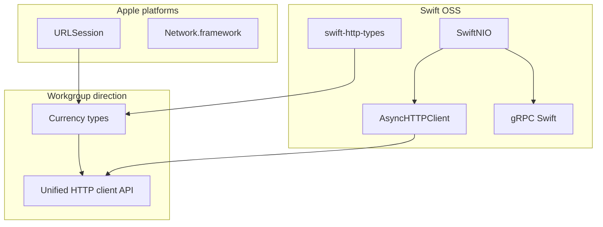
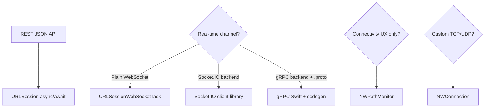
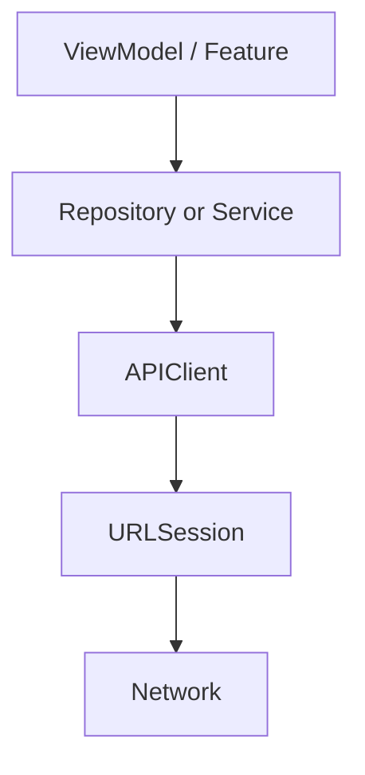
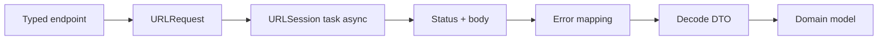

# Networking

По-русски

**Foundation tie-in:** процессы/потоки, RunLoop, sandbox и концепция сетевого стека — в **`I. Фундамент/02 Операционные системы и сети для iOS/`** (и Theme 2 в [`I_FUNDAMENT_Networking-URLSession-REST-WebSocket.md`](../../I.%20Фундамент/I_FUNDAMENT_Networking-URLSession-REST-WebSocket.md)). Здесь — клиентский слой приложения поверх этой базы.

## Apple docs

По-русски

- [URLSession](https://developer.apple.com/documentation/foundation/urlsession) и [URLSessionConfiguration](https://developer.apple.com/documentation/foundation/urlsessionconfiguration).

- [Loading and parsing data from the network](https://developer.apple.com/documentation/foundation/url_loading_system).
- [Background URLSession](https://developer.apple.com/documentation/foundation/urlsessionconfiguration/1411552-backgroundsessionconfiguration).

По-русски

- [Codable](https://developer.apple.com/documentation/foundation/archives_and_serialization/encoding_and_decoding_custom_types) для DTO и версионирования ответов.
- [URLSessionWebSocketTask](https://developer.apple.com/documentation/foundation/urlsessionwebsockettask) — нативный WebSocket поверх `URLSession`.
- [Network](https://developer.apple.com/documentation/network) — `NWPathMonitor`, `NWConnection` ниже HTTP.

- [WWDC26 — gRPC and Swift (265)](https://developer.apple.com/videos/play/wwdc2026/265/) — gRPC Swift, Protobuf codegen, streaming RPC, client lifecycle.

По-русски

- [grpc-swift (GitHub)](https://github.com/grpc/grpc-swift) — open-source runtime и tutorials.
- [Swift — Announcing the Networking Workgroup](https://www.swift.org/blog/announcing-the-networking-workgroup/) — community governance для cross-platform networking.
- [A Vision for Networking in Swift](https://forums.swift.org/t/prospective-vision-networking/85235) — единый layered stack, currency types, modern HTTP client API.
- [Designing an HTTP Client API for Swift](https://forums.swift.org/t/designing-an-http-client-api-for-swift/85254) — abstract `HTTPClient`, platform default (`URLSession` на Apple).

## 🎯 Focus vs Defer

### Focus

По-русски

По-русски

По-русски

- Сквозной throughput-подход: сеть, декодирование, storage и UI как единый pipeline.

По-русски

По-русски

По-русски

- Практики управления большими payload: chunk parsing, compression, prefetching, partial rendering.

### Defer

По-русски

По-русски

По-русски

- GraphQL subscriptions и экзотические транспорты до появления прод-нагрузки и SLO.

По-русски

По-русски

По-русски

- Ручной HTTP/2 multiplexer в клиенте вместо дефолтного поведения системы.

По-русски

По-русски

По-русски

- gRPC server-side deploy и advanced LB/retries — пока нет требований ops; клиентский паттерн — в [`notes/GRPC-Swift-WWDC26.md`](notes/GRPC-Swift-WWDC26.md).

## 📚 Key terms (Q&A)

По-русски

- **Idempotency (идемпотентность):** безопасные ретраи для GET/HEAD; для POST — явные токены или outbox.
- **ETag / Cache-Control:** условные запросы и кеш `URLCache` ([NSURLCache](https://developer.apple.com/documentation/foundation/nsurlcache)).
- **WebSocket / SSE:** долгоживущие каналы, heartbeat, реконнект и батарея.
- **Certificate pinning:** доверие к пинам vs ротация сертификатов и доставка ключей.
- **Alamofire / Moya:** third-party HTTP-слой; в новом проекте чаще свой тонкий `NetworkClient` на `URLSession` (см. **Q48**).
- **Socket.IO vs WebSocket:** WebSocket — протокол; Socket.IO — свой протокол поверх transport; обычный WS-клиент к Socket.IO backend не подойдёт.
- **gRPC / Protobuf:** контракт в `.proto`, codegen клиента, HTTP/2, unary и streaming RPC; см. **Q48**, [`notes/GRPC-Swift-WWDC26.md`](notes/GRPC-Swift-WWDC26.md).
- **Swift Networking Workgroup:** не замена `URLSession` завтра — долгосрочная унификация слоёв (SwiftNIO, swift-http-types, AsyncHTTPClient, gRPC Swift) под structured concurrency и cross-platform currency types.

## Libraries & lower-level APIs

По-русски

Базовый выбор для REST — **`URLSession` + async/await + Codable** (карточки **Q29**, **Q45**). Ниже — когда смотреть ниже или в сторону библиотек.

| API / библиотека | Роль | Когда брать |
|------------------|------|-------------|
| **`URLSession`** | HTTP/HTTPS, upload/download, background transfers | Почти всегда для REST |
| **`URLSessionWebSocketTask`** | Долгоживущий канал, plain WebSocket | Сервер говорит RFC WebSocket, без Socket.IO |
| **`Network.framework`** | `NWPathMonitor` — Wi‑Fi/cellular/offline/expensive; `NWConnection` — TCP/UDP/custom | Reachability, не-HTTP транспорт |
| **Alamofire** | Retry, interceptors, multipart, validation, удобный API | Легаси или явная польза поверх своего клиента |
| **Moya** | `TargetType` — endpoints как enum/struct поверх Alamofire | Уже в проекте; в greenfield — чаще свой endpoint + client |
| **gRPC Swift** | Protobuf codegen, HTTP/2, unary + streaming RPC, async/await | Backend на gRPC; live-данные, typed контракт, компактный wire format |

**Alamofire:** живая библиотека; оправдана, когда нужны готовые interceptors, multipart, validation, reachability-хелперы. Для простого REST + typed client — лишняя зависимость.

**Moya:** структурирует API (`path`, `method`, `headers`, `task`) и упрощает мокинг через `TargetType`; минус — слой абстракции и зависимость от Alamofire.

**Socket.IO trap:** к Socket.IO-серверу нельзя подключиться `URLSessionWebSocketTask` «как к обычному WebSocket» — нужен клиент под протокол Socket.IO (events, reconnect, fallback transport).

**Network vs URLSession:** `URLSession` — HTTP-уровень приложения; `NWPathMonitor` — наблюдение за путём (offline banner, отложить sync); `NWConnection` — когда HTTP недостаточно (raw TCP/UDP, custom framing).

### Swift networking ecosystem (direction)

По-русски

Сегодня iOS REST — **`URLSession`**. gRPC/SwiftNIO — когда контракт или server-side stack того требует. Workgroup выравнивает типы и HTTP API между платформами, не отменяя platform defaults overnight.

### Transport choice (typical)

По-русски

См. карточку **Q48** ниже.

## Diagrams

### App stack (typical)

По-русски

Feature **не** держит `URLSession` напрямую — один клиент, единые правила (timeouts, auth, errors).

### Request pipeline (inside APIClient)

По-русски

См. карточку **Q29** ниже.

### Throughput (cross-layer) {#throughput-cross-layer}

По-русски

Узкое место может быть **на любом** шаге — мерить по стадиям, не только «latency API».

## 🏋️ Exercises

По-русски

1. Настроить `ephemeral` vs `default` configuration и сравнить кеш/cookies на одном endpoint.
2. Описать политику ретраев для 429/503 с jitter и верхней границей.
3. Смоделировать offline: очередь запросов + индикатор конфликта при повторном входе.

## 🌟 Senior+ (strategic)

По-русски

- SLO клиента: p95 latency, error budget, отдельные метрики декодирования и UI choke points.
- Контракты API (OpenAPI/Proto) как часть CI; contract tests против staging.
- Фоновые загрузки только с понятным UX и лимитами системы ([Background Tasks](https://developer.apple.com/documentation/backgroundtasks)).

## Artifacts

- Notes: `notes/`
- Exercises: `exercises/`
- Assets: `assets/`
- Playgrounds: `playgrounds/`

### Recent notes

- [`notes/GRPC-Swift-WWDC26.md`](notes/GRPC-Swift-WWDC26.md) — gRPC Swift, Protobuf codegen, streaming RPC, client lifecycle (WWDC26-265)

По-русски

- [`notes/URLSession-Lifecycle-iOS-IQ.md`](notes/URLSession-Lifecycle-iOS-IQ.md) — жизненный цикл URLSession (iOS IQ); полный текст в [`_import/urlsession-lifecycle-iosiq-full.md`](../../../_import/urlsession-lifecycle-iosiq-full.md)

- `notes/throughput-estimation-for-large-data.md`

---

## TL;DR

По-русски

- Throughput в мобильной разработке — это не только сеть: узкие места возникают и в декодировании, БД, и рендере.
- Базовые подходы (pagination, lazy loading, caching, chunking) остаются обязательной основой.
- Для больших payload особенно полезны chunk parsing, сжатие (gzip/Brotli) и частичный рендеринг.
- Оптимизировать нужно сквозной pipeline, а не отдельный шаг.

## Source

По-русски

- Авторский материал из серии про управление сетевым трафиком (в сообщении без публичной ссылки).

## What throughput means on iOS

По-русски

Пропускная способность — объём данных/работы, который система обрабатывает за единицу времени.

В iOS throughput-пределы обычно встречаются в:

- загрузке данных по сети;
- парсинге больших JSON;
- записи в локальное хранилище;
- рендеринге больших списков и сложных экранов.

## Baseline solutions you cannot skip

По-русски

- Pagination и lazy loading вместо “загрузить всё сразу”.
- Кэширование на нужном уровне (HTTP cache, memory cache, disk cache).
- Chunking данных и операций, чтобы не делать гигантские монолитные шаги.

Это “гигиена” производительности, без которой точечные оптимизации редко дают устойчивый эффект.

### Problem

По-русски

`JSONDecoder.decode(...)` по огромному массиву может давать скачки памяти и долгий блокирующий шаг.

### Idea

По-русски

Разбивать данные на части и обрабатывать порциями:

- меньше пиковой памяти;
- лучше контролируемая задержка;
- проще вставить backpressure и отмену.

### Practical meaning

По-русски

Chunk parsing особенно полезен в feed/каталогах и при “длинных” API-ответах, где полная декодировка не нужна немедленно.

## 2) Response compression: gzip vs Brotli

### Problem

По-русски

Слишком большие payload увеличивают RTT/TTFB-эффект и энергопотребление на мобильной сети.

### Idea

По-русски

Использовать сжатие на сервере и корректные заголовки/поддержку на клиенте.

### Practical meaning

По-русски

Сжатие может радикально уменьшить объём трафика, но нужно учитывать CPU-стоимость распаковки и тип контента.

## 3) Partial rendering and precomputed layout

### Problem

По-русски

Если экран пытается сразу отрисовать огромный объём компонентов, деградируют FPS и время отклика.

### Idea

По-русски

- рендерить только видимую часть;
- готовить остальные данные/представления фоном;
- использовать prefetch-механизмы там, где они доступны.

Для UIKit:

- `UITableViewDataSourcePrefetching` помогает заранее подгружать данные;
- есть возможность отменять prefetch при быстром скролле.

Для SwiftUI:

- встроенные сценарии prefetch менее явные, поэтому часто нужны аккуратные собственные паттерны (windowing, staged loading, task cancellation).

## What it means for architecture

По-русски

Throughput-проблемы почти всегда кросс-слойные (см. [throughput diagram](#throughput-cross-layer) выше):

- сеть → декодирование → storage → UI.

Если оптимизировать только один слой, бутылочное горлышко просто смещается дальше по цепочке.

## Practical takeaways

По-русски

- Мерить throughput по стадиям pipeline, а не только “время ответа API”.
- Для больших JSON сразу проектировать chunk/parsing стратегию.
- Для больших списков заранее фиксировать политику partial rendering + prefetch + cancellation.
- В performance-review сравнивать не только latency, но и memory peaks/CPU spikes.

## Mini checklist

По-русски

- Есть ли у фичи явная стратегия pagination/lazy loading.
- Сжатие включено и измерено на реальных payload.
- Большие JSON не декодируются монолитно без необходимости.
- UI не пытается отрисовать весь набор элементов одним шагом.
- Есть отмена фоновых подгрузок при смене контекста/быстром скролле.

---## Interview Q&A (Knowledge cards)

Interview Q&A below.

<!-- knowledge-cards-canonical:start -->

### Q29
- **Question (EN):** How do you build a reliable `URLSession` API client?

- **Answer (EN):** “Building” a client means a dedicated module that turns an endpoint description into a typed result: one configured `URLSession`, a repeatable pipeline, and injectable pieces for testing—not only tweaking session knobs.

    1. Shell — an `APIClient`-style type owning/receiving `URLSession`, exposing a small surface (`send`/`fetch`). Enables shared rules, test doubles (`URLProtocol`), and environment swaps.

    2. Transport — tuned `URLSessionConfiguration` (timeouts, `waitsForConnectivity`, connection limits, cache policy). Optional session delegate for TLS/auth challenges when pinning matters.

    3. Request pipeline — compose `URLRequest` from typed endpoints (URL, method, shared headers, auth header hook, encoded body). One code path prevents drift across features.

    4. Execution policy — async tasks with cooperative cancellation, deliberate retries/backoff, centralized mapping from HTTP status, payloads, and `URLError` into app errors.

    5. Contract — typed encodable/decodable models plus one decoding convention for success vs API error envelopes.

    6. Observability — correlation headers, logging/metrics, `URLSessionTaskMetrics` for latency breakdowns.

По-русски

По-русски

По-русски

- **Устная заготовка (EN):**

    1. Dedicated client type + single session + pipeline to typed results.
    2. Session configuration (+ delegate when needed).
    3. Central `URLRequest` assembly (auth, encoding).
    4. Cancellation-aware execution, retries, unified error mapping.
    5. Typed decoding + observability.

По-русски

По-русски

По-русски

- **Follow-up:** что retriable (подлежит повтору), а что нет?

По-русски

По-русски

По-русски

- **Follow-up answer:** часто retriable: сетевые обрывы и таймауты `URLError`, 408, 429 (с backoff и заголовком Retry-After если есть), часть 5xx при идемпотентных операциях. Обычно не retriable без изменения запроса: 4xx семантические (401 без refresh, 403, 404), бизнес-ошибки в теле. POST без идемпотency-key — осторожно; после успешной мутации на сервере повтор может дублировать действие.

По-русски

- **Question (RU):** как устроить надёжный API client (клиент API) на `URLSession`?

- **Answer (RU):** «Устроить клиент» — значит ввести явный модуль (тип/сервис), который из описания endpoint делает типизированный результат: внутри него живёт одна сконфигурированная `URLSession`, предсказуемый конвейер шагов и подменяемые зависимости под тесты. Надёжность — не только конфиг сессии, а весь путь от доменного вызова до ответа и ошибки.

    1. Каркас — отдельный `APIClient` (или аналог): владеет или получает `URLSession` через DI, экспортирует узкий API (`send`, `fetch` по endpoint). Так проще единые правила, моки в тестах (`URLProtocol` и т.п.) и смена окружения (base URL, логирование).

    2. Транспорт — `URLSessionConfiguration`: `timeoutIntervalForRequest`, `timeoutIntervalForResource`, при необходимости `waitsForConnectivity`, `httpMaximumConnectionsPerHost`, политика `URLCache` (`.ephemeral` vs дисковый кэш под GET). При необходимости делегат сессии для TLS/challenge (pinning — см. доп.).

    3. Конвейер `URLRequest` — сборка из типизированного endpoint: base URL, path/query, метод, общие заголовки (`Accept`, локаль), заголовок авторизации (токен из отдельного слоя), кодирование тела (`JSONEncoder` и т.д.). Один проход «endpoint → готовый запрос» убирает расхождения между экранами.

    4. Политика выполнения — `data(for:)` / task + отмена (`Task.cancel`, `URLSessionTask.cancel`), retry/backoff только осмысленно (transient ошибки, лимиты, jitter, идемпотентность не-GET). После ответа — разбор HTTP status, тела ошибки и `URLError` в доменные ошибки одним местом.

    5. Контракт — модели запроса/ответа (`Encodable`/`Decodable`), единый `JSONDecoder`/правила дат и ключей; явное различение «успешное тело» vs «ошибка API в JSON».

    6. Наблюдаемость — correlation/request id в заголовках, структурные логи, метрики; для разборов задержек — `URLSessionTaskMetrics` (DNS/TLS/TTFB).

По-русски

По-русски

По-русски

- **Устная заготовка (RU):**

По-русски

    1. Явный тип клиента + одна `URLSession` + конвейер до типизированного результата.
    2. Конфиг сессии и при необходимости delegate под TLS.
    3. Сборка `URLRequest` из endpoint в одном месте (включая auth-заголовки).
    4. Выполнение с отменой, retry по правилам и единый маппинг ошибок.
    5. Декодинг контрактов и наблюдаемость.

- **Доп. информация:** `URLSessionDelegate` / `URLAuthenticationChallenge` (pinning, цепочка доверия) — отдельный слой безопасности; `URLSessionTaskMetrics` — разбор DNS/TLS/TTFB при инцидентах.

### Q30
- **Question (EN):** Where do you store access/refresh tokens?

По-русски

    На собесе лучше не «невозможно украсть», а «правильное место по модели угроз»: меньше шанс вытащить токен с файловой системы приложения и проще соблюдать гайды Apple. Абсолютной защиты при скомпрометированном устройстве или пользователе нет.

    Frame it by threat model: far better than plist defaults for secrets; not a magic shield on a fully compromised device.

По-русски

По-русски

По-русски

- **Устная заготовка (EN):**

    2. Pick `kSecAttrAccessible` deliberately.
    3. Keep refresh tokens especially locked down; never log secrets.

По-русски

По-русски

По-русски

- **Follow-up:** как решать token refresh race (гонку обновления токена)?

По-русски

- **Пример на словах (race на refresh):** десять запросов одновременно получили 401 → первый запускает refresh → остальные девять не создают новый POST, а `await`ят тот же `Task` → при успехе все продолжают с новым access; счётчик вызовов refresh на сервере — 1. Если бы каждый сам пошёл на refresh без координации, получили бы шквал обращений и возможный revoke сессии.

    - `whenUnlocked` — доступ только пока устройство разблокировано пользователем; при заблокированном экране элемент недоступен. Строже для секретов, которые не нужны в фоне на заблокированном устройстве.

    - `afterFirstUnlock` — после первой успешной разблокировки после загрузки элемент доступен до перезагрузки, в том числе когда экран снова заблокирован. Частый выбор для данных, которые нужны фоновым задачам без участия пользователя каждый раз; компромисс строгость vs UX фона.

    - `whenPasscodeSetThisDeviceOnly` — доступно только если на устройстве задан passcode; усиливает привязку к политике «устройство защищено кодом».

    Устаревшие/опасные режимы вроде постоянной доступности без привязки к блокировке не использовать. Для refresh-токена чаще выбирают более строгую пару (`whenUnlocked` + `ThisDeviceOnly`), если не нужен доступ на заблокированном экране; если нужен silent refresh в фоне — осознанно обсуждают `afterFirstUnlock` и модель угроз.

По-русски

- **Question (RU):** где хранить access token / refresh token (токены доступа и обновления)?

По-русски

По-русски

По-русски

- **Устная заготовка (RU):**

По-русски

    2. Подобрать `kSecAttrAccessible` под сценарий (экран заблокирован, backup).
    3. Refresh надёжнее изолировать и не светить в логах.

### Q31
- **Question (EN):** How do you design caching?

- **Answer (EN):** Split responsibilities: server headers define cacheability and freshness (`Cache-Control`, `ETag`/`Last-Modified`, `Vary`); the client picks behavior via `URLRequest.cachePolicy` and optional custom `URLCache` on `URLSessionConfiguration`.

    Defaults: `URLSessionConfiguration.default` uses the shared `URLCache` when `urlCache` is nil; default `URLRequest.cachePolicy` is `useProtocolCachePolicy`, so HTTP caching applies unless headers forbid it—override per request when you must bypass (`reloadIgnoringLocalCacheData`). Background/ephemeral configs differ—check Apple docs.

По-русски

По-русски

По-русски

- **Устная заготовка (EN):**

    1. Protocol cache vs app-level cache.
    2. Headers vs `cachePolicy` / custom `URLCache`.
    4. Stale/stampede—see follow-up.

По-русски

По-русски

По-русски

- **Follow-up:** как снизить stale data risk (риск устаревших данных) и cache stampede (шквал запросов)?

По-русски

По-русски

По-русски

- **Follow-up answer:** stale: короткий `max-age` для часто меняющегося; после мутаций инвалидировать кэш приложения и при следующем чтении форсировать сеть или условный запрос; optimistic UI + refetch; при наличии канала — push/WebSocket про инвалидацию. stampede: single-flight / dedup одного URL в полёте; общий репозиторий или actor вместо N экранов, каждый из которых дергает тот же GET.

По-русски

- **Question (RU):** как строить caching strategy (стратегию кэширования)?

- **Answer (RU):** стратегия = два осознанных слоя + понятно, кто что решает.

    Кто что задаёт: сервер — заголовки ответа (`Cache-Control`: `max-age`, `no-store`, `no-cache`, `private`/`public`; валидация `ETag` / `Last-Modified` и условные запросы → `304`; при необходимости `Vary`, иногда `Expires`). Клиент — использовать ли HTTP-кэш для запроса: `URLRequest.cachePolicy` и при необходимости свой `URLCache` на `URLSessionConfiguration`.

    Дефолт без ручной настройки: `URLSession.shared` / конфигурация `.default` — при `urlCache == nil` используется `URLCache.shared`; у `URLRequest` по умолчанию `cachePolicy == useProtocolCachePolicy`, то есть HTTP-кэш включён по правилам протокола, пока сервер не запретил (`no-store` и т.д.). Принудительный обход локального кэша на один вызов — `reloadIgnoringLocalCacheData`. Для background/ephemeral конфигураций поведение по документации Apple отличается.

    Настройка под продукт: свой `URLCache(memoryCapacity:diskCapacity:)` и `URLSessionConfiguration.urlCache` при нужных лимитах или изоляции модулей. Чувствительное — `no-store` с сервера и осознанное хранение на клиенте.

    Слой приложения: кэш декодированных моделей (`NSCache`, диск, БД) с TTL и инвалидацией (pull-to-refresh, мутация, push). Один источник истины для одного и того же ресурса — не два независимых кэша без правила.

По-русски

По-русски

По-русски

- **Устная заготовка (RU):**

По-русски

    1. Два слоя: HTTP (`URLCache` + политика запроса) и свой кэш моделей.
    2. Сервер — заголовки; клиент — `cachePolicy` и при необходимости свой `URLCache`.
    3. По умолчанию shared кэш и протокольная политика — кэш работает, пока сервер разрешает.
    4. Устаревание и stampede — в follow-up.

- **Доп. информация:** изображения часто выносят в отдельный image-cache; `private`/`public` критичнее для shared CDN, на телефоне чаще важны `no-store` и `Vary`. Углубление — `Networking-URLSession-REST-WebSocket.md` по networking в роадмапе.

### Q32
- **Question (EN):** What matters for background transfers?

По-русски

- **Вводные данные:** речь про [`URLSessionConfiguration.background(withIdentifier:)`](https://developer.apple.com/documentation/foundation/urlsessionconfiguration/backgroundsessionconfigurationwithidentifier:) и большие/долгие загрузки или загрузки на сервер, когда приложение могут приостановить или завершить, а передачу данных продолжает система. Детальный разбор и примеры — в роадмапе (`Networking-URLSession-REST-WebSocket.md`, playground); здесь канон для oral.

    - Для background-конфигурации нужен **`URLSessionDelegate`** (удобные completion-handler обёртки без делегата для фоновой сессии не подходят как единственный механизм — делегат нужен для событий задач).

    - После перезапуска приложения нужно **создать новый `URLSession`** с **тем же `identifier`** и тем же классом делегата — система **привязывает** уже идущие задачи к восстановленной сессии.

    - Когда есть события по фоновой сессии, UIKit вызывает у делегата приложения [`application(_:handleEventsForBackgroundURLSession:completionHandler:)`](https://developer.apple.com/documentation/uikit/uiapplicationdelegate/application(_:handleeventsforbackgroundurlsession:completionhandler:)) — переданный **`completionHandler`** нужно **вызвать после** того, как обработали делегатные колбэки и сохранили результат; иначе система может завершить фоновое выполнение раньше времени.

    - Состояние передачи и файл на диске — источник истины; **не хранить** «какой байт качаем» только в свойстве singleton в памяти — после смерти процесса память пуста. Прогресс и метаданные — в **`UserDefaults`/файл/Core Data** при необходимости, итог загрузки — копирование из временного URL в постоянное место в колбэке завершения.

    - Полезные настройки конфигурации (по сценарию): `sessionSendsLaunchEvents` — будить приложение для доставки событий; `isDiscretionary` — разрешить системе отложить работу до лучших условий (Wi‑Fi, питание) — не для критичных «сейчас» задач; кэш HTTP для фоновой сессии по умолчанию отключён (`urlCache == nil` в смысле «не как у default-сессии» — проверять доку под целевую ОС).

    - Для **`URLSessionDownloadTask`** большой файл приходит во **временный файл** — его нужно **сразу** переместить/скопировать в своё хранилище в `urlSession(_:downloadTask:didFinishDownloadingTo:)`, пока система не убрала временный файл. Отмена с возможностью продолжить — **`cancel(byProducingResumeData:)`** и новый таск с **`downloadTask(withResumeData:)`**.

- **Answer (EN):** Use `URLSessionConfiguration.background(withIdentifier:)` with a unique, stable identifier. The **system** owns long-running transfers—your process may die while downloads/uploads continue.

    Recreate `URLSession` with the **same identifier** after relaunch so tasks reattach. Implement `URLSessionDelegate`/`URLSessionDownloadDelegate`—background sessions rely on delegate callbacks, not “fire-and-forget” completion handlers alone.

    Implement `application(_:handleEventsForBackgroundURLSession:completionHandler:)` and **always** call the completion handler after you finish handling delegate work—otherwise background runtime may end early.

    Persist bookkeeping outside RAM; move downloaded files out of the temporary location promptly; use resume data APIs when you need resumable downloads.

По-русски

По-русски

По-русски

- **Устная заготовка (EN):**

    1. Background configuration + stable identifier.
    2. Delegate + recreate session after relaunch with same id.
    3. Call the app delegate completion handler after processing.
    4. Don’t trust RAM for progress; move temp download files immediately.

По-русски

По-русски

По-русски

- **Follow-up:** почему нельзя полагаться только на in-memory state (данные в памяти)?

По-русски

- **Question (RU):** что важно в background transfers (фоновых передачах)?

- **Answer (RU):** фоновые передачи строят на отдельной конфигурации сессии со **стабильным строковым идентификатором** (обычно reverse-DNS, уникальный в приложении). Система ведёт задачи **вне процесса** приложения: процесс может быть убит, а загрузка/аплоад продолжается.

    Обязательные идеи на собесе:

По-русски

По-русски

По-русски

- **Устная заготовка (RU):**

По-русски

    1. Background config + уникальный строковый id.
    2. Делегат обязателен; после рестарта — новая сессия с тем же id.
    3. `handleEventsForBackgroundURLSession` — вызвать системный completion после обработки.
    4. Состояние на диске; временный файл загрузки сразу сохранить к себе.

- **Доп. информация:** гайд Apple: [Downloading files in the background](https://developer.apple.com/documentation/foundation/downloading-files-in-the-background). Ограничения по времени фонового выполнения и необходимость не блокировать делегат тяжёлой работой — перенос распаковки/хэширования в отдельную очередь. Для загрузок в не‑UIKit приложениях смотреть актуальный объект делегата приложения на вашей платформе.

### Q33
- **Question (EN):** REST-ish HTTP verbs—GET/POST/PUT/PATCH/DELETE; safe vs idempotent; query vs body?

По-русски

    - **GET** — чтение; **без тела** по смыслу; параметры фильтрации — в **query**. Конвенция: **safe** (не должно мутировать серверное состояние «как у POST») и **идемпотентно** (повтор тот же по смыслу). **HEAD** — как GET без тела (метаданные).

    - **POST** — «сделать что-то» / **создать** с серверным назначением id / **неидемпотентно** по умолчанию (два одинаковых POST могут создать два объекта). Тело часто есть, но «секьюрность» тут не про метод: **TLS (HTTPS)** защищает канал; **не светить секреты в URL** (логи, Referer) — query для паролей/токенов плохая идея.

    - **PUT** — **полная замена** ресурса по URI (клиент присылает целое состояние); конвенция: **идемпотентно** (много одинаковых PUT → то же финальное состояние ресурса).

    - **PATCH** — **частичное** обновление (инструкции/«дельта»); идемпотентность **зависит от семантики** (часто проектируют как идемпотентное, но это не аксиома).

    - **DELETE** — удалить ресурс; конвенция: **идемпотентно** (повтор после удаления обычно «всё ещё удалено» / 404 — без новых «лишних» эффектов).

    **Идемпотентность (RU):** не «данные всегда свежие», а **повтор того же запроса не должен накапливать лишний эффект** относительно **одного** выполнения (в терминах состояния ресурса/сервера по контракту API). Свежесть — это **кэш**, `Cache-Control`, версии, повторный GET.

    **Safe (RU):** метод **не должен** задумываться как мутация серверного состояния (GET/HEAD/OPTIONS — конвенция safe). POST/PUT/PATCH/DELETE — **не safe**.

- **Answer (EN):** Verbs express intent. **Safe** methods should not have server-side side effects like mutations. **Idempotent** means repeating the same request does not *accumulate extra* effects beyond what one successful call implies—**not** “always fresh data.” **PUT** replaces; **PATCH** patches; **POST** is often neither safe nor idempotent unless designed (e.g. idempotency keys).

По-русски

- **Устный канон (опросник п.29 / H29, drill):** «**GET** — читать, **safe + idempotent**, параметры в **query**. **POST** — действие/создание, **не safe**, **не идемпотентен** по умолчанию, тело — да, секреты — **TLS**, не в URL. **PUT** — **полная** замена, **idempotent**. **PATCH** — **частично**, идемпотентность по договорённости. **DELETE** — **idempotent**. **Идемпотентность** — про **повтор без лишнего эффекта**, не про свежесть.»

### Q34A

- **Question (EN):** HTTP vs HTTPS and TLS?

- **Answer (EN):** Hook: HTTPS wraps the same HTTP semantics in TLS—encrypts on the wire and authenticates the server via its certificate chain.

По-русски

По-русски

По-русски

- **Устная заготовка (EN):** HTTPS = HTTP in TLS; confidentiality, integrity, server auth; handshake negotiates crypto + validates cert.

По-русски

По-русски

По-русски

- **Follow-up:** что происходит на TLS handshake (рукопожатии TLS)?

По-русски

По-русски

По-русски

- **Follow-up answer:** клиент и сервер договариваются о версии протокола и наборах шифров; сервер присылает сертификат; проверка цепочки доверия и имени хоста; обмен ключами (DH/ECDHE и т.д.); после handshake симметричные ключи для записи пакетов приложения. Детали этапов — по необходимости углубления.

### Q34B

- **Question (EN):** Why does idempotency matter for retries?

- **Answer (EN):** Retries replay the same request—without idempotency you risk duplicated side effects (double charges). Idempotent APIs or Idempotency-Key headers make retries safe.

По-русски

По-русски

По-русски

- **Устная заготовка (EN):** Retries duplicate delivery risk—use idempotent APIs or Idempotency-Key.

По-русски

По-русски

По-русски

- **Follow-up:** какие HTTP status codes retriable?

По-русски

По-русски

По-русски

- **Follow-up answer:** часто: транспортные ошибки и таймауты; HTTP 408, 429 (с backoff и Retry-After); часть 5xx при безопасном повторе. Обычно не без изменения запроса: семантические 4xx (400, 401 без refresh, 403, 404 как контрактная ошибка), бизнес-ошибки в теле. Классификация под конкретный API.

### Q34C

- **Question (EN):** Connect timeout vs resource timeout?

- **Answer (EN):** Resource caps end-to-end task time; request caps idle time between received chunks after connect—different failure modes.

По-русски

По-русски

По-русски

- **Устная заготовка (EN):** Resource = whole task budget; request = stall between chunks.

По-русски

По-русски

По-русски

- **Follow-up:** какие дефолты в mobile network (мобильной сети)?

По-русски

По-русски

По-русски

- **Follow-up answer:** дефолты платформы не заменяют продуктовый выбор: на LTE с обрывами полезны `waitsForConnectivity`, более мягкий resource timeout или явный retry; multipath может помочь при переключении Wi‑Fi/LTE; для больших тел измерять реальный UX, а не только «дефолт».

### Q34D

- **Question (EN):** How do `Cache-Control`, `ETag`, `If-None-Match`, and `304` work?

- **Answer (EN):** Cache-Control = freshness policy; conditional GET with If-None-Match + ETag → `304` reuses stored body, else `200` with new body.

По-русски

По-русски

По-русски

- **Устная заготовка (EN):** Freshness vs validation; `304` = Not Modified, reuse cached body.

По-русски

По-русски

По-русски

- **Follow-up:** как избегать stale data (устаревших данных)?

По-русски

По-русски

По-русски

- **Follow-up answer:** короткий `max-age` для часто меняющихся данных; явная инвалидация кэша приложения после мутаций; форс обход HTTP-кэша для критичных экранов; версии в URL/API для схемы; комбинация push/WebSocket «данные протухли».

### Q34E

- **Question (EN):** Role of gzip / Brotli compression?

- **Answer (EN):** Client advertises supported codecs; server may compress body (`Content-Encoding`). Trade bandwidth for CPU.

По-русски

По-русски

По-русски

- **Устная заготовка (EN):** Fewer bytes vs decode cost; tiny payloads and precompressed binaries rarely win.

По-русски

По-русски

По-русски

- **Follow-up:** когда compression ухудшает performance?

По-русски

По-русски

По-русски

- **Follow-up answer:** очень маленькие ответы — накладные расходы перевешивают; уже сжатые бинарники (JPEG/zip) почти не сжимаются повторно; на слабом устройстве горячий путь распаковки может быть заметен; двойное сжатие на клиенте перед отправкой ошибочно.

### Q34F

- **Question (EN):** Offset/limit vs cursor pagination?

- **Answer (EN):** Offset skips rows—mutations shift windows (skips/duplicates). Cursor pages after a stable bookmark (opaque token or sort key + tie-breaker).

По-русски

По-русски

По-русски

- **Устная заготовка (EN):** Mutable feeds break offsets; cursors follow last item + stable ordering.

По-русски

По-русски

По-русски

- **Follow-up:** как снизить дубли/потери при догрузке?

По-русски

По-русски

По-русски

- **Follow-up answer:** стабильный sort с tie-breaker по первичному ключу; курсор от сервера; для офлайна не смешивать страницы разных фильтров без ключа запроса; при синке — перезапрос с последнего известного курсора после ошибки.

### Q34G

- **Question (EN):** Why backoff with jitter?

- **Answer (EN):** Backoff spaces retries out; jitter avoids synchronized retry spikes after outages.

По-русски

По-русски

По-русски

- **Устная заготовка (EN):** Exponential delays + random spread break retry synchronization.

По-русски

По-русски

По-русски

- **Follow-up:** что считать non-retriable error (ошибкой без повторов)?

По-русски

По-русски

По-русски

- **Follow-up answer:** отмена пользователем (`URLError.cancelled`); 401 без успешного refresh; явные 4xx «неправильный запрос»; бизнес-ошибка в теле; часть 403. Повтор не спасает без изменения входных данных.

### Q34H

По-русски

По-русски

По-русски

- **Устная заготовка (EN):** Default-on secure transport; avoid global HTTP allowlist—tight domain exceptions or server fix.

По-русски

По-русски

По-русски

- **Follow-up answer:** легаси HTTP endpoint или сертификат вне стандарта — точечное исключение для домена (`NSExceptionDomains`) с обоснованием; после миграции сервера — убрать исключение. Не использовать произвольный HTTP для всего API без крайней нужды.

По-русски

- **Question (RU):** **п.29 / H29** — HTTP-методы в REST: **GET, POST, PUT, PATCH, DELETE**; **safe** и **идемпотентность**; куда класть данные (query vs body)?

- **Answer (RU):** Зацепка: **имя метода — про намерение на ресурсе**, а **идемпотентность и safe** — про **повтор** и **ожидаемые побочные эффекты на сервере** (по конвенции RFC/REST, реальный API может отклоняться — это отдельный follow-up).

По-русски

По-русски

По-русски

- **Follow-up (RU):** почему **GET с токеном в query** — плохо?

По-русски

По-русски

По-русски

- **Follow-up answer (RU):** query попадает в **прокси-логи**, историю, **Referer**; для секретов — **Authorization header** + HTTPS, не query.

По-русски

- **Question (RU):** HTTP vs HTTPS, роль TLS (шифрование транспорта)?

- **Answer (RU):** Зацепка: **HTTPS = тот же HTTP**, но внутри **TLS** — шифрование по дороге и проверка, что ты говоришь с нужным сервером (сертификат / цепочка доверия).

    HTTPS — HTTP поверх TLS: конфиденциальность и целостность данных на канале, аутентификация сервера по сертификату (цепочка до доверенного CA).

По-русски

По-русски

По-русски

- **Устная заготовка (RU):** HTTPS — HTTP в TLS; три цели: секретность, целостность, «это тот сервер»; handshake — сертификат и ключи.

По-русски

- **Question (RU):** зачем idempotency (идемпотентность) для retry policy (политики повторов)?

- **Answer (RU):** Зацепка: ретраи повторяют **тот же запрос**; если операция не идемпотентна, второй раз можно создать второй платёж/заказ.

    Повтор при сетевой неопределённости («ответ потерялся») может выполнить операцию дважды; идемпотентность значит: повтор даёт тот же конечный эффект, что и один вызов — без лишних платежей/дубликатов сущностей. Для POST часто используют заголовок **Idempotency-Key**.

По-русски

По-русски

По-русски

- **Устная заготовка (RU):** ретрай может выполнить дважды → нужна идемпотентность или ключ; GET безопаснее повторять, POST осторожно.

По-русски

- **Question (RU):** как выбирать connect timeout (тайм-аут соединения) и resource timeout (тайм-аут ресурса)?

- **Answer (RU):** Зацепка: в `URLSessionConfiguration` два разных «таймера» — один на **всю задачу целиком**, другой на **застой между порциями данных** после того как соединение уже есть.

    `timeoutIntervalForResource` — верхняя граница на всю задачу (резолв + TLS + получение тела); `timeoutIntervalForRequest` — бездействие между порциями данных после установления соединения. Короткий RPC — умеренный resource; долгая загрузка файла — больший resource; «зависание» потока между чанками — через request timeout.

По-русски

По-русски

По-русски

- **Устная заготовка (RU):** resource — всё от начала до конца ответа; request — тишина между байтами по уже открытому каналу.

По-русски

- **Question (RU):** как работают `Cache-Control` / `ETag` / `If-None-Match` / `304`?

- **Answer (RU):** Зацепка: **свежесть** задаёт `Cache-Control`; **проверка без полного тела** — условный GET с `If-None-Match` и сохранённым `ETag`.

    `Cache-Control` задаёт свежесть (`max-age` и др.). Когда кэшированная копия устарела или политика требует проверки, клиент шлёт GET с `If-None-Match: <etag>`; если ресурс не менялся — сервер отвечает `304 Not Modified` без тела, клиент берёт тело из локального кэша; если изменился — полный ответ `200`.

По-русски

По-русски

По-русски

- **Устная заготовка (RU):** `Cache-Control` — как долго верить кэшу; `If-None-Match` + ETag — «изменилось?» → `304` без тела или `200` с телом.

По-русски

- **Question (RU):** роль compression (сжатия) gzip/br?

- **Answer (RU):** Зацепка: **`Accept-Encoding`** на клиенте → **`Content-Encoding`** на ответе; для `URLSession` распаковка обычно **прозрачная**.

    Сервер может отдавать тело с `Content-Encoding: gzip` или br; клиент декодирует прозрачно для `URLSession`. Цель — меньше байт по сети; цена — CPU на сжатие/распаковку на сервере и клиенте.

По-русски

По-русски

По-русски

- **Устная заготовка (RU):** меньше байт по сети, больше CPU; на крошечных ответах и уже сжатых файлах выгода часто нулевая.

По-русски

- **Question (RU):** offset/limit vs cursor pagination (курсорная пагинация)?

- **Answer (RU):** Зацепка: offset = «пропусти N строк» — при **живом** списке окно **съезжает**; cursor = «дай записи **после** маркера» в **стабильном** порядке.

    offset пропускает N записей — при вставках/удалениях в начале списка возможны пропуски и дубли при догрузке. cursor указывает место после последнего видимого элемента в стабильном порядке сортировки (часто opaque token или пара timestamp + id).

По-русски

По-русски

По-русски

- **Устная заготовка (RU):** offset ломается при изменениях сверху; cursor держится за последнюю позицию + стабильный sort.

По-русски

- **Question (RU):** зачем backoff with jitter (повторы с задержкой и случайным разбросом)?

- **Answer (RU):** Зацепка: массовый outage → все ретраят **разом** → **thundering herd**; backoff растягивает попытки, **jitter** рассинхронизирует клиентов.

    При падении сервиса множество клиентов ретраят синхронно — создаётся «шторм» запросов; экспоненциальная задержка с jitter размазывает повторы во времени и снижает нагрузку на восстановившийся backend.

По-русски

По-русски

По-русски

- **Устная заготовка (RU):** без jitter все просыпаются в один момент и снова кладут сервер.

По-русски

По-русски

По-русски

- **Устная заготовка (RU):** не открывать весь HTTP; лучше HTTPS на сервере, легаси — **точечное** исключение по домену.

По-русски

- **Доп. информация:** [RFC 9110 — HTTP Semantics (methods, safe, idempotent)](https://www.rfc-editor.org/rfc/rfc9110.html#name-common-method-properties); [consolidated-interview-questionnaire.md](../../X.%20Карьера%20и%20софт-скилы/38%20Подготовка%20к%20собеседованиям/notes/resources/consolidated-interview-questionnaire.md) п.29.
- **Доп. информация:** заголовок Idempotency-Key для POST.
- **Доп. информация:** см. доку Apple по каждому свойству конфигурации под целевую ОС.
- **Доп. информация:** `Last-Modified` / `If-Modified-Since` — аналогичная идея без ETag.
- **Доп. информация:** не путать transport compression с шифрованием TLS.
- **Доп. информация:** глубокая лента — фильтры в состоянии запроса.
- **Доп. информация:** уважать заголовок `Retry-After` от сервера.
- **Доп. информация:** связка с pinning и обновлением сертификатов.

---
### Q45
- **Question (EN):** Minimal `URLSession` request flow?

- **Answer (EN):** Build `URLRequest`, run session task, cast to `HTTPURLResponse`, validate status, then decode—classify transport vs HTTP vs decoding failures.

По-русски

По-русски

По-русски

- **Устная заготовка (EN):** Status check before `Decodable`; separate retry policies per error kind.

По-русски

По-русски

По-русски

- **Follow-up:** какие ошибки обязательно разделять: transport (транспорт), server (сервер), decoding (декодирование)?

По-русски

По-русски

По-русски

- **Follow-up answer:** transport — нет сети, таймаут; server — код и тело ошибки API; decoding — несовпадение схемы; смешивание в одном `catch` мешает UX и retry.

По-русски

- **Answer (RU):** Зацепка: **URLRequest → data task → HTTPURLResponse.statusCode → decode**; ошибки по слоям не смешивать.

    собрать `URLRequest` (URL, метод, заголовки, тело); выполнить `URLSession.shared.data(for:)` или свой клиент; привести `URLResponse` к `HTTPURLResponse` и проверить `statusCode`; декодировать `Data` в модель; ошибки разделить: транспорт (`URLError`), HTTP-ошибка (4xx/5xx), ошибка декодирования.

По-русски

По-русски

По-русски

- **Устная заготовка (RU):** сначала статус, потом JSON; сеть ≠ «плохой JSON».

По-русски

- **Доп. информация:** проверять статус до `Decodable`.

### Q46
- **Question (EN):** How do you unit-test networking without hitting the real network?

- **Answer (EN):** Keep unit tests fast and deterministic—avoid real HTTP. Either inject a **fake HTTP client** that returns canned `(Data, URLResponse)` / throws, or register a custom **`URLProtocol`** via **`protocolClasses`** on a dedicated **`URLSession`** so `startLoading` feeds synthetic responses. Don’t poison `URLSession.shared`. Assert request assembly, status/body handling, error mapping, retries, and cancellation; leave real TLS and timing to integration tests.

По-русски

- **Устный канон (опросник п.30 / H30, drill):** «В unit **сеть не дергаем**: **фейк клиента** или **`URLProtocol` в `protocolClasses`** + **своя** `URLSession`; проверяем **запрос/ответ/ошибки**; **`shared` не трогаем**; реальную сеть — **интеграция**.»

По-русски

- **Question (RU):** **п.30 / H30** — как **тестировать сеть** в **unit-тестах** (без реального HTTP)?

- **Answer (RU):** Зацепка: unit-тесты хотят **скорость и детерминизм**; реальный HTTP даёт **флейки**, **таймауты** и внешние зависимости. Поэтому **транспорт подменяют**, а проверяют **свою** логику: сборка `URLRequest`, разбор статуса/тела, маппинг ошибок, ретраи, отмена.

    **Два уровня:**

    1. **Фейковый клиент (предпочтительно для «чистой» логики):** абстракция вроде `APIClient` / `HTTPClient` с `send` в тестах реализуется **`Fake…`**, который возвращает заранее заданные `(Data, URLResponse)` или бросает ошибку — **без** `URLSession`. Быстро, без глобального состояния.

    2. **`URLProtocol` + отдельная `URLSession`:** подкласс `URLProtocol` вставляют в **`URLSessionConfiguration.protocolClasses`** (часто **первая** в списке); в `startLoading()` вызывают у `client` колбэки (`didReceive` + `HTTPURLResponse`, `didLoad`, `urlProtocolDidFinishLoading` или `didFailWithError`). Так прогоняют **реальный** код пути `URLSession` без сети.

    **Практика:** не мутировать **`URLSession.shared`** для тестов — **параллельные** тесты и гонки. Создавать **свою** сессию на тест из **`URLSessionConfiguration.ephemeral`** + `protocolClasses`. Если использовали **`URLProtocol.registerClass`**, в **`tearDown`** вызывать **`unregisterClass`**.

    **Что проверять в unit:** метод/path/query/заголовки/тело запроса; успешные 2xx + декодинг; 4xx/5xx и тело ошибки API → доменные ошибки; `URLError` и политика retry; отмена `Task`/`URLSessionTask`. **Что не unit:** реальный TLS/pinning до конца, реальная задержь — **интеграция** против стенда или сужий e2e.

По-русски

По-русски

По-русски

- **Follow-up (RU):** почему нельзя полагаться на реальную сеть в CI?

По-русски

По-русски

По-русски

- **Follow-up answer (RU):** недетерминизм, флейки, внешние простои, секреты/аккаунты, долго; ломает смысл **unit** как быстрой обратной связи.

По-русски

- **Доп. информация:** [Habr H30](https://habr.com/en/articles/726388/); [consolidated-interview-questionnaire.md](../../X.%20Карьера%20и%20софт-скилы/38%20Подготовка%20к%20собеседованиям/notes/resources/consolidated-interview-questionnaire.md) п.30; **`URLProtocol`** — [Foundation](https://developer.apple.com/documentation/foundation/urlprotocol).

### Q47
- **Question (EN):** What are the seven URLSession lifecycle stages and what matters at each?

- **Answer (EN):** Configuration → URLRequest → create task (suspended) → resume → network I/O → response/cache → complete. Session config is fixed at creation; HTTP 4xx/5xx are not URLSession errors—you validate `HTTPURLResponse`. After cancel, create a new task.

- **Playground:** [open](OfflineFirstSync.playground/Contents.swift)

По-русски

- **Question (RU):** Какие **7 стадий** проходит сетевой запрос в **URLSession** и что критично на каждой?

- **Answer (RU):** **1 Configuration** — один раз задаём `URLSessionConfiguration` (таймауты, кэш, cellular/Low Data, `waitsForConnectivity`); **2 URLRequest** — URL через `URLComponents`, headers/body, builder; **3 Create Task** — `data`/`download`/`upload`/WebSocket, старт в `.suspended`; **4 `resume()`** — `.running`; **5 Network I/O** — DNS/TLS/HTTP, метрики `URLSessionTaskMetrics`; **6 Response** — `HTTPURLResponse`, кэш, редиректы (**status validate до Decodable**); **7 Complete** — success/error/cancel, retry с jitter, новая задача после cancel. Жизненный цикл — **граф** (cancel/retry/background), не строгая лента.

По-русски

По-русски

По-русски

- **Follow-up (RU):** когда `.background`, когда `.ephemeral`?

По-русски

По-русски

По-русски

- **Follow-up answer (RU):** `.background(identifier:)` — upload/download переживают kill app, только delegate + file body; `.ephemeral` — без дискового кэша/cookies (инкognito, token exchange, тесты).

По-русски

- **Доп. информация:** [iosiq.ru/urlsession-lifecycle.html](https://iosiq.ru/urlsession-lifecycle.html); конспект [`notes/URLSession-Lifecycle-iOS-IQ.md`](notes/URLSession-Lifecycle-iOS-IQ.md); архив [`_import/urlsession-lifecycle-iosiq-full.md`](../../../_import/urlsession-lifecycle-iosiq-full.md).

- **Notes:** [URLSession-Lifecycle-iOS-IQ.md](notes/URLSession-Lifecycle-iOS-IQ.md)
### Q48
- **Question (EN):** When is native `URLSession` enough vs Alamofire, Moya, Network.framework, or Socket.IO?

- **Answer (EN):** Default to **`URLSession` + async/await** for REST. Use **`URLSessionWebSocketTask`** only for plain WebSocket servers. **Socket.IO** requires a Socket.IO client—not a generic WebSocket task. **`NWPathMonitor`** for reachability; **`NWConnection`** for sub-HTTP transports. **Alamofire/Moya** when the team already relies on them or needs their interceptor/multipart stack—not for trivial Codable REST. **gRPC Swift** when the backend contract is Protobuf/gRPC and you need typed streaming—not as a default over REST.

По-русски

По-русски

По-русски

- **Устная заготовка (EN):**

    1. REST → URLSession + typed client.
    2. Plain WebSocket → URLSessionWebSocketTask.
    3. Socket.IO → dedicated client, not generic WS.
    4. Path monitoring → NWPathMonitor.
    5. Third-party HTTP libs only when they earn their weight.
    6. gRPC Swift when backend is gRPC—not a REST replacement by default.

По-русски

По-русски

По-русски

- **Follow-up:** почему Socket.IO ≠ WebSocket на собесе?

По-русски

По-русски

По-русски

- **Follow-up answer:** WebSocket — транспортный протокол; Socket.IO — прикладной протокол с handshake, namespaces, events и fallback — клиент и сервер должны говорить один и тот же stack.

По-русски

- **Question (RU):** когда `URLSession` достаточно, а когда Alamofire, Moya, `Network.framework` или Socket.IO?

- **Answer (RU):** Зацепка: **HTTP REST — `URLSession`**; библиотеки и `Network` — только под конкретный протокол или зрелую боль, не «по умолчанию».

    1. **`URLSession` + async/await** — production-база: `URLRequest`, status 2xx, `Decodable`, отмена `Task`, один injectable client (см. **Q29**). Для большинства REST этого хватает.

    2. **`URLSessionWebSocketTask`** — если backend — **plain WebSocket** (ping/pong, text/binary frames). Без сторонней lib для простых сценариев.

    3. **Socket.IO** — отдельный протокол (events, reconnect, fallback). Нужна **Socket.IO client library**; `URLSessionWebSocketTask` к такому серверу не подключится «из коробки».

    4. **`Network.framework`:** `NWPathMonitor` — UI/логика «offline / expensive / cellular»; `NWConnection` — TCP/UDP или custom protocol, когда HTTP не подходит. HTTP по-прежнему через `URLSession`.

    5. **Alamofire** — когда уже есть или реально нужны interceptors, retry chains, multipart, validation «из коробки». Простой REST — свой тонкий client дешевле по зависимостям.

    6. **Moya** — структурирует endpoints через `TargetType` поверх Alamofire; ок в существующем коде; в новом проекте чаще enum `Endpoint` + свой `NetworkClient`.

    7. **gRPC Swift** — когда backend отдаёт `.proto`: codegen клиента (`GRPCProtobufGenerator`), HTTP/2, unary + **streaming** RPC на async/await. Один shared `ClientManager`, disconnect в background. Не замена REST «по умолчанию» — только если контракт и infra на gRPC. См. [`notes/GRPC-Swift-WWDC26.md`](notes/GRPC-Swift-WWDC26.md).

По-русски

По-русски

По-русски

- **Устная заготовка (RU):**

По-русски

    1. REST — нативный `URLSession`, один client, DI под тесты.
    2. WebSocket — `URLSessionWebSocketTask`, если сервер не Socket.IO.
    3. Socket.IO — только matching client library.

    4. Reachability — `NWPathMonitor`; raw sockets — `NWConnection`.

По-русски

    5. Alamofire/Moya — по пользе, не по привычке.
    6. gRPC — `.proto` + codegen, streaming, shared client; не дефолт вместо REST.

По-русски

По-русски

По-русски

- **Follow-up (RU):** gRPC vs REST + WebSocket для live-обновлений?

По-русски

По-русски

По-русски

- **Follow-up answer (RU):** REST — polling или отдельный канал; WebSocket — гибко, но протокол часто ad-hoc; gRPC — typed streaming в контракте (server/bidi), компактный Protobuf, один HTTP/2 стек. Цена — зависимость от `.proto`, codegen, ops (HTTP/2, TLS). Если backend уже gRPC — клиент проще, чем изобретать WS-события.

По-русски

- **Доп. информация:** [URLSessionWebSocketTask](https://developer.apple.com/documentation/foundation/urlsessionwebsockettask); [NWPathMonitor](https://developer.apple.com/documentation/network/nwpathmonitor); [WWDC26-265](https://developer.apple.com/videos/play/wwdc2026/265/); [`notes/GRPC-Swift-WWDC26.md`](notes/GRPC-Swift-WWDC26.md); [Alamofire](https://github.com/Alamofire/Alamofire); [Moya](https://github.com/Moya/Moya).

<!-- knowledge-cards-canonical:end -->
