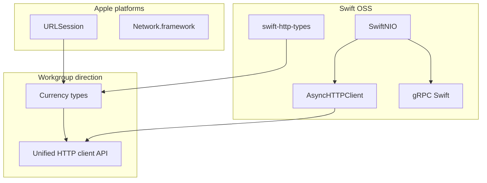
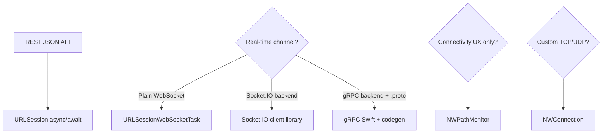
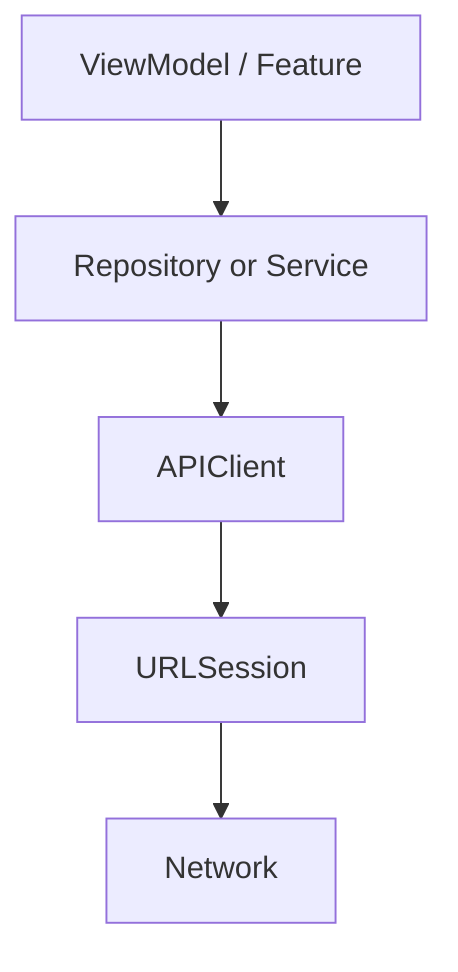
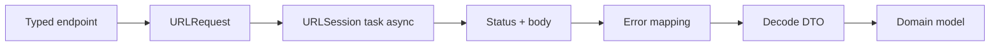
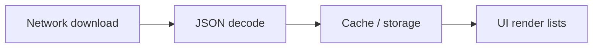

# Networking

## Apple docs

- [Loading and parsing data from the network](https://developer.apple.com/documentation/foundation/url_loading_system).
- [Background URLSession](https://developer.apple.com/documentation/foundation/urlsessionconfiguration/1411552-backgroundsessionconfiguration).

- [WWDC26 — gRPC and Swift (265)](https://developer.apple.com/videos/play/wwdc2026/265/) — gRPC Swift, Protobuf codegen, streaming RPC, client lifecycle.

## 🎯 Focus vs Defer

### Focus

### Defer

## 📚 Key terms (Q&A)

## Libraries & lower-level APIs

### Swift networking ecosystem (direction)

### Transport choice (typical)

## Diagrams

### App stack (typical)

### Request pipeline (inside APIClient)

### Throughput (cross-layer) {#throughput-cross-layer}

## 🏋️ Exercises

## 🌟 Senior+ (strategic)

## Artifacts

- Notes: `notes/`
- Exercises: `exercises/`
- Assets: `assets/`
- Playgrounds: `playgrounds/`

### Recent notes

- [`notes/GRPC-Swift-WWDC26.md`](notes/GRPC-Swift-WWDC26.md) — gRPC Swift, Protobuf codegen, streaming RPC, client lifecycle (WWDC26-265)

- `notes/throughput-estimation-for-large-data.md`

---

## TL;DR

## Source

## What throughput means on iOS

## Baseline solutions you cannot skip

### Problem

### Idea

### Practical meaning

## 2) Response compression: gzip vs Brotli

### Problem

### Idea

### Practical meaning

## 3) Partial rendering and precomputed layout

### Problem

### Idea

## What it means for architecture

## Practical takeaways

## Mini checklist

---## Interview Q&A (Knowledge cards)

Interview Q&A below.

<!-- knowledge-cards-canonical:start -->

### Q29
- **Question:** How do you build a reliable `URLSession` API client?

- **Answer:** “Building” a client means a dedicated module that turns an endpoint description into a typed result: one configured `URLSession`, a repeatable pipeline, and injectable pieces for testing—not only tweaking session knobs.

    1. Shell — an `APIClient`-style type owning/receiving `URLSession`, exposing a small surface (`send`/`fetch`). Enables shared rules, test doubles (`URLProtocol`), and environment swaps.

    2. Transport — tuned `URLSessionConfiguration` (timeouts, `waitsForConnectivity`, connection limits, cache policy). Optional session delegate for TLS/auth challenges when pinning matters.

    3. Request pipeline — compose `URLRequest` from typed endpoints (URL, method, shared headers, auth header hook, encoded body). One code path prevents drift across features.

    4. Execution policy — async tasks with cooperative cancellation, deliberate retries/backoff, centralized mapping from HTTP status, payloads, and `URLError` into app errors.

    5. Contract — typed encodable/decodable models plus one decoding convention for success vs API error envelopes.

    6. Observability — correlation headers, logging/metrics, `URLSessionTaskMetrics` for latency breakdowns.

    1. Dedicated client type + single session + pipeline to typed results.
    2. Session configuration (+ delegate when needed).
    3. Central `URLRequest` assembly (auth, encoding).
    4. Cancellation-aware execution, retries, unified error mapping.
    5. Typed decoding + observability.

### Q30
- **Question:** Where do you store access/refresh tokens?

    Frame it by threat model: far better than plist defaults for secrets; not a magic shield on a fully compromised device.

    2. Pick `kSecAttrAccessible` deliberately.
    3. Keep refresh tokens especially locked down; never log secrets.

### Q31
- **Question:** How do you design caching?

- **Answer:** Split responsibilities: server headers define cacheability and freshness (`Cache-Control`, `ETag`/`Last-Modified`, `Vary`); the client picks behavior via `URLRequest.cachePolicy` and optional custom `URLCache` on `URLSessionConfiguration`.

    Defaults: `URLSessionConfiguration.default` uses the shared `URLCache` when `urlCache` is nil; default `URLRequest.cachePolicy` is `useProtocolCachePolicy`, so HTTP caching applies unless headers forbid it—override per request when you must bypass (`reloadIgnoringLocalCacheData`). Background/ephemeral configs differ—check Apple docs.

    1. Protocol cache vs app-level cache.
    2. Headers vs `cachePolicy` / custom `URLCache`.
    4. Stale/stampede—see follow-up.

### Q32
- **Question:** What matters for background transfers?

- **Answer:** Use `URLSessionConfiguration.background(withIdentifier:)` with a unique, stable identifier. The **system** owns long-running transfers—your process may die while downloads/uploads continue.

    Recreate `URLSession` with the **same identifier** after relaunch so tasks reattach. Implement `URLSessionDelegate`/`URLSessionDownloadDelegate`—background sessions rely on delegate callbacks, not “fire-and-forget” completion handlers alone.

    Implement `application(_:handleEventsForBackgroundURLSession:completionHandler:)` and **always** call the completion handler after you finish handling delegate work—otherwise background runtime may end early.

    Persist bookkeeping outside RAM; move downloaded files out of the temporary location promptly; use resume data APIs when you need resumable downloads.

    1. Background configuration + stable identifier.
    2. Delegate + recreate session after relaunch with same id.
    3. Call the app delegate completion handler after processing.
    4. Don’t trust RAM for progress; move temp download files immediately.

### Q33
- **Question:** REST-ish HTTP verbs—GET/POST/PUT/PATCH/DELETE; safe vs idempotent; query vs body?

- **Answer:** Verbs express intent. **Safe** methods should not have server-side side effects like mutations. **Idempotent** means repeating the same request does not *accumulate extra* effects beyond what one successful call implies—**not** “always fresh data.” **PUT** replaces; **PATCH** patches; **POST** is often neither safe nor idempotent unless designed (e.g. idempotency keys).

### Q34A

- **Question:** HTTP vs HTTPS and TLS?

- **Answer:** Hook: HTTPS wraps the same HTTP semantics in TLS—encrypts on the wire and authenticates the server via its certificate chain.

### Q34B

- **Question:** Why does idempotency matter for retries?

- **Answer:** Retries replay the same request—without idempotency you risk duplicated side effects (double charges). Idempotent APIs or Idempotency-Key headers make retries safe.

### Q34C

- **Question:** Connect timeout vs resource timeout?

- **Answer:** Resource caps end-to-end task time; request caps idle time between received chunks after connect—different failure modes.

### Q34D

- **Question:** How do `Cache-Control`, `ETag`, `If-None-Match`, and `304` work?

- **Answer:** Cache-Control = freshness policy; conditional GET with If-None-Match + ETag → `304` reuses stored body, else `200` with new body.

### Q34E

- **Question:** Role of gzip / Brotli compression?

- **Answer:** Client advertises supported codecs; server may compress body (`Content-Encoding`). Trade bandwidth for CPU.

### Q34F

- **Question:** Offset/limit vs cursor pagination?

- **Answer:** Offset skips rows—mutations shift windows (skips/duplicates). Cursor pages after a stable bookmark (opaque token or sort key + tie-breaker).

### Q34G

- **Question:** Why backoff with jitter?

- **Answer:** Backoff spaces retries out; jitter avoids synchronized retry spikes after outages.

### Q34H

---
### Q45
- **Question:** Minimal `URLSession` request flow?

- **Answer:** Build `URLRequest`, run session task, cast to `HTTPURLResponse`, validate status, then decode—classify transport vs HTTP vs decoding failures.

### Q46
- **Question:** How do you unit-test networking without hitting the real network?

- **Answer:** Keep unit tests fast and deterministic—avoid real HTTP. Either inject a **fake HTTP client** that returns canned `(Data, URLResponse)` / throws, or register a custom **`URLProtocol`** via **`protocolClasses`** on a dedicated **`URLSession`** so `startLoading` feeds synthetic responses. Don’t poison `URLSession.shared`. Assert request assembly, status/body handling, error mapping, retries, and cancellation; leave real TLS and timing to integration tests.

### Q47
- **Question:** What are the seven URLSession lifecycle stages and what matters at each?

- **Answer:** Configuration → URLRequest → create task (suspended) → resume → network I/O → response/cache → complete. Session config is fixed at creation; HTTP 4xx/5xx are not URLSession errors—you validate `HTTPURLResponse`. After cancel, create a new task.

- **Playground:** [open](OfflineFirstSync.playground/Contents.swift)

- **Notes:** [URLSession-Lifecycle-iOS-IQ.md](notes/URLSession-Lifecycle-iOS-IQ.md)
### Q48
- **Question:** When is native `URLSession` enough vs Alamofire, Moya, Network.framework, or Socket.IO?

- **Answer:** Default to **`URLSession` + async/await** for REST. Use **`URLSessionWebSocketTask`** only for plain WebSocket servers. **Socket.IO** requires a Socket.IO client—not a generic WebSocket task. **`NWPathMonitor`** for reachability; **`NWConnection`** for sub-HTTP transports. **Alamofire/Moya** when the team already relies on them or needs their interceptor/multipart stack—not for trivial Codable REST. **gRPC Swift** when the backend contract is Protobuf/gRPC and you need typed streaming—not as a default over REST.

    1. REST → URLSession + typed client.
    2. Plain WebSocket → URLSessionWebSocketTask.
    3. Socket.IO → dedicated client, not generic WS.
    4. Path monitoring → NWPathMonitor.
    5. Third-party HTTP libs only when they earn their weight.
    6. gRPC Swift when backend is gRPC—not a REST replacement by default.

<!-- knowledge-cards-canonical:end -->
