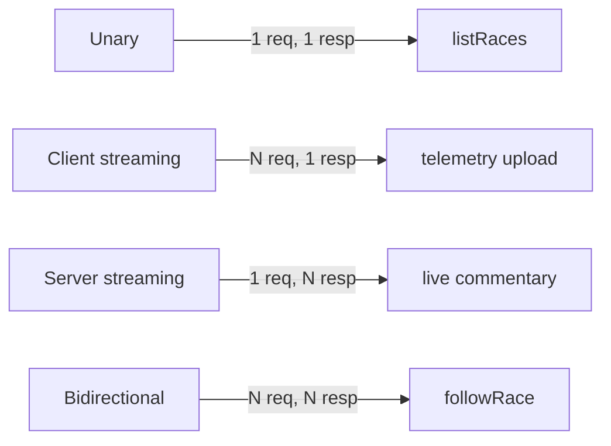
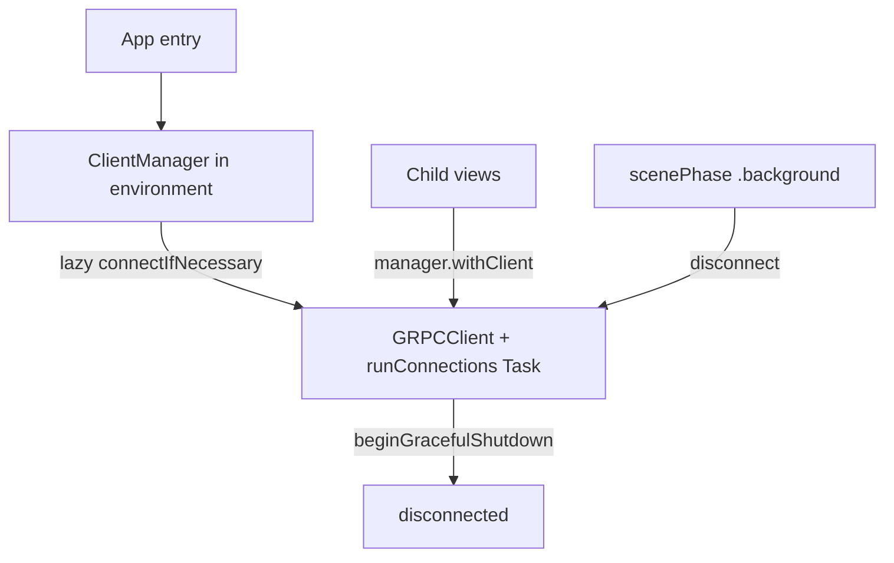

# gRPC Swift — WWDC26

Конспект для темы **Networking**. Источник: [WWDC26 — Build real-time apps and services with gRPC and Swift (265)](https://developer.apple.com/videos/play/wwdc2026/265/). Связь: [Networking README](../README.md) (**Q48**), [OpenAPI Generator (WWDC23)](https://developer.apple.com/videos/play/wwdc2023/10171/).

---

## За 30 секунд


_English summary — expand «По-русски» for the full Russian text._


<details class="lang-ru">
<summary>По-русски</summary>

**gRPC** — RPC-фреймворк (CNCF) поверх HTTP/2: API описывают в **Protocol Buffers** (`.proto`), клиент и сервер **генерируются** из спецификации. **gRPC Swift** — runtime на **Swift Concurrency** (async/await, async sequences). На iOS: unary для CRUD-списков, **streaming RPC** — для live-карт, лидербордов, чатов. Один **shared client** в environment; **disconnect** в background. Альтернатива ручному REST + самодельному WebSocket-протоколу, когда backend уже на gRPC.

---

</details>


## gRPC vs REST vs WebSocket

_English summary — expand «По-русски» for full text (gRPC vs REST vs WebSocket)._

<details class="lang-ru">
<summary>По-русски</summary>

| | REST + `URLSession` | Plain WebSocket | gRPC |
|---|----------------------|-----------------|------|
| Контракт | OpenAPI / docs / Codable | Часто ad-hoc JSON/events | `.proto` — source of truth |
| Codegen | OpenAPI Generator (WWDC23) | Нет | `GRPCProtobufGenerator` |
| Real-time | Polling, SSE | Двусторонний канал | 4 стиля RPC, в т.ч. bidirectional |
| Payload | JSON (текст) | Обычно JSON/text | Protobuf (бинарный, ~2× компактнее JSON) |
| Транспорт | HTTP/1.1–2 | WS поверх HTTP | HTTP/2 |

**Когда gRPC на клиенте:** backend отдаёт `.proto`; нужны typed streaming; много service-to-service контрактов; мобильный трафик критичен. **Когда нет:** простой public REST, CDN, браузерные клиенты без gRPC — остаётся `URLSession`.

---

</details>

## Четыре стиля RPC

_English summary — expand «По-русски» for full text (Четыре стиля RPC)._

<details class="lang-ru">
<summary>По-русски</summary>



| Стиль | Клиент | Сервер | Пример |
|-------|--------|--------|--------|
| **Unary** | 1 message | 1 message | `listRaces` |
| **Client streaming** | stream | 1 message | телеметрия картов на сервер |
| **Server streaming** | 1 message | stream | текстовая трансляция гонки |
| **Bidirectional** | stream | stream | подписка на события + смена фильтра в полёте |

В `.proto` streaming — ключевое слово `stream` перед типом:

```protobuf
rpc FollowRace(stream FollowRaceRequest) returns (stream FollowRaceResponse);
```

---

</details>

## Setup в Xcode (клиент)

_English summary — expand «По-русски» for full text (Setup в Xcode (клиент))._

<details class="lang-ru">
<summary>По-русски</summary>

**SPM-пакеты:**

- `grpc-swift-nio-transport` — HTTP/2 transport на SwiftNIO
- `grpc-swift-protobuf` — build plugin **GRPCProtobufGenerator**

**Build Phases → Run Build Tool Plug-ins → GRPCProtobufGenerator.** Конфиг `grpc-swift-proto-generator-config.json`:

```json
{
    "generate": {
        "clients": true,
        "servers": false,
        "messages": true
    }
}
```

Плагин сканирует `.proto` в target; при первом запуске Xcode просит **trust the plugin**.

**Импорты в app:**

```swift
import GRPCCore
import GRPCNIOTransportHTTP2
import SwiftProtobuf
```

---

</details>

## Unary RPC

_English summary — expand «По-русски» for full text (Unary RPC)._

<details class="lang-ru">
<summary>По-русски</summary>

```protobuf
service SwiftKartService {
  rpc ListRaces(ListRacesRequest) returns (ListRacesResponse);
}
```

```swift
try await withGRPCClient(
    transport: .http2NIOTS(
        address: .ipv4(host: "127.0.0.1", port: 8080),
        transportSecurity: .tls
    )
) { client in
    let kart = SwiftKartService.Client(wrapping: client)
    let response = try await kart.listRaces(ListRacesRequest())
    // map response.races → view models
}
```

`GRPCClient` знает только **transport** (host, TLS). Сгенерированный `SwiftKartService.Client` знает **методы сервиса**.

---

</details>

## Lifecycle клиента

_English summary — expand «По-русски» for full text (Lifecycle клиента)._

<details class="lang-ru">
<summary>По-русски</summary>

**Антипаттерн:** новый `withGRPCClient` на каждый `.onAppear` — лишний connect latency.

**Паттерн WWDC26:** `ClientManager` (`@Observable`, `Sendable`):



- **Lazy connect** при первом `withClient`
- **`client.runConnections()`** в фоновом `Task`
- **`disconnect()`** + `beginGracefulShutdown()` при уходе в background
- Деплой: `target: .dns(host:)` + `transportSecurity: .tls` (Cloud Run с `--use-http2`)

---

</details>

## Bidirectional streaming (FollowRace)

_English summary — expand «По-русски» for full text (Bidirectional streaming (FollowRace))._

<details class="lang-ru">
<summary>По-русски</summary>

Клиент шлёт подписки (какие `event_types`), сервер фильтрует поток событий. Подписка меняется в runtime — через `AsyncStream<Bool>` (показ лидерборда) и `onChange`.

```swift
try await kart.followRace { requestStream in
    for await showLeaderboard in stream {
        var message = FollowRaceRequest()
        message.raceName = race.name
        message.eventTypes = [.kartLocations]
        if showLeaderboard { message.eventTypes.append(.standings) }
        try await requestStream.write(message)
    }
} onResponse: { responseStream in
    for try await message in responseStream.messages {
        if let event = message.event { await handleEvent(event) }
    }
}
```

**Сервер:** `request` — `RPCAsyncSequence`, `response` — `RPCWriter`; `withThrowingTaskGroup` — одна задача стримит события, другая читает смену подписки из request stream; конец request stream → `cancelAll()`.

---

</details>

## Protobuf на wire

_English summary — expand «По-русски» for full text (Protobuf на wire)._

<details class="lang-ru">
<summary>По-русски</summary>

- Поля идентифицируются **field number**, не именем → меньше байт, чем JSON
- **Well Known Types:** `google.protobuf.Timestamp`, `Duration`
- **`oneof`** в proto ≈ enum с associated values в Swift (`FollowRaceResponse.OneOf_Event`)
- Swift types — через **SwiftProtobuf** (`Race()`, `serializedBytes()`)

---

</details>

## Production (упомянуто в сессии, не в demo)


- Client-side **load balancing**, **retries**, custom **name resolvers**
- **Swift OTel**, **Swift Service Lifecycle**
- gRPC Swift в Apple: Containerization (VM IPC), Private Cloud Compute, iCloud Keychain/Photos, SharePlay file sharing

---

## Deploy сервера (кратко)

_English summary — expand «По-русски» for full text (Deploy сервера (кратко))._

<details class="lang-ru">
<summary>По-русски</summary>

Swift server → multi-stage **Containerfile** → registry → Cloud Run с `--use-http2`. iOS client переключается с `plaintext` localhost на **DNS + TLS**.

---

</details>

## Interview Q&A

_English summary — expand «По-русски» for full text (Interview Q&A)._

<details class="lang-ru">
<summary>По-русски</summary>

**Почему не писать networking вручную?** Спека устаревает; расхождение DTO; gRPC/OpenAPI генерируют клиент из source of truth.

**gRPC vs OpenAPI?** OpenAPI — HTTP-ресурсы; gRPC — функции + streaming first-class. Оба с codegen в Swift-экосистеме.

**Почему один client на app?** HTTP/2 multiplexing, reuse connections, меньше handshake.

**Почему disconnect в background?** Батарея, лимиты ОС, освобождение сокетов; reconnect при возврате через lazy connect.

**Когда bidirectional, а не server streaming?** Клиент должен **менять подписку** без нового RPC (фильтры, каналы чата).

---

</details>

## Official links


- [WWDC26-265 — gRPC and Swift](https://developer.apple.com/videos/play/wwdc2026/265/)
- [grpc-swift (GitHub)](https://github.com/grpc/grpc-swift)
- [Protocol Buffers](https://protobuf.dev/)
- [WWDC23 — Meet Swift OpenAPI Generator](https://developer.apple.com/videos/play/wwdc2023/10171/)
- [WWDC24 — Explore the Swift on Server ecosystem](https://developer.apple.com/videos/play/wwdc2024/10216/)
