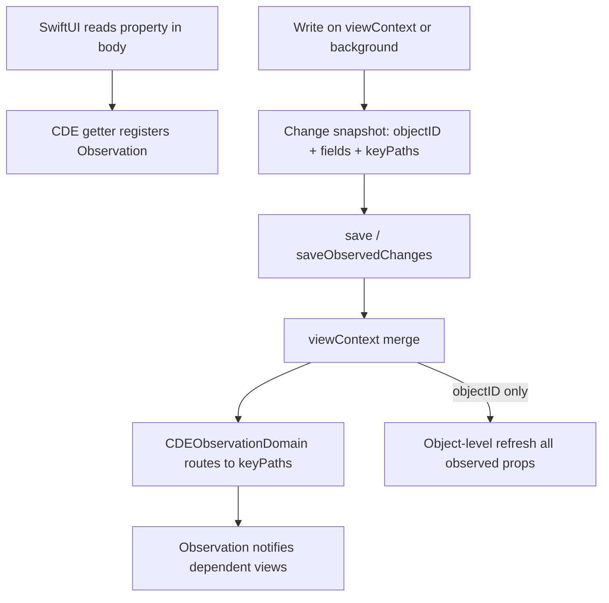

# Core Data + Observation

Конспект для темы **Storage & Persistence**. Источник: [Fatbobman — Core Data + Observation](https://fatbobman.com/en/posts/core-data-observation-freer-mental-model/) (реализация в [CoreDataEvolution](https://github.com/fatbobman/CoreDataEvolution)). Связь: [Storage README](../README.md) (**Q50**), [SwiftUI Observation](../../../ios-sdk/swiftui/README.md).

---

## За 30 секунд

**Observation** (iOS 17+) даёт **property-level** reactivity: view перерисовывается только если изменилось прочитанное поле. **SwiftData** интегрирует это нативно; **Core Data** — нет: классический путь — `@ObservedObject` на каждый `NSManagedObject` по цепочке relationship, иначе UI «глухой» или лишние refresh.

**CDE (Core Data Evolution)** — мост: `@PersistentModel(observation: .mainActor)` + `CDEObservationDomain`. Модель: **подписка при чтении**, **публикация после save/merge**. Property-level — только когда известны изменённые поля; иначе честный fallback на object-level. Не замена Core Data и не «SwiftData-клон» — узкий слой для SwiftUI.

---

## Observation vs ObservableObject (mental model)

| | `ObservableObject` + `@Published` | `@Observable` (Observation) |
|---|-----------------------------------|-----------------------------|
| Граница | Объект целиком | Конкретное свойство по read path |
| Relationship chain | Часто split views + `@ObservedObject` на каждом MO | Чтение `memo.item.note.color` трекается по пути |
| SwiftUI refresh | Любой `@Published` → все подписчики | Только view, прочитавшие поле |

```swift
@Observable
class A {
    var a = 10
    var b = B()
}

@Observable
class B {
    var b = 10
}

class Root {
    let a = A()

    var b: Int {
        a.b.b
    }
}
```

View, читающая `root.b`, подписывается на `a.b.b` — без wrapper-типов «ради observation».

---

## Проблема Core Data в SwiftUI

Цепочка `Note → Item → ItemData → Memo`. В SwiftData:

```swift
HStack {
    Image(systemName: memo.itemData.item.symbol)
    Text(memo.content)
        .foregroundStyle(memo.itemData.item.note.color)
}
```

Property reads по relationship участвуют в Observation. В Core Data без моста — **отдельный `struct View` + `@ObservedObject`** на каждый `NSManagedObject` в цепочке, иначе промежуточные изменения не доходят до финальной view. Структура UI диктуется механизмом observation, а не доменом.

---

## CDE: границы capability

**Не** universal Core Data observation system. Фокус — SwiftUI pain point: читать properties/relationships на `NSManagedObject` без `@ObservedObject`.

| Граница | Правило |
|---------|---------|
| Actor | MainActor; для SwiftUI |
| Precision | Property-level только при известных changed fields |
| Fallback | Object-level refresh при CloudKit merge, batch update, rollback |
| Timing | После save/merge, не в setter |
| Scope | Persistent properties + relationship accessors от `@PersistentModel` |
| Platform | iOS 17+ / Observation; Swift 6.2+ для CDE |

**Принцип:** subscribe on read → publish after successful save.

---

## Поток изменений



---

## Источники изменений и точность

| Источник | Информация | Точность |
|----------|------------|----------|
| Local save в `viewContext` | objectID + changed fields | Property-level |
| `@NSModelActor.saveObservedChanges()` / `observation.saveObservedChanges(in:)` | Snapshot до save → merge | Property-level |
| CloudKit / unregistered context merge | Обычно только objectID | Object-level |
| Batch update/delete, refresh, rollback | objectID или нет | Object-level / нет гарантии |
| Echo от CloudKit / Persistent History | Тот же save снова | Фильтр echo; сохранить исходную точность |

**Background writes:** для property-level CDE должен записать «какие поля изменились» **до** save — иначе `changedValues` уже неполны. `save()` без wrapper → coarse path.

---

## Usage (CDE)

```swift
@objc(Item)
@PersistentModel(observation: .mainActor)
final class Item: NSManagedObject {
    var title: String = ""
    var summary: String = ""

    @Relationship(inverse: "items", deleteRule: .nullify)
    var tag: Tag?
}
```

```swift
struct ItemRow: View {
    let item: Item

    var body: some View {
        VStack(alignment: .leading) {
            Text(item.title)
            Text(item.tag?.name ?? "")
        }
    }
}
```

Без `@ObservedObject` на `Item` или `Tag`. Типы по цепочке relationship тоже с `observation: .mainActor`.

```swift
@MainActor
final class Store {
    let container: NSPersistentContainer
    let observation: CDEObservationDomain

    init(container: NSPersistentContainer) {
        self.container = container
        observation = CDEObservationDomain(container: container)
    }
}
```

Background actor:

```swift
@NSModelActor
actor ItemWriter {
    func rename(id: NSManagedObjectID, to title: String) async throws {
        guard let item = self[id, as: Item.self] else { return }
        item.title = title
        try await saveObservedChanges()
    }
}

let writer = ItemWriter(observationDomain: store.observation)
```

`saveObservedChanges()` — для **update** существующих объектов; insert/delete — обычный save.

---

## Engineering challenges (interview angles)

1. **Timing snapshot** — `changedValues` не ledger; после save/merge/refresh поля могут быть неполны → capture до merge consumption.
2. **Notification echo** — CloudKit / PHT может вернуть тот же objectID → dilute property-level в object-level; нужен короткий фильтр, не глушить легитимные будущие изменения.
3. **Relationship fan-out** — не сканировать весь object graph; bounded routing по affected objects + known mappings.
4. **Honest degradation** — objectID-only не маскировать под keyPath; overpromise хуже conservative fallback.

**Cost model:** routing O(изменения в транзакции), не O(registered objects × graph size). Worst case = object-level invalidation ≈ потолок `@ObservedObject`.

---

## Когда что на собесе

| Сценарий | Подход |
|----------|--------|
| Greenfield SwiftUI, простой graph | SwiftData + `@Query` |
| Legacy Core Data, complex migration | Core Data + threading rules (**Q33**) |
| Core Data + SwiftUI, relationship-heavy UI | CDE Observation **или** split views + `@ObservedObject` |
| Background writes + precise UI | `saveObservedChanges` / observed background context |

**CDE vs SwiftData:** CDE не заменяет `.xcdatamodeld`; добавляет Swift-first слой и Observation bridge. SwiftData — когда можно мигрировать стек целиком.

---

## Interview Q&A

### Q1
- **Question (RU):** Почему `@ObservedObject` на `NSManagedObject` — боль в SwiftUI?
- **Question (EN):** Why is `@ObservedObject` on `NSManagedObject` painful in SwiftUI?
- **Answer (RU):** Граница observation на **объекте**, не на поле. Relationship chain требует split views и `@ObservedObject` на каждом MO — иначе промежуточные изменения не propagating. UI структурируется под observation, не под домен.
- **Answer (EN):** Object-level observation forces view splitting along the MO chain; Observation property-level reads align UI structure with business semantics.

### Q2
- **Question (RU):** Когда property-level reactivity для Core Data **не** гарантирована?
- **Question (EN):** When is property-level Core Data reactivity not guaranteed?
- **Answer (RU):** CloudKit/external merge (часто только objectID), batch update/delete, refresh, rollback, save без observed wrapper с background context. CDE degrades to object-level или без instance guarantee — **честно**, не притворяясь keyPath precision.
- **Answer (EN):** Insufficient change metadata → object-level or no guarantee; never fake property-level updates.

### Q3
- **Question (RU):** Зачем `saveObservedChanges()` вместо обычного `save()`?
- **Question (EN):** Why `saveObservedChanges()` instead of plain `save()`?
- **Answer (RU):** Field-level snapshot нужен **до** save, пока `changedValues` надёжен. Background path: metadata → merge в `viewContext` → Domain публикует keyPaths. Прямой `save()` без snapshot → coarse refresh.
- **Answer (EN):** Capture changed fields before save; background merges consume snapshot on main context merge.

---

## Official & further reading

- [Observation](https://developer.apple.com/documentation/observation) — framework.
- [Using Core Data in your app](https://developer.apple.com/documentation/coredata/using_core_data_in_your_app).
- [Using Core Data in the background](https://developer.apple.com/documentation/coredata/using_core_data_in_the_background).
- [WWDC23 — Discover Observation in SwiftUI](https://developer.apple.com/videos/play/wwdc2023/10149/).
- [Core Data + Observation (Fatbobman)](https://fatbobman.com/en/posts/core-data-observation-freer-mental-model/).
- [CoreDataEvolution — MainActor Observation Guide](https://github.com/fatbobman/CoreDataEvolution) (Docs).
