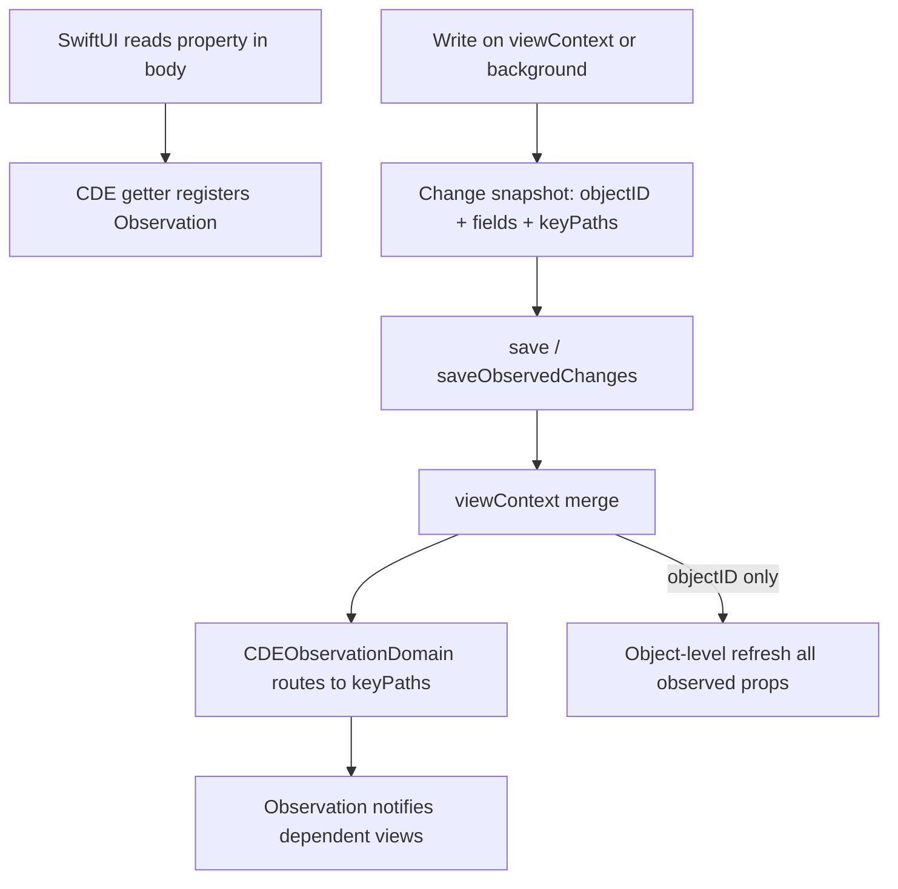

# Core Data + Observation

Notes for **Storage & Persistence**. Source: [Fatbobman — Core Data + Observation](https://fatbobman.com/en/posts/core-data-observation-freer-mental-model/) (implementation in [CoreDataEvolution](https://github.com/fatbobman/CoreDataEvolution)). Related: [Storage README](../README.md) (**Q50**), [SwiftUI Observation](../../../ios-sdk/swiftui/README.md).

---

## In 30 seconds

## Observation vs ObservableObject (mental model)

## Core Data problem in SwiftUI

## CDE: capability boundaries

## Change flow



---

## Change sources and precision

## Usage (CDE)

```swift
@objc(Item)
@PersistentModel(observation: .mainActor)
final class Item: NSManagedObject {
    var title: String = ""
    var summary: String = ""

    @Relationship(inverse: "items", deleteRule: .nullify)
    var tag: Tag?
}
```

```swift
struct ItemRow: View {
    let item: Item

    var body: some View {
        VStack(alignment: .leading) {
            Text(item.title)
            Text(item.tag?.name ?? "")
        }
    }
}
```

No `@ObservedObject` on `Item` or `Tag`. Types along the relationship chain also use `observation: .mainActor`.

```swift
@MainActor
final class Store {
    let container: NSPersistentContainer
    let observation: CDEObservationDomain

    init(container: NSPersistentContainer) {
        self.container = container
        observation = CDEObservationDomain(container: container)
    }
}
```

Background actor:

```swift
@NSModelActor
actor ItemWriter {
    func rename(id: NSManagedObjectID, to title: String) async throws {
        guard let item = self[id, as: Item.self] else { return }
        item.title = title
        try await saveObservedChanges()
    }
}

let writer = ItemWriter(observationDomain: store.observation)
```

`saveObservedChanges()` — for **update** of existing objects; insert/delete use a regular save.

---

## Engineering challenges (interview angles)

## What to use when (interview)

## Interview Q&A

### Q1
- **Question:** Why is `@ObservedObject` on `NSManagedObject` painful in SwiftUI?

- **Answer:** Object-level observation forces view splitting along the MO chain; Observation property-level reads align UI structure with business semantics.

### Q2
- **Question:** When is property-level Core Data reactivity not guaranteed?

- **Answer:** Insufficient change metadata → object-level or no guarantee; never fake property-level updates.

### Q3
- **Question:** Why `saveObservedChanges()` instead of plain `save()`?

- **Answer:** Capture changed fields before save; background merges consume snapshot on main context merge.

---

## Official & further reading

- [Observation](https://developer.apple.com/documentation/observation) — framework.

- [Using Core Data in your app](https://developer.apple.com/documentation/coredata/using_core_data_in_your_app).

- [Using Core Data in the background](https://developer.apple.com/documentation/coredata/using_core_data_in_the_background).

- [WWDC23 — Discover Observation in SwiftUI](https://developer.apple.com/videos/play/wwdc2023/10149/).

- [Core Data + Observation (Fatbobman)](https://fatbobman.com/en/posts/core-data-observation-freer-mental-model/).

- [CoreDataEvolution — MainActor Observation Guide](https://github.com/fatbobman/CoreDataEvolution) (Docs).
