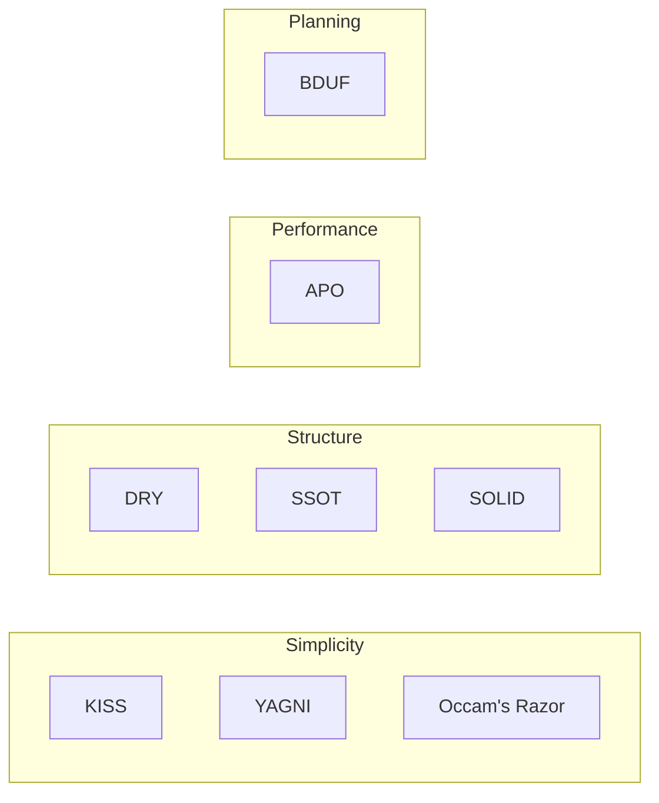

# Development Principles

> **Source:** [@swiftynew](https://t.me/swiftynew) — *Development Principles* (KISS, DRY, YAGNI, BDUF, SOLID, APO, Occam's Razor).

## За 30 секунд

Development principles are decision guides, not dogma. They help you keep code readable, testable, and easy to change. Interviewers rarely test acronym recall — they want you to **reason about trade-offs**: when to extract shared logic (DRY), when to stop adding layers (YAGNI, KISS, Occam), when to plan before coding (BDUF), how SOLID reduces coupling in Swift (protocols, SRP), and when to optimize only after measurement (APO). Middle+ engineers explain **why** a solution is simple enough, not just that they "follow SOLID."

## Apple docs

- [The Swift Programming Language — Protocols](https://docs.swift.org/swift-book/documentation/the-swift-programming-language/protocols) — abstraction boundaries for DIP and ISP.
- [Improving app performance](https://developer.apple.com/documentation/xcode/improving-app-performance) — measure before optimizing (APO).
- [Analyzing performance](https://developer.apple.com/documentation/xcode/analyzing-performance) — Instruments, Time Profiler, Allocations.

## 🎯 Focus vs Defer

### Focus

- **YAGNI** — ship only what the current task needs; delete dead code during refactors (git history preserves it).
- **DRY + SSOT** — one source of truth for rules and data; duplication multiplies maintenance and test surface.
- **KISS** — simplest solution that satisfies requirements; complexity should come from the product, not from tooling fashion.
- **BDUF (lightweight)** — think through constraints and architecture **before** large implementation; align with the team early.
- **SOLID (especially SRP, OCP, DIP in iOS)** — single responsibility per type, extend via protocols/composition, depend on abstractions.
- **APO** — optimize only after Instruments proves a bottleneck.
- **Occam's Razor** — among working options, pick the simplest sufficient one.

### Defer

- Memorizing SOLID letter expansions without Swift examples.
- Treating BDUF as months of upfront design with no iteration.
- Applying DRY to three-line UI duplicates that will diverge anyway.
- Micro-optimizing before profiling.

## Ключевые понятия

| Principle | Full name | One-line meaning |
|-----------|-----------|------------------|
| **YAGNI** | You Aren't Gonna Need It | Write only what today's task requires |
| **DRY** | Don't Repeat Yourself | One source of truth for important logic |
| **SSOT** | Single Source of Truth | Change data/rules in one place |
| **KISS** | Keep It Simple, Stupid | Pick the simplest adequate solution |
| **BDUF** | Big Design Up Front | Plan task, constraints, and architecture before coding |
| **SOLID** | — | Five OOP design principles that reduce coupling |
| **APO** | Avoid Premature Optimization | Optimize only confirmed performance problems |
| **Occam's Razor** | — | Do not multiply entities without necessity |

### SOLID breakdown

| Letter | Principle | iOS hook |
|--------|-----------|----------|
| **S** | Single Responsibility | VC = UI; service = network; ViewModel = screen state |
| **O** | Open/Closed | Extend via new types/protocols, not endless edits to core logic |
| **L** | Liskov Substitution | Subtypes honor the contract of the base type |
| **I** | Interface Segregation | Several small protocols beat one "god" protocol |
| **D** | Dependency Inversion | High-level modules depend on `protocol`, not concrete services |

### How principles combine



- **KISS + YAGNI** — keep solutions small; avoid speculative code.
- **DRY + SSOT** — do not scatter the same business rule across the project.
- **SOLID** — lower coupling so changes stay local.
- **APO + Occam** — do not add complexity without proven need.
- **BDUF** — fewer rewrites when architecture is agreed early.

## Как отвечать на интервью

1. **Name the trade-off**, not the acronym — e.g. "I'd extract shared validation once the second screen needs the same rules (DRY), but I wouldn't add a generic framework after one use (YAGNI)."
2. **Give a Swift boundary** — SRP: "This ViewModel owns screen state; networking lives in a `UserFetching` protocol implementation."
3. **Show measurement for performance** — "I'd profile with Time Profiler before caching or switching data structures (APO)."
4. **Acknowledge tension** — DRY vs YAGNI: abstract when the pattern is stable, not on the first duplicate.
5. **Connect to team process** — BDUF as a short design discussion or ADR, not a waterfall spec.

## Код и примеры

### YAGNI vs speculative abstraction

```swift
// ❌ YAGNI violation — generic "future" hook nobody asked for
protocol FeatureFlagRouting {
    func route(for flag: String, payload: [String: Any])
}

// ✅ Enough for the current story
func openProfile(userID: String) {
    router.push(ProfileView(userID: userID))
}
```

### DRY + SSOT — one validation rule

```swift
enum EmailValidator {
    static func isValid(_ email: String) -> Bool {
        let pattern = #"^[A-Z0-9._%+-]+@[A-Z0-9.-]+\.[A-Z]{2,}$"#
        return email.range(of: pattern, options: [.regularExpression, .caseInsensitive]) != nil
    }
}
```

Sign-up and password-reset screens both call `EmailValidator.isValid` — the regex lives in one place.

### KISS — prefer clarity over cleverness

```swift
// ✅ Straightforward
func formattedPrice(_ cents: Int) -> String {
    let dollars = Double(cents) / 100
    return String(format: "$%.2f", dollars)
}
```

### SOLID: SRP + DIP in MVVM

```swift
protocol SessionStoring: Sendable {
    func save(token: String) async throws
}

@MainActor
@Observable
final class LoginViewModel {
    private let sessionStore: any SessionStoring

    var email = ""
    var isLoading = false

    init(sessionStore: any SessionStoring) {
        self.sessionStore = sessionStore
    }

    func submit(token: String) async throws {
        isLoading = true
        defer { isLoading = false }
        try await sessionStore.save(token: token)
    }
}
```

ViewModel owns UI state (SRP). Storage is injected through a protocol (DIP). Tests swap a fake `SessionStoring`.

### SOLID: OCP + ISP — extend without editing core

```swift
protocol ImageLoading {
    func load(from url: URL) async throws -> Data
}

struct RemoteImageLoader: ImageLoading {
    private let session: URLSession

    init(session: URLSession = .shared) {
        self.session = session
    }

    func load(from url: URL) async throws -> Data {
        let (data, _) = try await session.data(from: url)
        return data
    }
}

struct CachingImageLoader: ImageLoading {
    private let loader: any ImageLoading
    private var cache: [URL: Data] = [:]

    init(loader: any ImageLoading) {
        self.loader = loader
    }

    func load(from url: URL) async throws -> Data {
        if let cached = cache[url] { return cached }
        let data = try await loader.load(from: url)
        cache[url] = data
        return data
    }
}
```

New behavior wraps existing loaders (OCP). Callers depend only on `ImageLoading` (ISP), not every concrete type.

### APO — measure first

Workflow for a "slow list":

1. Reproduce on device with realistic data.
2. **Time Profiler** — is layout, decoding, or I/O the hotspot?
3. **Allocations** — unexpected churn?
4. Fix the proven bottleneck (cell reuse, decode off main actor, pagination).
5. Re-profile to confirm.

Optimizing cell height caching before step 2 often adds code with no measurable win.

### Occam's Razor vs extra layers

Ask before adding a new service or coordinator:

- Does it remove real duplication or coupling?
- Can an existing type own this with one clear method?
- Will onboarding cost exceed the benefit?

If two designs work, pick the one with fewer moving parts.

## Ссылки

- [Clean Code (Martin)](https://www.pearson.com/en-us/subject-catalog/p/clean-code-a-handbook-of-agile-software-craftsmanship/P200000003284) — craftsmanship context for SOLID and readability
- [Refactoring (Fowler)](https://martinfowler.com/books/refactoring.html) — when and how to improve structure safely
- [The Pragmatic Programmer](https://pragprog.com/titles/tpp20/the-pragmatic-programmer-20th-anniversary-edition/) — DRY, tracer bullets, good-enough design
- Related in this knowledge base: [MVVM → TCA](../../architecture/patterns/) (SOLID Q&A, KISS/DRY/YAGNI **Q52**), [Design Patterns](../../algorithms/design-patterns/), [Performance](../../quality/performance/)

---

## Карточки знаний (Q&A)

<!-- knowledge-cards-canonical:start -->

### Q1
- **Question (RU):** Что такое **YAGNI** и когда его нарушают?
- **Question (EN):** What is YAGNI and when do teams violate it?
- **Answer (RU):** **You Aren't Gonna Need It** — пишите только код для **текущей** задачи. Нарушение: фичи «на будущее», универсальные хуки без требования, лишние протоколы «на вырост». При рефакторинге мёртвый код можно удалять — git сохранит историю.
- **Answer (EN):** Build only what you need now. Violations include speculative features, unused extension points, and premature generalization. Delete dead code during refactors; version control preserves history.
- **Устная заготовка (RU):** «Не кодирую гипотезы — только то, что просит задача сейчас.»
- **Follow-up (RU):** YAGNI против тестов?
- **Follow-up answer (RU):** Тесты на **текущее** поведение — не YAGNI; тесты на воображаемые сценарии без требования — да.

### Q2
- **Question (RU):** **DRY** и **SSOT** — в чём разница?
- **Question (EN):** DRY vs SSOT — what's the difference?
- **Answer (RU):** **DRY** — не дублировать **важную логику** в нескольких местах. **SSOT** — конкретный приём: данные и правила меняются в **одном** месте (один validator, один mapper, один remote config source). DRY — принцип; SSOT — архитектурная цель.
- **Answer (EN):** DRY avoids repeating meaningful logic. SSOT means a single place owns data or rules. DRY is the principle; SSOT is the structural outcome.
- **Follow-up (RU):** Когда дублирование допустимо?
- **Follow-up answer (RU):** Когда абстракция ещё нестабильна или дубликаты **случайно похожи**, но по смыслу разойдутся — два явных фрагмента дешевле ложного DRY.

### Q3
- **Question (RU):** **KISS** — это «писать примитивно»?
- **Question (EN):** Does KISS mean writing primitive code?
- **Answer (RU):** Нет — **достаточно просто для задачи**. Сложность должна идти из **требований**, а не из модных паттернов. Простое решение легче читать, ревьюить и передавать команде.
- **Answer (EN):** No — as simple as the problem allows. Complexity should come from requirements, not from pattern chasing. Simple designs are easier to read, review, and maintain.

### Q4
- **Question (RU):** **BDUF** — это waterfall?
- **Question (EN):** Is BDUF the same as waterfall?
- **Answer (RU):** Нет в agile-смысле «заморозить всё». BDUF здесь — **осознанное проектирование до кода**: ограничения, границы модулей, спорные места с командой **раньше**, чтобы меньше переделок. Короткий design doc / ADR / схема на доске — достаточно.
- **Answer (EN):** Not full waterfall. It means thinking through constraints and architecture before large implementation — short design notes, team alignment, fewer rewrites.

### Q5
- **Question (RU):** Перечислите **SOLID** и дайте iOS-пример **SRP**.
- **Question (EN):** List SOLID and give an iOS SRP example.
- **Answer (RU):** **S**ingle Responsibility, **O**pen/Closed, **L**iskov Substitution, **I**nterface Segregation, **D**ependency Inversion. **SRP:** `UIViewController` — UI lifecycle; `NetworkClient` — HTTP; `LoginViewModel` — состояние экрана и команды. Один тип — одна зона ответственности.
- **Answer (EN):** Single Responsibility, Open/Closed, Liskov Substitution, Interface Segregation, Dependency Inversion. SRP example: VC handles UI, network service handles HTTP, ViewModel holds screen state.

### Q6
- **Question (RU):** **OCP** и **DIP** в Swift — как показать на собесе?
- **Question (EN):** How do you demonstrate OCP and DIP in Swift?
- **Answer (RU):** **OCP:** новое поведение через **новый тип** (wrapper, strategy), а не правки рабочего класса. **DIP:** ViewModel/UseCase зависит от `protocol ImageLoading`, а не от `URLSession` напрямую; конкретику собирают в composition root.
- **Answer (EN):** OCP: add behavior with new conforming types instead of editing stable code. DIP: depend on protocols; wire concretes at the composition root.

### Q7
- **Question (RU):** **APO** — что сказать про iOS?
- **Question (EN):** APO — what should you say about iOS?
- **Answer (RU):** **Avoid Premature Optimization** — оптимизируйте **подтверждённую** проблему. Сначала Instruments: Time Profiler, Allocations, FPS. Без измерения оптимизация часто усложняет код без выигрыша.
- **Answer (EN):** Optimize only proven bottlenecks. Profile with Instruments first; otherwise you risk complexity without measurable gain.

### Q8
- **Question (RU):** **Бритва Оккама** vs **KISS** и **YAGNI**?
- **Question (EN):** Occam's Razor vs KISS and YAGNI?
- **Answer (RU):** **Оккам:** из рабочих вариантов — **минимум сущностей** (слои, сервисы, типы). **KISS** — простота решения. **YAGNI** — не писать ненужное. Вместе: не добавлять абстракцию без понятной пользы.
- **Answer (EN):** Occam picks the fewest entities among valid designs. KISS favors simple solutions. YAGNI avoids unneeded features. Together they curb unnecessary layers.

### Q9
- **Question (RU):** Конфликт **DRY** и **YAGNI** — как решать?
- **Question (EN):** DRY vs YAGNI — how do you resolve the tension?
- **Answer (RU):** Выносить общий код, когда повтор отражает **одно и то же правило** и паттерн **стабилен**. Не выносить на первом похожем фрагменте — иначе абстракция сломается на втором кейсе. Правило трёх повторений — практичный ориентир.
- **Answer (EN):** Extract when duplication reflects the same stable rule. Wait if the pattern might diverge; premature abstraction breaks on the next use case.

### Q10
- **Question (RU):** Как принципы проверяют на интервью?
- **Question (EN):** How are these principles tested in interviews?
- **Answer (RU):** Не расшифровки, а **рассуждение**: почему этот дизайн проще, где граница ответственности, когда не стоит оптимизировать, как бы вы упростили перегруженный VC. Middle+ — уметь **объяснить решение**, а не назвать пять букв SOLID.
- **Answer (EN):** Interviewers want reasoning about simplicity, boundaries, and trade-offs — not acronym recitation. Senior candidates justify design choices with principles.

<!-- knowledge-cards-canonical:end -->
