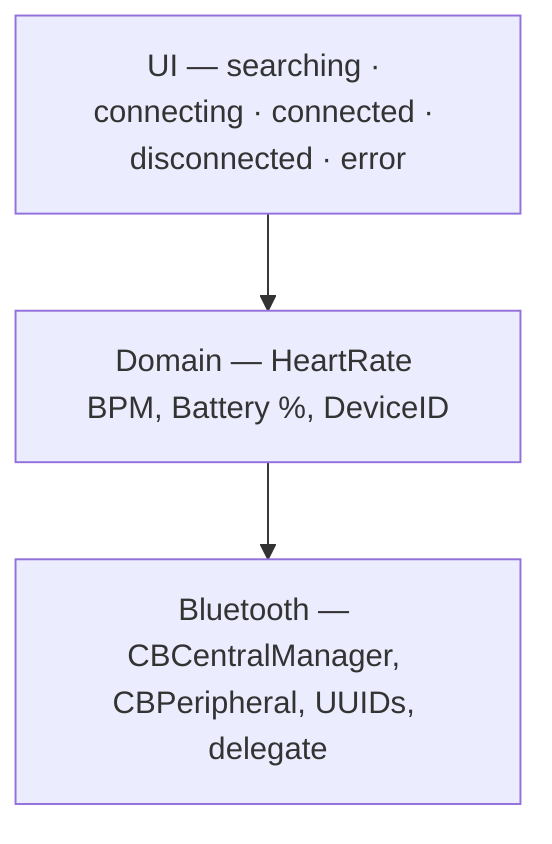
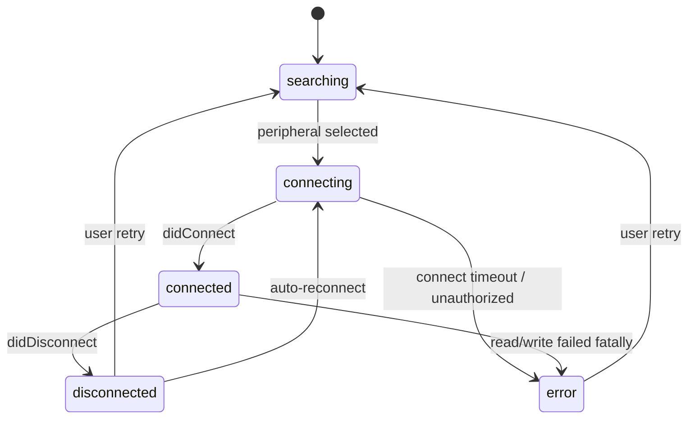

# Core Bluetooth & BLE

## In 30 seconds

**Bluetooth Low Energy (BLE)** is not a cable — it is a **GATT conversation**: Central scans for peripherals, connects, discovers **services** and **characteristics**, then **reads**, **writes**, or **subscribes** to values. **Core Bluetooth** is Apple's framework for both **Central** (`CBCentralManager`) and **Peripheral** (`CBPeripheralManager`) roles. Production BLE is defined by **disconnects**, **background limits**, and **layered architecture** — not the happy-path connect flow. Interview depth: GATT hierarchy, delegate callbacks, notify vs read, state restoration, and why UI must not own `CBCentralManager`.

## Apple docs

- [Core Bluetooth](https://developer.apple.com/documentation/corebluetooth) — central and peripheral APIs.
- [Core Bluetooth Programming Guide](https://developer.apple.com/library/archive/documentation/NetworkingInternetWeb/Conceptual/CoreBluetooth_concepts/) — GATT model, roles, workflows.
- [CBCentralManager](https://developer.apple.com/documentation/corebluetooth/cbcentralmanager) — scan, connect, retrieve known peripherals.
- [CBPeripheral](https://developer.apple.com/documentation/corebluetooth/cbperipheral) — discover services/characteristics, read/write/notify.
- [Transferring Data Between Bluetooth Low Energy Devices](https://developer.apple.com/documentation/corebluetooth/transferring-data-between-bluetooth-low-energy-devices) — end-to-end data flow.
- [Performing Common Central Role Tasks](https://developer.apple.com/documentation/corebluetooth/performing-common-central-role-tasks) — scan → connect → explore.
- [Using Core Bluetooth Classic](https://developer.apple.com/documentation/corebluetooth/using-core-bluetooth-classic) — when Classic applies (not LE).
- [Core Bluetooth Background Processing](https://developer.apple.com/library/archive/documentation/NetworkingInternetWeb/Conceptual/CoreBluetooth_concepts/CoreBluetoothBackgroundProcessingForIOSApps/PerformingTasksWhileYourAppIsInTheBackground.html) — background modes, state preservation/restoration.

## Mental model — hotel analogy

**Infographic:** [`assets/ble-hotel-analogy.png`](assets/ble-hotel-analogy.png) · **Note:** [ble-hotel-mental-model.md](notes/ble-hotel-mental-model.md)

| Analogy | BLE / Core Bluetooth |
|---------|----------------------|
| Guest | **Central** — usually the iPhone (`CBCentralManager`) |
| Hotel | **Peripheral** — sensor, wearable, beacon (`CBPeripheral`) |
| Department | **Service** — e.g. Heart Rate, Battery (`CBService`) |
| Desk | **Characteristic** — concrete data endpoint (`CBCharacteristic`) |
| Information | **Value** — `Data` from read/write/notification |

**Clarification:** Core Bluetooth implements **both** sides of the conversation — your app can be Central *or* Peripheral. GATT defines how services and characteristics are exposed; the framework delivers delegate callbacks on the main queue unless you configure otherwise.

### Happy path (Central role)


1. **Scan** — `scanForPeripherals(withServices:options:)`; filter by service UUID when possible.
2. **Connect** — `connect(_:options:)`; queue connects — one peripheral at a time in simple apps.
3. **Discover services** — `discoverServices(_:)` on `CBPeripheral`.
4. **Discover characteristics** — `discoverCharacteristics(_:for:)` per service.
5. **Exchange data** — `readValue(for:)`, `writeValue(_:for:type:)`, `setNotifyValue(_:for:)` for streaming updates.

## Why BLE tests your architecture

BLE is **low energy** — the peripheral sleeps; the radio drops; iOS suspends your app. The real world is not the demo path.

| Failure | What the user still expects |
|---------|----------------------------|
| User walks away | Graceful disconnect UI, auto-reconnect when back in range |
| Signal drops | Retry with backoff, no wedged "connecting…" forever |
| Peripheral battery dies | Clear error, not a spinner |
| App enters background | Defined policy: suspend UI updates, restore session, or show "reopen app" |

### Layered design



- **Bluetooth layer** — owns `CBCentralManager`, parses `CBUUID`, maps delegate events to typed events.
- **Domain layer** — exposes what the product needs (`heartRate: Int?`, `connectionPhase: ConnectionPhase`).
- **UI layer** — only renders **finite states**; never calls `readValue` directly from a button.



> A good iOS developer connects to a device. A senior iOS developer designs for what happens when the connection fails.

## 🎯 Focus vs Defer

### Focus

- **GATT hierarchy:** Central → Peripheral → Service → Characteristic → Value.
- **Read vs Write vs Notify:** one-shot read; write with/without response; notify/indicate for sensor streams.
- **Delegate-driven API:** `CBCentralManagerDelegate`, `CBPeripheralDelegate` — events are async and reorderable.
- **Connection state machine** in domain layer — UI binds to `ConnectionPhase`, not raw `CBPeripheralState`.
- **Scan filters:** pass service UUIDs to reduce noise and battery drain.
- **Background:** `bluetooth-central` mode, state preservation/restoration identifiers when product requires reconnect after kill.
- **Threading:** Core Bluetooth callbacks on main queue by default; keep parsing off hot paths if payloads grow.

### Defer

- **Custom GATT server on iPhone** until you need Peripheral role (`CBPeripheralManager`).
- **Bluetooth Classic** for new LE-only hardware.
- **Wrapping everything in Combine** — prefer thin delegate → `AsyncStream` / actor if you need structured concurrency.
- **Synchronous "connect and send"** mental model — always model timeouts and cancellation.

## Key concepts

| Term | Meaning |
|------|---------|
| **Central** | Scans and initiates connections (typical iPhone app role). |
| **Peripheral** | Advertises services (sensor, tag, another phone in peripheral mode). |
| **GATT** | Generic Attribute Profile — services/characteristics/values tree. |
| **UUID** | Identifies services and characteristics (16-bit standard or 128-bit vendor). |
| **Notify / Indicate** | Peripheral pushes value updates; indicate expects acknowledgment. |
| **RSSI** | Signal strength from scan/connect callbacks — hint, not a contract. |
| **State restoration** | iOS relaunches app and restores `CBCentralManager` / peripherals after termination. |
| **MTU** | Max payload per packet — negotiate for larger writes on supported stacks. |

## 🏋️ Exercises

1. **Scan filter:** Scan for one known service UUID; list peripheral names and RSSI. **Expected:** explain why filtering saves battery.

2. **Connect flow:** Connect, discover Battery service (standard UUID), read level characteristic. **Expected:** correct delegate order, handle `CBError`.

3. **Notify stream:** Subscribe to Heart Rate measurement notify; parse BPM from `Data`. **Expected:** `setNotifyValue(true, for:)` before updates arrive.

4. **State machine:** Model `searching → connecting → connected → disconnected → error` in a type; drive SwiftUI from it. **Expected:** no `CBCentralManager` in the View.

5. **Disconnect drill:** Kill peripheral power mid-notify; UI shows disconnected, offers retry. **Expected:** `didDisconnectPeripheral` handled, no force-unwrap on stale peripheral.

6. **Timeout:** If connect does not complete in N seconds, transition to `error`. **Expected:** cancel connect or stop scan, user-visible message.

## Code patterns

### Central manager skeleton

```swift
import CoreBluetooth

final class BluetoothCentral: NSObject {
    private var central: CBCentralManager!
    private let heartRateService = CBUUID(string: "180D")

    override init() {
        super.init()
        central = CBCentralManager(delegate: self, queue: .main)
    }

    func startScanning() {
        guard central.state == .poweredOn else { return }
        central.scanForPeripherals(withServices: [heartRateService], options: nil)
    }
}

extension BluetoothCentral: CBCentralManagerDelegate {
    func centralManagerDidUpdateState(_ central: CBCentralManager) {
        if central.state == .poweredOn { startScanning() }
    }

    func centralManager(
        _ central: CBCentralManager,
        didDiscover peripheral: CBPeripheral,
        advertisementData: [String: Any],
        rssi RSSI: NSNumber
    ) {
        central.stopScan()
        central.connect(peripheral, options: nil)
    }

    func centralManager(_ central: CBCentralManager, didConnect peripheral: CBPeripheral) {
        peripheral.delegate = self
        peripheral.discoverServices([heartRateService])
    }
}

extension BluetoothCentral: CBPeripheralDelegate {
    func peripheral(_ peripheral: CBPeripheral, didDiscoverServices error: Error?) {
        guard let service = peripheral.services?.first(where: { $0.uuid == heartRateService }) else { return }
        peripheral.discoverCharacteristics(nil, for: service)
    }

    func peripheral(
        _ peripheral: CBPeripheral,
        didDiscoverCharacteristicsFor service: CBService,
        error: Error?
    ) {
        guard let characteristic = service.characteristics?.first else { return }
        peripheral.setNotifyValue(true, for: characteristic)
    }

    func peripheral(
        _ peripheral: CBPeripheral,
        didUpdateValueFor characteristic: CBCharacteristic,
        error: Error?
    ) {
        guard let data = characteristic.value else { return }
        _ = data
    }
}
```

### Domain-facing phase (UI consumes this)

```swift
enum ConnectionPhase: Equatable {
    case searching
    case connecting(peripheralName: String)
    case connected
    case disconnected(reason: String?)
    case error(message: String)
}
```

## Artifacts

- Notes: `notes/`
- Assets: `assets/`

### Recent notes

- `notes/ble-hotel-mental-model.md` — hotel analogy, failure modes, senior framing

## Links

- [WWDC 2012 — Core Bluetooth 101](https://developer.apple.com/videos/play/wwdc2012/705/) — foundational session (concepts still apply).
- [WWDC 2013 — Core Bluetooth in Practice](https://developer.apple.com/videos/play/wwdc2013/708/) — central workflow patterns.

---

## Interview Q&A (Knowledge cards)

<!-- knowledge-cards-canonical:start -->

### Q1
- **Question:** BLE hierarchy — Central, Peripheral, Service, Characteristic, Value?

- **Answer:** Central scans and connects; peripheral exposes services; characteristics are data endpoints; value is the payload. GATT tree, not a raw socket.

### Q2
- **Question:** Read vs Write vs Notify — when to use each?

- **Answer:** Read for one-shot; write for commands; notify/indicate for peripheral-driven updates (sensors).

### Q3
- **Question:** Central vs Peripheral on iPhone — always Central?

- **Answer:** Apps are usually Central; Peripheral role via `CBPeripheralManager` when the phone advertises GATT services.

### Q4
- **Question:** Why not put all BLE in the ViewModel?

- **Answer:** Separate hardware delegate noise from product types; UI renders finite connection phases only.

- **Follow-up answer:** searching, connecting, connected, disconnected, error.

### Q5
- **Question:** BLE in background — what does iOS actually allow?

- **Answer:** Background modes + optional state restoration; not unlimited background scanning; design explicit reconnect.

<!-- knowledge-cards-canonical:end -->
