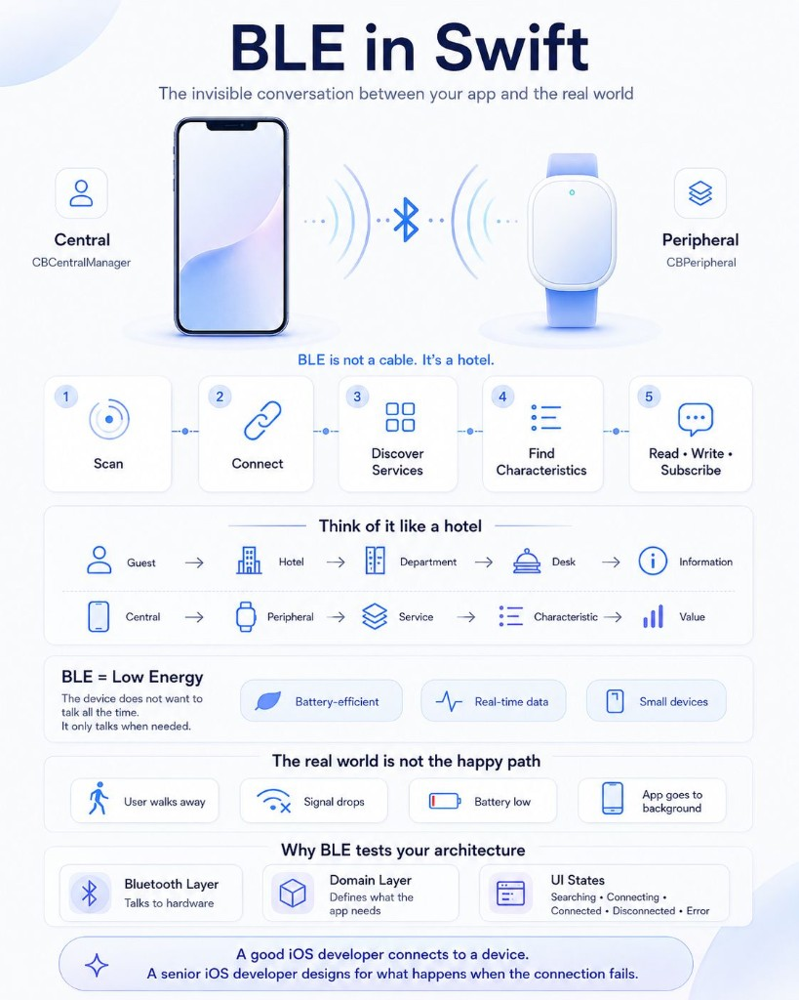
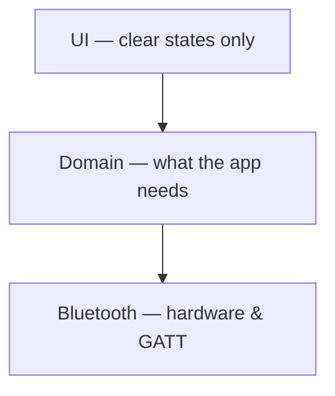

# Core Bluetooth — hotel mental model

- **Status:** curated note
- **Added:** 2026-06-19
- **Related:** [Core Bluetooth README](../README.md)

---

## За 30 секунд

_English summary — expand «По-русски» for the full Russian text._

По-русски

BLE is not "connect and send data." It is a **GATT hotel**: the iPhone is the **guest** (Central), the device is the **hotel** (Peripheral), **services** are departments, **characteristics** are desks, and **values** are the information you read, write, or subscribe to. **Low Energy** means the device does not want to talk all the time — and the **happy path is not the real world**. Senior mobile work starts when you design for disconnect, background, and weak signal.

---

## Infographic

---

## The conversation

For a long time, Bluetooth looked like "connect and send data." **Core Bluetooth** shows a different picture.

Your iPhone is the **guest**. The BLE device is the **hotel**. Core Bluetooth is the **framework on both sides** — it helps Central and Peripheral speak GATT. (A useful metaphor: GATT is the **front desk protocol** — who offers which services, at which desks.)

### Check-in flow

1. **Look for the hotel** — scanning (`CBCentralManager.scanForPeripherals`).
2. **Check in** — connecting (`connect(_:options:)`).
3. **"What services do you offer?"** — discovering services (Heart Rate, Battery, Glucose).
4. **"Which desk handles this?"** — discovering characteristics — the real data point.
5. **Read · Write · Subscribe** — exchange values.

### Mapping

| Mental model | BLE |
|--------------|-----|
| Guest | Central |
| Hotel | Peripheral |
| Department | Service |
| Desk | Characteristic |
| Information | Value |

---

## Low Energy = not a cable

**BLE** optimizes for **battery**, **small payloads**, and **intermittent** contact. The peripheral sleeps; the radio fades; the user walks away; iOS backgrounds your app. Users still expect the product to **recover** — not freeze on "Connecting…".

### Real world (not the demo)

| Event | Product expectation |
|-------|---------------------|
| User walks away | Disconnect UI, reconnect when in range |
| Signal drops | Backoff retry, no wedged state |
| Battery dies on device | Actionable error |
| App backgrounded | Policy: restore session, pause, or prompt |

---

## Why BLE tests architecture

If everything lives in a ViewModel, the app becomes **fragile**: delegate callbacks, UUID parsing, and reconnect logic drown UI code.

**Bluetooth layer** talks to hardware. **Domain layer** defines heart rate, battery, pairing status. **UI** knows only: *searching · connecting · connected · disconnected · error*.

> A good iOS developer connects to a device. A senior iOS developer designs for what happens when the connection fails.

That is where real mobile engineering begins.

---

## Interview hooks

- Explain **notify vs read** for a heart-rate strap.
- Draw the **five-step** central workflow from memory.
- Name three things that break in production but not in the Xcode demo.
- Where does **`CBCentralManager`** live — and why not in `ContentView`?

---

## Official links

- [Core Bluetooth Programming Guide](https://developer.apple.com/library/archive/documentation/NetworkingInternetWeb/Conceptual/CoreBluetooth_concepts/)
- [Performing Common Central Role Tasks](https://developer.apple.com/documentation/corebluetooth/performing-common-central-role-tasks)
- [Core Bluetooth Background Processing](https://developer.apple.com/library/archive/documentation/NetworkingInternetWeb/Conceptual/CoreBluetooth_concepts/CoreBluetoothBackgroundProcessingForIOSApps/PerformingTasksWhileYourAppIsInTheBackground.html)
