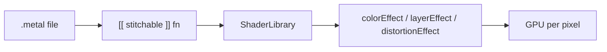

# Graphics & Metal

## In 30 seconds

**Core Graphics** (`CGContext`, paths, gradients) is the immediate-mode 2D API behind much of UIKit drawing and **`UIImage`** rendering. **`UIGraphicsImageRenderer`** (preferred over legacy `UIGraphicsBeginImageContext`) creates bitmap contexts with correct scale and wide-color format. **`UIImage`** drawing respects **`UIImage.RenderingMode`**, asset catalogs, and PDF/vector assets at target size. **Metal** is Apple's low-level GPU API for high-throughput shading — use **`MTKView`**, **`CAMetalLayer`**, or SwiftUI **`MeshGradient`** / custom render pipelines when Core Graphics or Core Animation cannot meet performance goals; most UI stays UIKit/SwiftUI. **SwiftUI stitchable shaders** (iOS 17+): write `[[ stitchable ]]` functions in a `.metal` file, call them via auto-generated **`ShaderLibrary`**, apply with **`.colorEffect`**, **`.layerEffect`**, or **`.distortionEffect`** — per-pixel GPU effects without a manual render pipeline. **`CADisplayLink`** drives frame-synced redraw loops for custom **`draw(_:)`** or Metal present. **Pixel formats** (`RGBA8`, `BGRA`, extended sRGB, **`prefersExtendedRange`**) affect memory and color accuracy. All **UIKit/AppKit drawing and view mutation** belongs on the **main thread** — mark custom drawing types **`@MainActor`** in Swift concurrency code.

## Apple docs

- [Core Graphics](https://developer.apple.com/documentation/coregraphics) — contexts, paths, images, transforms.
- [UIGraphicsImageRenderer](https://developer.apple.com/documentation/uikit/uigraphicsimagerenderer) — bitmap rendering with format control.
- [Drawing and printing guide (archive)](https://developer.apple.com/library/archive/documentation/2DDrawing/Conceptual/DrawingPrintingiOS/GraphicsDrawingOverview/GraphicsDrawingOverview.html) — UIKit drawing model.
- [UIImage](https://developer.apple.com/documentation/uikit/uiimage) — initialization, rendering mode, scale.
- [Metal](https://developer.apple.com/documentation/metal) — devices, command queues, pipelines.
- [MetalKit](https://developer.apple.com/documentation/metalkit) — `MTKView`, texture loading.
- [CAMetalLayer](https://developer.apple.com/documentation/quartzcore/cametallayer) — Metal drawable surface.
- [CADisplayLink](https://developer.apple.com/documentation/quartzcore/cadisplaylink) — frame-synced updates for custom drawing.
- [CGColorSpace](https://developer.apple.com/documentation/coregraphics/cgcolorspace) — sRGB, extended range, display P3.
- [MainActor](https://developer.apple.com/documentation/swift/mainactor) — UI-isolated code in Swift concurrency.
- [Shader](https://developer.apple.com/documentation/swiftui/shader) — stitchable Metal functions in SwiftUI.
- [colorEffect(_:isEnabled:)](https://developer.apple.com/documentation/swiftui/view/coloreffect(_:isenabled:)) — per-pixel color filter.
- [layerEffect(_:maxSampleOffset:isEnabled:)](https://developer.apple.com/documentation/swiftui/view/layereffect(_:maxsampleoffset:isenabled:)) — sample rendered layer (`SwiftUI::Layer`).
- [distortionEffect(_:maxSampleOffset:isEnabled:)](https://developer.apple.com/documentation/swiftui/view/distortioneffect(_:maxsampleoffset:isenabled:)) — geometric pixel offset.

## 🎯 Focus vs Defer

### Focus

- **When to draw:** `draw(_:)` in custom `UIView` / `draw(_:)` in SwiftUI `Canvas` — expensive if over-invalidated; prefer layers or pre-rendered images for static art.
- **UIGraphicsImageRenderer:** specify `format` (opaque, scale, wide gamut); closure receives `CGContext`.
- **UIImage pipeline:** asset catalog PDF preserves vector; `@2x/@3x` bitmaps; **`UIImage.SymbolConfiguration`** for SF Symbols; downscale off main before assign to `UIImageView`.
- **Pixel format basics:** bytes per pixel, premultiplied alpha, BGRA vs RGBA on Apple GPUs — affects `CGBitmapInfo` and renderer format.
- **Main thread / @MainActor:** `setNeedsDisplay`, `UIGraphicsImageRenderer`, `UIImageView.image` — main; decode large images on background **`CGImageSource`** then assign on main.
- **Metal overview:** device → command queue → command buffer → render/compute pipeline → drawable present; not required for every interview but know **when** (particles, filters, massive meshes, custom shaders).
- **SwiftUI stitchable shaders:** `.metal` file → `[[ stitchable ]]` → build generates **`ShaderLibrary`** → `.colorEffect(ShaderLibrary.name(...))`; SwiftUI injects `position` / `color` / `layer` — you pass only custom uniforms (`.float`, `.color`, `.boundingRect`). Normalize with **`.boundingRect`**, not hardcoded view size.
- **Display link + draw:** custom chart refresh; throttle work; don't allocate full-screen buffer every frame without need.

### Defer

- **Raw Metal pipeline** when **`.colorEffect` / `.layerEffect`** cover the effect — stitchable path avoids `MTLRenderPipelineDescriptor` boilerplate.
- **Raw Metal pipeline** for static icons and standard UI — SF Symbols and assets suffice.
- **Core Graphics for every list cell live** — cache rendered thumbnails, use `UIImageView` + proper reuse.
- **Legacy `UIGraphicsBeginImageContext`** — use renderer API.
- **CPU-side PDF parsing each frame** — rasterize once at needed size.
- **Drawing from background threads** — never mutate UIKit graphics state off main.

## Key concepts

| Term | Meaning |
|------|---------|
| **CGContext** | Current graphics state: transform, clip, stroke/fill, text drawing. |
| **CGBitmapContext** | Raster backing store; width × height × bytesPerRow. |
| **UIGraphicsImageRenderer** | High-level API creating UIImage from drawing closure. |
| **Scale factor** | Points vs pixels (`UIScreen.main.scale`, trait-aware). |
| **Premultiplied alpha** | RGB already multiplied by alpha — standard for iOS bitmaps. |
| **Extended range / P3** | Wide color assets; renderer format must match display capability. |
| **Metal device** | `MTLDevice` — GPU representation. |
| **Drawable** | Texture presented to screen via `CAMetalLayer`. |
| **@MainActor** | Compiler-enforced main-thread isolation for UI types and drawing. |
| **setNeedsDisplay** | Marks view dirty; `draw(_:)` called on next layout/display cycle. |
| **`[[ stitchable ]]`** | Marks an MSL function for SwiftUI; runtime can compose multiple shader effects. |
| **ShaderLibrary** | Xcode-generated accessors to stitchable functions in project `.metal` files. |
| **colorEffect** | Runs a stitchable `half4(float2, half4, …)` per pixel — recolor / procedural fill. |
| **layerEffect** | Stitchable with `SwiftUI::Layer` — read pixels via `layer.sample(position)`. |
| **distortionEffect** | Stitchable `float2(float2, …)` — warp sampling coordinates (waves, bulge). |

### Rendering stack (simplified)

```
SwiftUI Canvas / Image
        ↓
UIKit UIImageView / draw(_:)
        ↓
UIGraphicsImageRenderer → CGContext
        ↓
Core Animation (CALayer contents)
        ↓
Metal / render server (GPU compositing)
```

**Metal vs Core Graphics:** Core Graphics is **CPU** 2D rasterization (may use GPU assist internally). **Metal** is explicit **GPU** programming (shaders, buffers). Choose CG for image generation, PDF-like drawing, moderate complexity; Metal for sustained GPU workloads (games, video filters, procedural graphics at 120fps).

### SwiftUI stitchable shaders (iOS 17+)

A stitchable function runs **once per pixel** on the GPU. A 300×300 pt view at @3x ≈ 810k invocations — fine for parallel GPU work; still profile animated shaders in Instruments.

**Workflow:** add `Shaders.metal` → mark functions `[[ stitchable ]]` → build (Xcode generates `ShaderLibrary`) → attach modifier on a `View`. No manual Metal bridge.



| Modifier | Required MSL signature (after `[[ stitchable ]]`) | Typical use |
|----------|---------------------------------------------------|-------------|
| **colorEffect** | `half4 name(float2 position, half4 color, args…)` | Solid fills, gradients, color filters |
| **layerEffect** | `half4 name(float2 position, SwiftUI::Layer layer, args…)` | Blur-like sampling, pixelate, ripple on rendered content |
| **distortionEffect** | `float2 name(float2 position, args…)` | Wave, bulge — returns offset sampling position |

SwiftUI supplies system parameters (`position`, `color`, or `layer`); bind custom args with `.float`, `.color`, `.size`, `.boundingRect`, etc. Return **premultiplied** color in extended sRGB. Drive animation with **`TimelineView`** + time uniform, or pre-warm with **`Shader.compile()`** (iOS 18+) before first frame.

**When stitchable vs raw Metal:** stitchable for view-bound visual effects (gradients, distortions, transitions). Raw **`MTKView`** pipeline when you own the full frame loop, 3D meshes, compute, or cross-platform Metal sharing.

### Pixel formats (practical)

| Format | Typical use |
|--------|-------------|
| **32-bit BGRA8** | Default UI bitmaps, `UIGraphicsImageRenderer` |
| **RGBA8** | Interchange, some CG contexts |
| **16-bit float (RGBA)** | HDR / extended range pipelines |
| **sRGB vs Display P3** | Color-managed assets in catalog |

Wrong `bitmapInfo` → tinted edges, washed colors, or extra memory. Always thread **`scale`** through renderer format on Retina devices.

## 🏋️ Exercises

1. **Renderer badge:** Draw rounded rect + centered text with `UIGraphicsImageRenderer`; verify crisp output on @3x simulator. **Expected:** set `format.opaque` correctly; explain points vs pixels.

2. **Off-main decode:** Load 4000×4000 JPEG on background using `CGImageSourceCreateThumbnailAtIndex`; assign to `UIImageView` on main. **Expected:** no main-thread hitch in Instruments.

3. **Custom `draw(_:)` chart:** Simple line chart in `UIView` subclass; drive updates with `CADisplayLink` throttled to 30fps. **Expected:** invalidate link; thin callback.

4. **PDF asset:** Vector PDF in asset catalog; render at 24 pt and 96 pt via `UIImage` — compare sharpness to single @3x PNG. **Expected:** when vector catalog wins.

5. **Wide color swatch:** P3 color drawn with extended range renderer format vs sRGB-only — view on P3 device/simulator. **Expected:** describe format + color space chain.

6. **Metal hello triangle:** `MTKView` + minimal render pipeline (vertex/fragment shader) — one rotating triangle. **Expected:** high-level Metal frame: device, queue, drawable, present.

7. **@MainActor drawer:** Swift class wrapping `UIGraphicsImageRenderer` marked `@MainActor`; call from `Task.detached` and fix isolation error. **Expected:** `await MainActor.run` or redesign API.

8. **Caching strategy:** List of 500 avatars — compare live `draw(_:)` per cell vs pre-rendered cache + reuse. **Expected:** quantify memory vs CPU trade-off.

9. **Stitchable gradient:** `basicColor` + `gradient` shaders in `.metal`; apply with `.colorEffect(ShaderLibrary.gradient(.boundingRect))` on a resizable rectangle. **Expected:** gradient scales with view bounds; explain why hardcoded `300.0` breaks.

## Links

- [WWDC 2023 — What's new in SwiftUI](https://developer.apple.com/videos/play/wwdc2023/10148/) — Metal shaders, `ShaderLibrary`, text styling (shader segment ~23:39)
- [WWDC 2018 — Image and Graphics Best Practices](https://developer.apple.com/videos/play/wwdc2018/219/)
- [WWDC 2020 — Build a Metal renderer](https://developer.apple.com/videos/play/wwdc2020/10602/)
- [WWDC 2022 — Display EDR content with Core Image, Metal, and SwiftUI](https://developer.apple.com/videos/play/wwdc2022/10113/)
- [WWDC 2023 — Explore materials in SwiftUI](https://developer.apple.com/videos/play/wwdc2023/10202/) — rendering integration context
- [Drawing and Printing Guide for iOS (archive)](https://developer.apple.com/library/archive/documentation/2DDrawing/Conceptual/DrawingPrintingiOS/Introduction/Introduction.html)

## Code patterns

### UIGraphicsImageRenderer

```swift
let renderer = UIGraphicsImageRenderer(size: CGSize(width: 120, height: 40))
let image = renderer.image { context in
    UIColor.systemBlue.setFill()
    UIBezierPath(roundedRect: CGRect(origin: .zero, size: renderer.format.bounds.size), cornerRadius: 8).fill()
    let attrs: [NSAttributedString.Key: Any] = [.font: UIFont.systemFont(ofSize: 14), .foregroundColor: UIColor.white]
    ("Badge" as NSString).draw(at: CGPoint(x: 12, y: 10), withAttributes: attrs)
}
```

### Background thumbnail decode

```swift
func decodeThumbnail(url: URL, maxPixelSize: Int) async -> UIImage? {
    await Task.detached(priority: .userInitiated) {
        guard let source = CGImageSourceCreateWithURL(url as CFURL, nil) else { return nil }
        let options: [CFString: Any] = [
            kCGImageSourceCreateThumbnailFromImageAlways: true,
            kCGImageSourceThumbnailMaxPixelSize: maxPixelSize,
            kCGImageSourceCreateThumbnailWithTransform: true
        ]
        guard let cgImage = CGImageSourceCreateThumbnailAtIndex(source, 0, options as CFDictionary) else { return nil }
        return UIImage(cgImage: cgImage)
    }.value
}
```

### @MainActor drawing wrapper

```swift
@MainActor
enum BadgeRenderer {
    static func makeBadge(title: String) -> UIImage {
        let renderer = UIGraphicsImageRenderer(size: CGSize(width: 120, height: 40))
        return renderer.image { _ in
            // draw badge
        }
    }
}
```

### SwiftUI stitchable shaders (.metal + colorEffect)

```metal
#include <metal_stdlib>
#include <SwiftUI/SwiftUI.h>
using namespace metal;

[[ stitchable ]] half4 basicColor(float2 position, half4 color) {
    return half4(0.2, 0.6, 0.9, 1.0);
}

[[ stitchable ]] half4 gradient(float2 position, half4 color, float4 bounds) {
    float2 uv = (position - bounds.xy) / bounds.zw;
    return half4(half(uv.x), half(uv.y), half(1.0 - uv.x), 1.0);
}
```

```swift
import SwiftUI

struct GradientShaderView: View {
    var body: some View {
        Rectangle()
            .fill(.black)
            .frame(maxWidth: .infinity, maxHeight: 300)
            .colorEffect(ShaderLibrary.gradient(.boundingRect))
    }
}
```

`ShaderLibrary.basicColor()` needs no extra arguments — SwiftUI injects `position` and `color` automatically.

---

## Interview Q&A (Knowledge cards)

<!-- knowledge-cards-canonical:start -->

### Q1
- **Question:** UIGraphicsImageRenderer vs UIGraphicsBeginImageContext — what to know?

- **Answer:** Renderer handles scale and format correctly; legacy context APIs are error-prone for Retina and alpha. Use renderer for all new bitmap generation.

### Q2
- **Question:** UIKit Core Graphics pipeline — draw(_:), setNeedsDisplay, layers?

- **Answer:** Invalidation triggers draw(_:) on main; cache static art as images or layer contents; avoid heavy per-frame full view redraw.

- **Follow-up:** `draw(_:)` vs `CALayer` delegate?

- **Follow-up answer:** layer-backed views often draw into layer; direct layer contents skip some view draw path — know your hierarchy.

### Q3
- **Question:** Metal overview — when Metal vs Core Graphics / SwiftUI?

- **Answer:** CG for 2D image generation; SwiftUI stitchable shaders for view effects; raw Metal for GPU-bound 3D/compute; most app UI never needs a custom pipeline.

- **Follow-up:** `MTKView` vs raw `CAMetalLayer`?

- **Follow-up answer:** MTKView — loop, drawable size, delegate; CAMetalLayer — lower level embed in custom view hierarchy.

### Q4
- **Question:** Pixel formats, color spaces, and @MainActor for drawing — interview topics?

- **Answer:** Know default BGRA premultiplied; wide color needs end-to-end color space match; decode off main, assign on main; mark UI drawing types @MainActor.

- **Follow-up answer:** per-frame allocation, main-thread overload — profile; throttle or move simulation off hot path.

### Q5
- **Question:** SwiftUI stitchable shaders — workflow, signatures, when enough vs raw Metal?

- **Answer:** Mark MSL functions `[[ stitchable ]]`, call via generated `ShaderLibrary`, apply with color/layer/distortion effect modifiers; use `.boundingRect` for size-aware math; prefer stitchable for view effects, raw Metal for full GPU pipelines.

- **Follow-up answer:** `TimelineView(.animation)` + `.float(elapsedTime)` argument; iOS 18+ `Shader.compile()` to avoid first-frame hitch.

<!-- knowledge-cards-canonical:end -->
