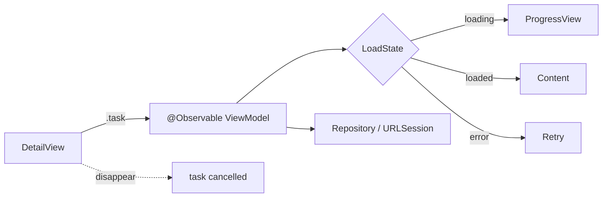

# SwiftUI data loading — `.task` vs `.onAppear`

- **Status:** curated note
- **Added:** 2026-06-19
- **Source:** [appsell.su — stop using onAppear for API calls](https://appsell.su/blog/den-apps-1/swift-razrabotka/prekratite-ispolzovat-onappear-dlya-vyzovov-k-zaprosov-k-api-v-swiftui-532)
- **Related:** [SwiftUI README](../README.md) · [Approachable Concurrency](../../../swift/concurrency/notes/Approachable-Swift-Concurrency-Site.md) · [URLSession lifecycle](../../../data-and-network/networking/notes/URLSession-Lifecycle-iOS-IQ.md)

---

## In 30 seconds

## Flow: view → VM → network

---

## Concepts

## `.onAppear` vs `.task` — summary

## Best practices & mistakes

## Interview Q&A (Knowledge cards)

## Apple docs

- [task(priority:_:)](https://developer.apple.com/documentation/swiftui/view/task(priority:_:))
- [task(id:priority:_:)](https://developer.apple.com/documentation/swiftui/view/task(id:priority:_:))
- [onAppear(perform:)](https://developer.apple.com/documentation/swiftui/view/onappear(perform:))
- [refreshable(action:)](https://developer.apple.com/documentation/swiftui/view/refreshable(action:))
- [Adopting Swift concurrency](https://developer.apple.com/tutorials/app-dev-training/adopting-swift-concurrency) — `.task` vs `onAppear`

---

## Link to parent topic

- [SwiftUI README](../README.md) — Q-card data loading, `@Observable`
- [Approachable Concurrency](../../../swift/concurrency/notes/Approachable-Swift-Concurrency-Site.md) — §2 `.task`, §9 "invisible Task"
- [URLSession lifecycle](../../../data-and-network/networking/notes/URLSession-Lifecycle-iOS-IQ.md) — cancel when leaving the screen
- [architecture/patterns](../../../architecture/patterns/README.md) — ViewModel and `ViewState`
