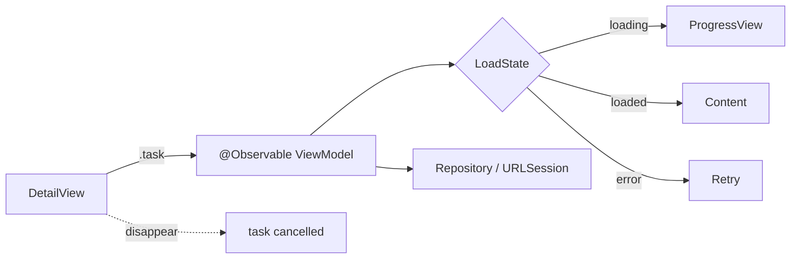

# SwiftUI data loading — `.task` vs `.onAppear`

- **Status:** curated note
- **Added:** 2026-06-19
- **Source:** [appsell.su — прекратите использовать onAppear для API](https://appsell.su/blog/den-apps-1/swift-razrabotka/prekratite-ispolzovat-onappear-dlya-vyzovov-k-zaprosov-k-api-v-swiftui-532)
- **Related:** [SwiftUI README](../README.md) · [Approachable Concurrency](../../../swift/concurrency/notes/Approachable-Swift-Concurrency-Site.md) · [URLSession lifecycle](../../../data-and-network/networking/notes/URLSession-Lifecycle-iOS-IQ.md)

---

## За 30 секунд


_English summary — expand «По-русски» for the full Russian text._


<details class="lang-ru">
<summary>По-русски</summary>

`View` в SwiftUI — **лёгкие struct**, пересоздаются часто. **`.onAppear`** — событие «view стала видимой», не контракт на загрузку данных. **`Task { }` внутри `.onAppear`** — неструктурированная работа без автоотмены. Для async-загрузки экрана: **`enum` состояния (FSM)** в **`@Observable` ViewModel** + модификатор **`.task`** (или **`.task(id:)`**). `.task` отменяет task при исчезновении view; **повторный fetch при возврате на экран** решает кэш/VM, а не сам модификатор.

---

</details>


## Поток: view → VM → сеть




---

## Концепты

_English summary — expand «По-русски» for full text (Концепты)._

<details class="lang-ru">
<summary>По-русски</summary>

### 1) Почему `.onAppear` — ловушка для API

| Проблема | Что происходит |
|----------|----------------|
| Повторное появление | Назад → снова на экран → `.onAppear` снова → второй запрос, хотя данные уже в памяти |
| `Task { await load() }` в `.onAppear` | Неструктурированная задача; SwiftUI **не** отменяет её в `.onDisappear` |
| Ручная отмена | `task?.cancel()` в `.onDisappear` — легко забыть, дублируется на каждом экране |
| Три флага | `isLoading`, `error`, `data` независимы → UI может показать loader и error одновременно |

`.onAppear` остаётся уместным для **синхронных** side effects: аналитика, `scrollTo`, чтение `GeometryReader` — не для основного async fetch.

### 2) Конечный автомат (`LoadState`)

Один `enum` — одно допустимое состояние экрана:

```swift
enum LoadState<Value> {
    case idle
    case loading
    case loaded(Value)
    case error(Error)
}
```

Бизнес-логика и переходы — в ViewModel; view только **читает** `state` и вызывает `load()` / `retry()`.

### 3) ViewModel + `.task`

```swift
@MainActor
@Observable
final class UserDetailViewModel {
  private(set) var state: LoadState<User> = .idle
  private let repository: UserRepository

  init(repository: UserRepository) {
    self.repository = repository
  }

  func load(userID: UUID) async {
    guard case .idle = state else { return }
    state = .loading
    do {
      let user = try await repository.user(id: userID)
      state = .loaded(user)
    } catch is CancellationError {
      state = .idle
    } catch {
      state = .error(error)
    }
  }

  func retry(userID: UUID) async {
    state = .idle
    await load(userID: userID)
  }
}
```

```swift
struct UserDetailView: View {
  @State private var viewModel: UserDetailViewModel
  let userID: UUID

  init(userID: UUID, repository: UserRepository) {
    self.userID = userID
    _viewModel = State(initialValue: UserDetailViewModel(repository: repository))
  }

  var body: some View {
    Group {
      switch viewModel.state {
      case .idle, .loading:
        ProgressView()
      case .loaded(let user):
        Text(user.name)
      case .error:
        ContentUnavailableView("Failed to load", systemImage: "wifi.exclamationmark")
      }
    }
    .task {
      await viewModel.load(userID: userID)
    }
    .refreshable {
      await viewModel.retry(userID: userID)
    }
  }
}
```

`guard case .idle` — защита от повторного fetch при **повторном** срабатывании `.task` (возврат на экран). Альтернатива: хранить VM **выше** по дереву (`@State` на родителе навигации), чтобы переживать pop/push.

### 4) Почему `.task`, а не `.onAppear`

По [документации Apple](https://developer.apple.com/documentation/swiftui/view/task(priority:_:)):

- closure **async** — без обёртки `Task { }`;
- lifetime task **привязан к view** — отмена после исчезновения или смены identity;
- **`.task(id:)`** — отмена предыдущего task и новый запуск при смене `id` (поиск, смена таба, другой `userID`).

```swift
.task(id: userID) {
  await viewModel.load(userID: userID)
}
```

### 5) Кооперативная отмена

SwiftUI **помечает** task cancelled; выполнение не обрывается мгновенно. В `load()` и в `URLSession` нужно уважать отмену (`Task.checkCancellation()`, `try Task.checkCancellation()` после `await`). Иначе ответ может прийти после ухода с экрана и записать state «в пустоту» (если VM ещё жива).

### 6) `.refreshable`

Pull-to-refresh — отдельный вход в загрузку; не смешивай с `.task` без явной модели (например `retry()` сбрасывает в `.idle` и грузит снова).

---

</details>

## `.onAppear` vs `.task` — сводка

_English summary — expand «По-русски» for full text (`.onAppear` vs `.task` — сводка)._

<details class="lang-ru">
<summary>По-русски</summary>

| | `.onAppear` + `Task { }` | `.task` / `.task(id:)` |
|--|--------------------------|-------------------------|
| Async из коробки | нет | да |
| Отмена при disappear | вручную | автоматически (cooperative) |
| Повтор при re-appear | да | да |
| Защита от дубля запроса | guard / кэш / VM | guard / кэш / VM |
| Типичный кейс | sync side effects | screen load, search debounce via `id` |

---

</details>

## Best practices & mistakes

_English summary — expand «По-русски» for full text (Best practices & mistakes)._

<details class="lang-ru">
<summary>По-русски</summary>

| ✅ Делай | ❌ Не делай |
|----------|------------|
| `LoadState` или один `enum` экрана | `isLoading` + `error?` + `data?` без инвариантов |
| `.task` / `.task(id:)` для async load | `Task { }` в `.onAppear` без отмены |
| VM с `@MainActor` + `@Observable` | Сеть и мутация state прямо в `body` |
| `guard` / кэш перед fetch | Надежда, что `.task` сам не перезапросит |
| `refreshable` для явного reload | Второй скрытый fetch в `.onAppear` |
| Проверка cancellation в repository | Игнорировать `CancellationError` |

---

</details>

## Карточки знаний (Q&A)

_English summary — expand «По-русски» for full text (Карточки знаний (Q&A))._

<details class="lang-ru">
<summary>По-русски</summary>

### Q: Почему не вызывать API в `.onAppear`?

**Вопрос (RU):** Почему на собесе и в код-ревью критикуют `onAppear { Task { await load() } }`?

**Ответ (RU):** Зацепка: **lifecycle ≠ data-loading contract**.

- `.onAppear` срабатывает при каждом появлении view — без guard/кэша будет **повторный** запрос.
- Вложенный `Task { }` **не привязан** к жизненному циклу view — при уходе с экрана task может продолжаться (лишний трафик, запись в VM после dismiss).
- `.task` даёт **structured** async с автоотменой; FSM в VM убирает **противоречивый** UI.

**Answer (EN):** `.onAppear` fires every time the view becomes visible; unstructured `Task` inside it is not cancelled when the view leaves. Use `.task` for async work tied to view lifetime and a single `enum` screen state in a ViewModel. Duplicate fetches on back navigation are prevented by cached `.loaded` / guard, not by `.task` alone.

**Follow-up (RU):** Когда `.onAppear` всё же ок?

**Follow-up answer (RU):** Синхронные действия без async: трекинг экрана, одноразовая настройка UI, работа с geometry. Не для primary network load.

---

### Q: `.task` vs `.task(id:)`

**Вопрос (RU):** Когда нужен `.task(id:)`?

**Ответ (RU):** Когда параметр загрузки **меняется**, пока view на экране: `userID`, текст поиска, выбранный фильтр. Смена `id` → отмена предыдущего task → новый запрос. Для статичного экрана достаточно `.task { }`.

**Answer (EN):** Use `.task(id:)` when the load key changes while the view stays mounted; plain `.task` for one-shot load on appear.

---

</details>

## Apple docs


- [task(priority:_:)](https://developer.apple.com/documentation/swiftui/view/task(priority:_:))
- [task(id:priority:_:)](https://developer.apple.com/documentation/swiftui/view/task(id:priority:_:))
- [onAppear(perform:)](https://developer.apple.com/documentation/swiftui/view/onappear(perform:))
- [refreshable(action:)](https://developer.apple.com/documentation/swiftui/view/refreshable(action:))
- [Adopting Swift concurrency](https://developer.apple.com/tutorials/app-dev-training/adopting-swift-concurrency) — `.task` vs `onAppear`

---

## Связь с базой


- [SwiftUI README](../README.md) — Q-card data loading, `@Observable`
- [Approachable Concurrency](../../../swift/concurrency/notes/Approachable-Swift-Concurrency-Site.md) — §2 `.task`, §9 «невидимые Task»
- [URLSession lifecycle](../../../data-and-network/networking/notes/URLSession-Lifecycle-iOS-IQ.md) — cancel на уходе с экрана
- [architecture/patterns](../../../architecture/patterns/README.md) — ViewModel и `ViewState`
