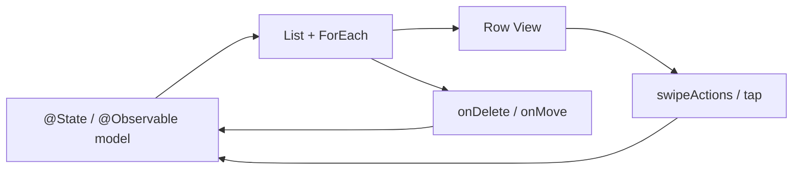

# SwiftUI List & dynamic data

- **Status:** curated note
- **Added:** 2026-06-19
- **Related:** [SwiftUI README](../README.md) · [Performance](../../quality/performance/README.md)

---

## За 30 секунд


_English summary — expand «По-русски» for the full Russian text._


<details class="lang-ru">
<summary>По-русски</summary>

`List` — ленивый контейнер строк из **коллекции с стабильной identity** (`Identifiable` / явный `id`). Источник правды — массив или модель **снаружи** `List`; delete, reorder и swipe меняют тот же state. На собесе: **стабильные `id`**, `List` vs `ScrollView` + `LazyVStack`, владение edit mode, пустой экран (`ContentUnavailableView`), тяжёлый `body` строки.

---

</details>


## Поток данных

_English summary — expand «По-русски» for full text (Поток данных)._

<details class="lang-ru">
<summary>По-русски</summary>



`List` не хранит данные — только отображает и пробрасывает жесты в ваш state.

---

</details>

## Концепты

_English summary — expand «По-русски» for full text (Концепты)._

<details class="lang-ru">
<summary>По-русски</summary>

### 1) Базовый List

```swift
List(["SwiftUI", "iOS", "Xcode"], id: \.self) { item in
    Text(item)
}
```

`id: \.self` — для простых `Hashable`, когда значение **не меняется** и уникально. Для моделей — `Identifiable`.

### 2) Identifiable-модели

```swift
struct User: Identifiable {
    let id: UUID
    var name: String
    var email: String
}

List(users) { user in
    HStack {
        Image(systemName: "person.circle.fill")
        VStack(alignment: .leading) {
            Text(user.name).font(.headline)
            Text(user.email)
                .font(.subheadline)
                .foregroundStyle(.secondary)
        }
    }
}
```

**Стабильный `id`:** `UUID` при создании записи, `serverId` с бэкенда. **Не** `UUID()` в `init` при каждом `body` — новая identity → мигание и сброс `@State` внутри строки.

### 3) Секции

```swift
List {
    Section("Fruits") {
        ForEach(fruits) { Text($0.name) }
    }
    Section("Vegetables") {
        ForEach(vegetables) { Text($0.name) }
    }
}
.listStyle(.insetGrouped)
```

| `listStyle` | Когда |
|-------------|--------|
| `.insetGrouped` | Настройки, категории |
| `.plain` | Плоский список, часто в навигации |
| `.sidebar` | iPad / macOS |

### 4) Swipe actions

```swift
List(tasks) { task in
    Text(task.title)
        .swipeActions(edge: .trailing) {
            Button(role: .destructive) {
                delete(task)
            } label: {
                Label("Delete", systemImage: "trash")
            }
            Button {
                more(task)
            } label: {
                Label("More", systemImage: "ellipsis")
            }
        }
}
```

Swipe — быстрые действия на строке. Edit mode — массовое удаление и reorder. `role: .destructive` даёт красную кнопку и full-swipe delete.

### 5) Delete & reorder (edit mode)

```swift
@State private var items = ["A", "B", "C"]

List {
    ForEach(items, id: \.self) { item in
        Text(item)
    }
    .onDelete { offsets in
        items.remove(atOffsets: offsets)
    }
    .onMove { source, destination in
        items.move(fromOffsets: source, toOffset: destination)
    }
}
.toolbar {
    EditButton()
}
```

`.onDelete` / `.onMove` вешаются на **`ForEach` внутри `List`**. `EditButton()` переключает `@Environment(\.editMode)`.

Прод-паттерн: массив в `@Observable` / ViewModel; delete синхронизирует UI и API:

```swift
.onDelete { offsets in
    let ids = offsets.map { items[$0].id }
    Task { await viewModel.delete(ids: ids) }
}
```

### 6) Кастомная строка

Строка — обычный `View`. Тяжёлую работу (сеть, форматирование, декодирование) выноси из `body` строки; для картинок — кэш, не голый `AsyncImage` на сотнях строк без политики загрузки.

### 7) Empty state

```swift
Group {
    if items.isEmpty {
        ContentUnavailableView(
            "No Items",
            systemImage: "tray",
            description: Text("Add items to get started.")
        )
    } else {
        List(items) { item in
            Text(item.title)
        }
    }
}
```

Пустой `List { }` без объяснения — частый минус в ревью и на собесе.

---

</details>

## List vs ScrollView + LazyVStack

_English summary — expand «По-русски» for full text (List vs ScrollView + LazyVStack)._

<details class="lang-ru">
<summary>По-русски</summary>

| | `List` | `ScrollView` + `LazyVStack` |
|--|--------|------------------------------|
| Swipe / edit / selection | из коробки | вручную |
| Стиль iOS-списка | да | кастом |
| Гибкая вёрстка | через модификаторы строк | полная |
| Типичный кейс | настройки, задачи, чаты | лента, кастомные карточки |

---

</details>

## Полезные модификаторы

_English summary — expand «По-русски» for full text (Полезные модификаторы)._

<details class="lang-ru">
<summary>По-русски</summary>

| Модификатор | Назначение |
|-------------|------------|
| `.listStyle(.insetGrouped)` | Группы с отступами |
| `.scrollContentBackground(.hidden)` | Свой фон под списком |
| `.listRowSeparator(.hidden)` | Без разделителей |
| `.listRowInsets(...)` | Свои отступы строки |
| `.refreshable { await reload() }` | Pull-to-refresh |
| `.listRowBackground(...)` | Фон отдельной строки |

---

</details>

## Best practices & mistakes

_English summary — expand «По-русски» for full text (Best practices & mistakes)._

<details class="lang-ru">
<summary>По-русски</summary>

| ✅ Делай | ❌ Не делай |
|----------|------------|
| Стабильные `id` (`Identifiable`) | `ForEach(items.indices, id: \.self)` |
| Лёгкий `body` строки | Сеть и тяжёлые вычисления в каждой строке |
| Секции для группировки | Один бесконечный плоский список |
| `ContentUnavailableView` при пустоте | Пустой экран без текста |
| Тест на большом датасете + Instruments | «На пяти элементах ок» |

---

</details>

## Карточки знаний (Q&A)

_English summary — expand «По-русски» for full text (Карточки знаний (Q&A))._

<details class="lang-ru">
<summary>По-русски</summary>

### Q: List мигает или сбрасывает state в строке после update / delete

**Вопрос (RU):** Почему `List` мигает, пересоздаёт строки или теряет `@State` внутри row после удаления / обновления данных?

**Ответ (RU):** Зацепка: **нестабильная view identity в `ForEach`**.

- `ForEach(items.indices, id: \.self)` — при delete/reorder индексы съезжают; SwiftUI путает, какая строка какая.
- `id: UUID()` в `init` модели при каждом `body` — каждый кадр «новая» строка.
- Правильно: **`Identifiable`** с `id`, живущим столько же, сколько запись (client id, server id).
- Отдельно: **data identity** (запись в массиве) vs **view identity** (узел в дереве) — см. Q11 в [SwiftUI README](../README.md).

**Answer (EN):** Flicker and lost row state almost always mean unstable `ForEach` keys — array indices or regenerated `UUID()` per body pass. Use stable `Identifiable` ids tied to the record lifetime.

**Follow-up (RU):** Delete удаляет «не ту» строку?

**Follow-up answer (RU):** Часто из-за indices-based `ForEach` или рассинхрона UI-массива и бэкенда. Удаляй по `id`, не по offset в shared state без проверки.

---

### Q: Когда `List`, когда `LazyVStack`?

**Вопрос (RU):** `List` или `ScrollView` + `LazyVStack` для длинного скролла?

**Ответ (RU):** **`List`** — когда нужны встроенные swipe, edit mode, selection, grouped style, типичный iOS-список. **`LazyVStack`** — когда нужна свободная вёрстка карточек/ленты и вы готовы сами собирать жесты и edit UX. Оба ленивые; тормоза чаще от тяжёлого `body`, а не от выбора контейнера.

**Answer (EN):** Pick `List` for standard list interactions and system styling; pick `LazyVStack` for custom card layouts. Profile row `body` work either way.

---

</details>

## Apple docs


- [List](https://developer.apple.com/documentation/swiftui/list)
- [ForEach](https://developer.apple.com/documentation/swiftui/foreach)
- [swipeActions(edge:allowsFullSwipe:content:)](https://developer.apple.com/documentation/swiftui/view/swipeactions(edge:allowsfullswipe:content:))
- [ContentUnavailableView](https://developer.apple.com/documentation/swiftui/contentunavailableview)
- [EditMode](https://developer.apple.com/documentation/swiftui/editmode)

---

## Связь с базой

_English summary — expand «По-русски» for full text (Связь с базой)._

<details class="lang-ru">
<summary>По-русски</summary>

- [SwiftUI README](../README.md) — view identity (Q11), multilevel dismiss (Q9), performance exercise
- [Performance](../../quality/performance/README.md) — профилирование скролла
- [Navigation & Deep Links](../../architecture/navigation/README.md) — `NavigationLink` внутри строк

</details>

