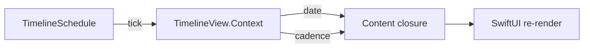

# SwiftUI — `TimelineView` (time-driven UI)

- **Status:** curated note
- **Added:** 2026-06-19
- **Source:** [Nil Coalescing — TimelineView in SwiftUI](https://nilcoalescing.com/blog/TimelineViewInSwiftUI/)
- **Related:** [SwiftUI README](../README.md) · [Graphics / shaders](../../graphics/README.md) (shader time via `TimelineView(.animation)`)

---

## In 30 seconds

## Flow: schedule → context → view

---

## Concepts

## Best practices & mistakes

## Interview Q&A (Knowledge cards)

## Apple docs

- [TimelineView](https://developer.apple.com/documentation/swiftui/timelineview)
- [TimelineSchedule](https://developer.apple.com/documentation/swiftui/timelineschedule)
- [TimelineViewDefaultContext](https://developer.apple.com/documentation/swiftui/timelineviewdefaultcontext)
- [everyMinute](https://developer.apple.com/documentation/swiftui/timelineschedule/everyminute)
- [periodic(from:by:)](https://developer.apple.com/documentation/swiftui/timelineschedule/periodic(from:by:))
- [animation](https://developer.apple.com/documentation/swiftui/timelineschedule/animation)

---

## Link to parent topic

- [SwiftUI README](../README.md) — Q-card TimelineView
- [TimelineViewDemo.playground](../TimelineViewDemo.playground) — live preview
- [Graphics / Metal shaders](../../graphics/README.md) — `TimelineView(.animation)` + shader uniforms
