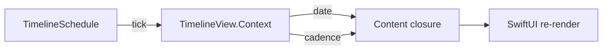

# SwiftUI — `TimelineView` (time-driven UI)

- **Status:** curated note
- **Added:** 2026-06-19
- **Source:** [Nil Coalescing — TimelineView in SwiftUI](https://nilcoalescing.com/blog/TimelineViewInSwiftUI/)
- **Related:** [SwiftUI README](../README.md) · [Graphics / shaders](../../graphics/README.md) (shader time via `TimelineView(.animation)`)

---

## In 30 seconds


_English summary — expand «По-русски» for the full Russian text._


<details class="lang-ru">
<summary>По-русски</summary>

Обычный SwiftUI пересчитывает `body`, когда меняется **state**. **`TimelineView`** пересчитывает content closure по **расписанию** — часы, секундомер, пульсирующий loader, фон без `@State` для фазы анимации. Closure получает **`TimelineView.Context`**: `date` (время текущего тика) и **`cadence`** (как часто система реально обновляет UI). Для **обновления данных** и фоновой логики — **`Timer`** / **`Task` + sleep**; для **отображения, зависящего от времени** — `TimelineView`.

---

</details>


## Flow: schedule → context → view




---

## Concepts

_English summary — expand «По-русски» for full text (Концепты)._

<details class="lang-ru">
<summary>По-русски</summary>

### 1) Basic API

```swift
TimelineView(.everyMinute) { context in
    Text(context.date, format: .dateTime.hour().minute())
}
```

- **Schedule** — когда SwiftUI снова вызывает closure.
- **`context.date`** — «текущее» время тика (не обязательно `Date.now` в момент вызова — опирайся на него для UI).

### 2) Built-in schedules

| Schedule | Поведение | Типичный кейс |
|----------|-----------|---------------|
| `.everyMinute` | На границе минуты | Часы без секунд, «обновить в 10:01» |
| `.periodic(from:by:)` | Равный интервал от `from` | Секунды, обратный отсчёт, polling UI |
| `.animation` | Частота под анимацию | Shimmer, hue, shader uniform по времени |
| `.animation(minimumInterval:paused:)` | Пауза / минимальный шаг | Экономия батареи, стоп анимации |

```swift
TimelineView(.periodic(from: .now, by: 1)) { context in
    Text(context.date, format: .dateTime.hour().minute().second())
        .monospacedDigit()
}
```

### 3) `context.cadence`

SwiftUI может **снизить частоту** тиков (Low Power Mode, watchOS Always On, неактивное окно). **`TimelineView.Context.Cadence`**: `.live`, `.seconds`, `.minutes` — enum, **`Comparable`** (медленнее = «больше»). Скрывай детали: `cadence > .live` или `cadence == .live` для дробных секунд.

```swift
TimelineView(.animation) { context in
    let format: Date.FormatStyle =
        context.cadence == .live
        ? .dateTime.hour().minute().second().secondFraction(.fractional(3))
        : .dateTime.hour().minute().second()

    Text(context.date, format: format)
        .monospacedDigit()
}
```

Не полагайся на 60 FPS в UI-тестах: проверяй **логику форматирования** и ветвление по `cadence`, не точный кадр.

### 4) Animation without state

`TimelineView(.animation)` удобен, когда визуал — **функция времени** (`sin(time)`, hue), а не накопленный `@State`:

```swift
TimelineView(.animation) { context in
  let time = context.date.timeIntervalSinceReferenceDate
  let hue = (sin(time * 0.2) + 1) / 2
  Color(hue: hue, saturation: 0.7, brightness: 0.9)
}
```

Для **Metal / `colorEffect`** тот же паттерн — см. [graphics README](../../graphics/README.md).

### 5) `TimelineView` vs `Timer`

| | `TimelineView` | `Timer` / `Task.sleep` |
|--|----------------|-------------------------|
| Привязка | Жизненный цикл **view** | Ручная подписка / отмена |
| Назначение | **Отрисовка** от времени | Fetch, таймауты, доменная логика |
| Отмена | Скрытие view → тики прекращаются | `invalidate()` / отмена `Task` вручную |
| State | Можно без `@State` для фазы | Обычно пишет в `@State` / VM |

**Правило:** часы на экране → `TimelineView`; «раз в 30 с подтянуть баланс» → `Task` + `.task` или `Timer` в сервисе, не в `body`.

---

</details>

## Best practices & mistakes

_English summary — expand «По-русски» for full text (Best practices & mistakes)._

<details class="lang-ru">
<summary>По-русски</summary>

| ✅ Делай | ❌ Не делай |
|----------|------------|
| `TimelineView` для clock / countdown / shimmer | `Timer` в `onAppear` + `@State` tick для каждой секунды на экране |
| `monospacedDigit()` для цифрового времени | `Text("\(Date())")` без формата — лишние перерисовки и скачки ширины |
| Ветвление по `cadence` для детализации | Жёстко показывать миллисекунды везде |
| `.animation(paused: true)` когда анимация не нужна | `TimelineView(.animation)` на весь экран без причины |
| Shader time через `context.date` | Отдельный глобальный `Timer` только ради uniform |

---

</details>

## Interview Q&A (Knowledge cards)

_English summary — expand «По-русски» for full text (Карточки знаний (Q&A))._

<details class="lang-ru">
<summary>По-русски</summary>

### Q: `TimelineView` vs `Timer` — when to use which?

**Вопрос (RU):** На собесе: зачем `TimelineView`, если есть `Timer`?

**Ответ (RU):** Зацепка: **`TimelineView` — время для UI, `Timer` — время для работы**.

- `TimelineView` встраивает тики в **дерево view**: исчез view — обновления прекращаются без `invalidate`.
- Closure получает **`date`** и **`cadence`** — можно упростить UI, когда система режет частоту.
- `Timer` / периодический `Task` — для **данных**, синхронизации, таймаутов вне отрисовки; в UI часто тянет лишний `@State` и ручной lifecycle.

**Answer (EN):** Use `TimelineView` when the *display* should track time (clocks, animations driven by `context.date`). Use `Timer` or structured concurrency for data refresh and non-UI timers. `TimelineView` ties ticks to view lifetime and exposes `cadence` for adaptive detail.

**Follow-up (RU):** Можно ли обновлять API из `TimelineView`?

**Follow-up answer (RU):** Технически да, но это антипаттерн: смешиваешь render schedule с side effects. Лучше `.task` / фоновый fetch; `TimelineView` только читает уже загруженное или форматирует время.

---

</details>

## Apple docs


- [TimelineView](https://developer.apple.com/documentation/swiftui/timelineview)
- [TimelineSchedule](https://developer.apple.com/documentation/swiftui/timelineschedule)
- [TimelineViewDefaultContext](https://developer.apple.com/documentation/swiftui/timelineviewdefaultcontext)
- [everyMinute](https://developer.apple.com/documentation/swiftui/timelineschedule/everyminute)
- [periodic(from:by:)](https://developer.apple.com/documentation/swiftui/timelineschedule/periodic(from:by:))
- [animation](https://developer.apple.com/documentation/swiftui/timelineschedule/animation)

---

## Link to parent topic


- [SwiftUI README](../README.md) — Q-card TimelineView
- [TimelineViewDemo.playground](../TimelineViewDemo.playground) — live preview
- [Graphics / Metal shaders](../../graphics/README.md) — `TimelineView(.animation)` + shader uniforms
