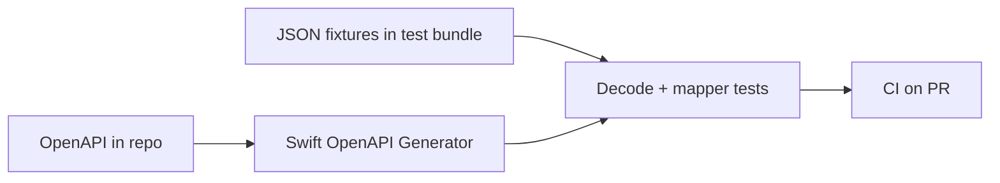

# Contract tests и OpenAPI

**Назначение:** клиент ↔ API контракт до продакшена — фикстуры, схема, codegen. Сеть в unit: [Testing-Network-Stub-RU](Testing-Network-Stub-RU.md). REST/gRPC выбор: [Networking README](../../../data-and-network/networking/README.md).

**Topic README:** [Testing](../README.md)

---

## TL;DR

**Contract test** проверяет, что **мобильный клиент** и **backend** согласованы: пути, статусы, форма JSON. Лёгкий уровень — **JSON fixtures** из примеров спеки + `Decodable` в integration. Сильнее — **OpenAPI** как source of truth + **Swift OpenAPI Generator** и тесты на декодинг/маппинг. Не заменяет unit домена и не требует реального HTTP на каждый commit.

---

## Зачем

| Без контракта | С контрактом |
|---------------|--------------|
| Backend переименовал поле → краш в prod | Красный CI на decode/mapper |
| Клиент шлёт устаревший path | Тест на собранный `URLRequest` или generated client |
| «Работает на staging» | Фикстуры из спеки = эталон |

Приоритет под дедлайн — после критического домена, **до** vanity UI ([Q37](../README.md)).

---

## Уровни зрелости



| Уровень | Что делаем | Скорость |
|---------|------------|----------|
| **1. Fixtures** | `user_ok.json`, `user_missing_field.json` в test target | Быстро |
| **2. Spec examples** | Примеры из `openapi.yaml` копируются/генерятся в fixtures | Средне |
| **3. Codegen** | Клиент и типы из OpenAPI; тесты на generated + thin wrapper | Выше порог входа |
| **4. Staging contract** | Прогон против mock/staging (Nightly, не PR) | Медленно |

**На собесе:** для iOS чаще достаточно **1 + 2**; codegen — когда API большой и стабильный.

---

## Fixture-based contract (минимум)

1. Backend публикует пример ответа (или fragment из OpenAPI `example`).
2. Файл в **test bundle**: `Fixtures/user_profile_200.json`.
3. Integration-тест: `JSONDecoder` + mapper → domain model.
4. Негатив: `user_401.json` → доменная `ProfileError.unauthorized`, не generic crash — **playground:** [user_401.json](../testing.playground/Resources/user_401.json) + [Contents.swift](../testing.playground/Contents.swift) (`runContract401Demo`).

```swift
struct APIErrorDTO: Decodable {
    let code: String
    let message: String
}

enum ProfileError: Error, Equatable {
    case unauthorized(message: String)
    case unexpectedStatus(Int)
}

struct UserDTO: Decodable {
    let id: String
    let displayName: String
}
```

Тест падает, если спека добавила обязательное поле, а клиент не обновлён.

---

## OpenAPI как source of truth

- **`openapi.yaml` в git** — ревью вместе с клиентом.
- CI: lint/validate spec (spectral, openapi-diff на PR backend).
- iOS: [Swift OpenAPI Generator](https://developer.apple.com/documentation/swift-openapi-generator) (WWDC23) — типы и клиент из спеки.

**Поток:**

```text
openapi.yaml  →  swift-openapi-generator  →  Generated Client + Types
                      ↓
              Thin APIClient (auth, retry, logging)
                      ↓
              Contract tests: fixtures + decode + mapping
```

**gRPC / Proto:** тот же принцип — `.proto` + codegen; см. [GRPC-Swift-WWDC26](../../../data-and-network/networking/notes/GRPC-Swift-WWDC26.md).

---

## Что проверять в contract-тесте

| Проверка | Unit / integration |
|----------|-------------------|
| Декодинг 2xx body | Integration + fixture |
| 4xx/5xx body → domain error | Integration |
| Обязательные поля / versioning | Fixture + optional OpenAPI diff |
| Реальный TLS, latency | Staging / Nightly only |
| Бизнес-правила (скидка, валидация) | Unit, не contract |

**Граница:** contract = **форма и контракт транспорта**; доменные инварианты — unit.

---

## Consumer vs provider (кратко)

- **Consumer-driven** (Pact-стиль): клиент описывает ожидания, backend верифицирует — реже на чистом iOS без platform team.
- **Provider spec + fixtures:** backend владеет OpenAPI; iOS тестирует против **зафиксированных** примеров — типичный мобильный вариант.

---

## CI

| Gate | Содержимое |
|------|------------|
| **PR** | Decode всех fixtures; unit mappers; `URLProtocol` на path/query ([Testing-Network-Stub-RU](Testing-Network-Stub-RU.md)) |
| **Nightly** | Опционально staging smoke; openapi-diff если backend repo linked |
| **Release** | Полный набор fixtures + критические endpoints |

Не гонять реальный backend на каждый push — флейки и секреты.

---

## Вопросы–ответы (собес)

**Q. Contract test vs unit?**  
**A.** Unit — логика без привязки к JSON backend. Contract — «этот JSON из API всё ещё парсится и маппится как ожидаем».

**Q. Зачем OpenAPI, если есть Postman?**  
**A.** Postman — ручной/коллекции; OpenAPI — машиночитаемая спека для codegen, diff и CI.

**Q. Backend сломал поле — кто упадёт первым?**  
**A.** Contract/integration в клиенте на PR, если fixture обновлён в том же PR что спека; иначе — процесс синхронизации spec → fixtures.

**Q. Contract vs E2E?**  
**A.** Contract — детерминированный JSON; E2E — весь стек + UI, медленно.

---

## Официально

- [Swift OpenAPI Generator](https://developer.apple.com/documentation/swift-openapi-generator)
- [WWDC23 — Meet Swift OpenAPI Generator](https://developer.apple.com/videos/play/wwdc2023/10171/)
- [URLProtocol](https://developer.apple.com/documentation/foundation/urlprotocol)

---

**Версия:** 1.0 · **Язык:** RU
