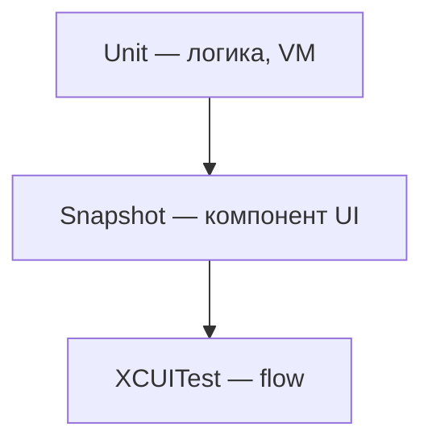

# Snapshot testing — дисциплина

**Назначение:** когда снапшоты уместны на iOS; граница с unit и UI. В Apple SDK нет first-class snapshot API — сторонние библиотеки + дисциплина эталонов.

**Topic README:** [Testing](../README.md)

---

## TL;DR

Snapshot сравнивает **эталон** (изображение или описание view) с текущим рендером. Уместен для **стабильных компонентов** при фиксированном device/OS. Не заменяет unit (логика) и не должен покрывать **весь экран** при живом дизайне.

---

## Когда да / когда нет

| Делать | Не делать (пока) |
|--------|------------------|
| Кнопка, ячейка, card — изолированный компонент | Full-screen при частых redesign |
| Design system / shared UI kit | Динамический контент (ads, avatars URL) |
| Фиксированный simulator + OS в CI | Разные OS без отдельного эталона |
| Обновление эталона через code review | Snapshot ради coverage % |

**Альтернатива визуалу:** для DTO/моделей — `Codable` + JSON fixture; для layout-контракта — unit на view model state.

---

## Дисциплина эталонов

1. **Один** reference device (например iPhone 16, iOS 18.2) в CI и локально.
2. Эталоны в git; обновление — отдельный PR «update snapshots».
3. Компонент, не весь flow — меньше шума при смене навбара.
4. Тёмная тема — отдельный эталон или явный trait в тесте.
5. Dynamic Type — отдельные эталоны для `.accessibility3` если критично (дорого — осознанно).

---

## Место в пирамиде

Snapshot **между** unit и UI: дороже unit, дешевле полного E2E по смыслу, но хрупче при смене пикселей.

---

## Сторонние библиотеки

Apple не поставляет snapshot testing в SDK. Команды выбирают OSS (например snapshot-библиотеки для UIView/SwiftUI) и **фиксируют политику** в README команды: что снимаем, где лежат эталоны, кто апрувит diff.

Не дублировать обзор библиотек здесь — меняется часто; важна **дисциплина**, не название пакета.

---

## Вопросы–ответы (собес)

**Q. Snapshot vs UI test?**  
**A.** Snapshot — пиксель/лейаут компонента; UI test — тапы, навигация, accessibility flow.

**Q. Почему snapshot флейкают?**  
**A.** Разный OS, шрифты, anti-aliasing, анимация не доиграла — фиксируй device, отключай анимации в тестовом режиме.

**Q. Когда без snapshot?**  
**A.** Часто меняющийся маркетинговый UI; достаточно unit на state.

---

## Связанное

- [XCUITest-Essentials-RU](XCUITest-Essentials-RU.md)
- [Testing-Fundamentals-RU](Testing-Fundamentals-RU.md) — пирамида
- [Testing README — Focus vs Defer](../README.md)

---

**Версия:** 1.0 · **Язык:** RU
