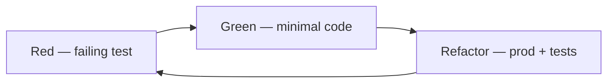

# TDD basics (without AI)

**Назначение:** red–green–refactor, triangulation, TDD vs test-after. Продолжение: [AI-assisted TDD](ai-assisted-tdd.md), [Testing-Fundamentals-RU](Testing-Fundamentals.md).

**Topic README:** [Testing](../README.md)

---

## TL;DR

_English summary — expand «По-русски» for full text (TL;DR)._

<details class="lang-ru">
<summary>По-русски</summary>

**TDD** — цикл: **красный** тест → **зелёный** минимальный код → **refactor**. Тест — спецификация. **Test-after** допустим под дедлайн, если приоритет — риск ([Q37](../README.md)). AI ускоряет цикл, но не снимает ответственность за triangulation — см. [AI-assisted TDD](ai-assisted-tdd.md).

---

</details>

## Red – green – refactor cycle

_English summary — expand «По-русски» for full text (Цикл red – green – refactor)._

<details class="lang-ru">
<summary>По-русски</summary>



| Фаза | Правило |
|------|---------|
| **Red** | Тест падает по **правильной** причине (не compile error случайно) |
| **Green** | Минимум кода, чтобы пройти; без «на будущее» |
| **Refactor** | Упростить prod и тесты; зелёный CI после каждого шага |

---

</details>

## Triangulation

_English summary — expand «По-русски» for full text (Triangulation)._

<details class="lang-ru">
<summary>По-русски</summary>

Три (или больше) **конкретных** примера уточняют обобщение:

1. `discount(100, 0) → 100`
2. `discount(100, 10) → 90`
3. `discount(100, 100) → 0`

После третьего — выносишь формулу. **Удаляй** частные тесты, если один параметризованный `@Test(arguments:)` их поглотил.

---

</details>

## TDD vs test-after

_English summary — expand «По-русски» for full text (TDD vs test-after)._

<details class="lang-ru">
<summary>По-русски</summary>

| | **TDD** | **Test-after** |
|---|---------|----------------|
| Когда | Новая логика, неясный контракт | Hotfix под дедлайн, прототип |
| Плюс | Дизайн через API теста | Быстрее «сначала фича» |
| Минус | Медленнее старт | Легко забыть edge cases |

**На собесе:** не «TDD всегда», а **риск-first** — критический путь с тестами, остальное по времени.

---

</details>

## What TDD does not solve

_English summary — expand «По-русски» for full text (Что TDD не решает)._

<details class="lang-ru">
<summary>По-русски</summary>

- UI pixel-perfect, полный E2E.
- LLM-ответы в продукте → [Evaluations](../../../ai-engineering/evaluations/README.md).
- Интеграция с прод API без stub.

---

</details>

## Mini example (Swift Testing)

_English summary — expand «По-русски» for full text (Мини-пример (Swift Testing))._

<details class="lang-ru">
<summary>По-русски</summary>

```swift
import Testing

func applyDiscount(price: Decimal, percent: Decimal) -> Decimal {
    price * (1 - percent / 100)
}

@Test
func discount_zeroPercent_unchanged() {
    #expect(applyDiscount(price: 100, percent: 0) == 100)
}

@Test
func discount_tenPercent() {
    #expect(applyDiscount(price: 100, percent: 10) == 90)
}
```

Red: функция не существует или возвращает 0. Green: формула. Refactor: guard `percent <= 100`, новый тест на ошибку.

---

</details>

## Interview Q&A

_English summary — expand «По-русски» for full text (Вопросы–ответы (собес))._

<details class="lang-ru">
<summary>По-русски</summary>

**Q. Зачем TDD если есть QA?**  
**A.** Автоматическая регрессия на каждый commit; QA — исследовательское и сценарии, не замена unit.

**Q. Triangulation?**  
**A.** Несколько примеров → обобщение; убрать дублирующие тесты после обобщения.

**Q. TDD с legacy без тестов?**  
**A.** Characterization test на текущее поведение → refactor → нормальные спеки.

---

</details>

## Read next


- [The Cycles of TDD](https://blog.cleancoder.com/uncle-bob/2014/12/17/TheCyclesOfTDD.html)
- [Transformation Priority Premise](https://blog.cleancoder.com/uncle-bob/2013/05/27/TheTransformationPriorityPremise.html) — в [AI-assisted TDD](ai-assisted-tdd.md)

---

**Версия:** 1.0 · **Язык:** RU
