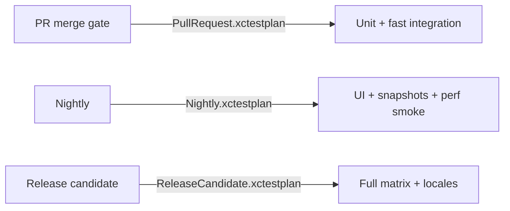

# Test Plans and CI

**Назначение:** как разделить PR / Nightly / Release в Xcode и `xcodebuild`. Детали pipeline: [CI/CD](../../../devops/ci-cd/README.md).

**Topic README:** [Testing](../README.md)

---

## TL;DR

_English summary — expand «По-русски» for full text (TL;DR)._

<details class="lang-ru">
<summary>По-русски</summary>

**Test Plan** (`.xctestplan`) версионирует **какие тесты** и **с какими env** гонять. PR — быстрый subset (<10 min); Nightly — UI + медленные; flaky — отдельный plan с политикой, не игнор красного CI.

---

</details>

## Typical split

_English summary — expand «По-русски» for full text (Типичное разделение)._

<details class="lang-ru">
<summary>По-русски</summary>



| Plan | Содержимое | Цель |
|------|------------|------|
| **PullRequest** | Unit, Swift Testing `.unit`, быстрый integration | < 10 min feedback |
| **Nightly** | XCUITest, snapshots, localization smoke | Глубина без блокировки каждого commit |
| **ReleaseCandidate** | Полный набор + diagnostics | Перед тегом / TestFlight |

---

</details>

## Setup in Xcode

_English summary — expand «По-русски» for full text (Настройка в Xcode)._

<details class="lang-ru">
<summary>По-русски</summary>

1. **Product → Test Plan → New Test Plan** — сохранить в репозитории.
2. Scheme → **Test** action → выбрать plan по умолчанию.
3. В plan: включить/выключить targets, test classes, configurations (язык, arguments).
4. Swift Testing: фильтр по **tags**; XCTest — по class/method.

**Shared scheme** обязателен — иначе CI не видит настройки разработчика.

---

</details>

## Command line

_English summary — expand «По-русски» for full text (Command line)._

<details class="lang-ru">
<summary>По-русски</summary>

```bash
xcodebuild test \
  -scheme MyApp \
  -destination 'platform=iOS Simulator,name=iPhone 16,OS=latest' \
  -testPlan PullRequest \
  -resultBundlePath TestResults.xcresult \
  -parallel-testing-enabled YES
```

- `-resultBundlePath` — `.xcresult` для разбора падений в Xcode.
- Фиксированный `OS=` — меньше «только в CI» флейков.

---

</details>

## Flaky tests in CI

_English summary — expand «По-русски» for full text (Flaky tests в CI)._

<details class="lang-ru">
<summary>По-русски</summary>

| Политика | Описание |
|----------|----------|
| **Quarantine plan** | Flaky в отдельный plan + retry limit; не в PR gate |
| **Fix or delete** | Flaky хуже отсутствия теста |
| **Не** | `@ignore` без тикета и срока |

Параллель: `-parallel-testing-enabled YES`; шардирование по классам на нескольких runner — см. [CI/CD Q2](../../../devops/ci-cd/README.md).

---

</details>

## Link to Swift Testing tags

_English summary — expand «По-русски» for full text (Связь с тегами Swift Testing)._

<details class="lang-ru">
<summary>По-русски</summary>

```swift
@Test(.tags(.unit))
func validatesEmail() { }

@Test(.tags(.integration))
func decodesUserFixture() { }

@Test(.tags(.ui))
func opensProfile() { }
```

Test Plan или CI script выбирает subset по тегам (через фильтры Xcode / будущие CLI flags).

---

</details>

## Interview Q&A

_English summary — expand «По-русски» for full text (Вопросы–ответы (собес))._

<details class="lang-ru">
<summary>По-русски</summary>

**Q. Зачем Test Plan в git?**  
**A.** Одинаковый набор тестов локально и в CI; изменение набора — code review.

**Q. Как ускорить PR?**  
**A.** Subset plan, parallel, без UI на каждый commit, stub I/O.

**Q. Падение только в CI?**  
**A.** Скачать `.xcresult`, сравнить OS/locale/env с локальным `-destination` и тем же plan.

---

</details>

## Official docs


- [Organizing tests to improve feedback](https://developer.apple.com/documentation/xcode/organizing-tests-to-improve-feedback)
- [Running tests from the command line](https://developer.apple.com/documentation/xcode/running-tests-from-the-command-line)

---

**Версия:** 1.0 · **Язык:** RU
