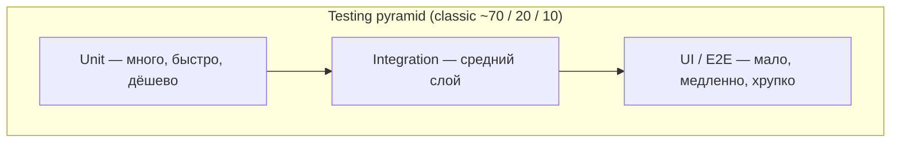

# Основы тестирования (интервью)

**Назначение:** фундамент до senior-практик — зачем тесты, пирамида, FIRST, AAA, test doubles. Продолжение: [Senior-Unit-Testing-Mastery-RU](Senior-Unit-Testing-Mastery-RU.md).

**Topic README:** [Testing](../README.md)

---

## TL;DR

Тесты нужны не чтобы «убедиться, что код работает» (это делает ручной прогон), а для **regression safety** — изменения не ломают то, что уже работало — и как **живая спецификация** для новых разработчиков. Большинство проверок — быстрые **unit** (изоляция, моки); меньше **integration**; минимум **UI/E2E**. Хороший тест — **FIRST**; структура — **AAA**; зависимости — **test doubles** по роли (на собесе чаще всего **Stub vs Mock**).

---

## Зачем вообще нужны тесты

Главная идея не в том, чтобы «проверить что код работает». Ты и так можешь запустить приложение и потыкать.

| Смысл | Что даёт |
|-------|----------|
| **Regression safety** | Изменения не ломают то, что уже работало |
| **Документация** | Хороший тест читается как спецификация: «когда пользователь добавляет товар в корзину — счётчик увеличивается на 1» |

Новый разработчик читает тесты и понимает, как должна работать система — без археологии в прод-коде.

---

## Пирамида тестирования

Три уровня; у каждого своя цена и цель:



| Уровень | Что тестирует | Скорость | Доля (ориентир) |
|---------|---------------|----------|-----------------|
| **Unit** | Одна единица (функция, класс) в полной изоляции | Миллисекунды | ~70% |
| **Integration** | Несколько компонентов вместе (VM + сеть до stub, декодер + JSON) | Медленнее | ~20% |
| **UI / E2E** | Реальное приложение, тапы пользователя (XCUITest) | Очень медленно | ~10% |

**На интервью:** почему не делать всё UI-тестами?

- Медленно — фидбек в CI минутами, не секундами.
- Дорого в поддержке — ломаются от смены вёрстки, локализации, таймингов.
- Сложно локализовать причину — падение далеко от бизнес-правила.

Unit даёт быстрый, точный сигнал; UI — страховка на критических потоках.

---

## FIRST

Хорошие тесты обязаны быть:

| Буква | Принцип | Практика |
|-------|---------|----------|
| **F** — Fast | Миллисекунды | Сеть и диск в unit — уже не unit |
| **I** — Isolated | Независимы друг от друга | Общее состояние между тестами — бомба замедленного действия |
| **R** — Repeatable | 100 прогонов → один результат | **Flaky** хуже отсутствия теста — CI перестают доверять |
| **S** — Self-validating | Pass/fail без ручного разбора логов | Нет «посмотри в консоль и скажи, ок ли» |
| **T** — Timely | Пишутся вместе с кодом | Не «через полгода, когда забудем контракт» |

Связь с репозиторием: детерминизм async, флейки — [Testing README](../README.md) (Key terms, event-stream TL;DR).

---

## AAA (Arrange – Act – Assert)

Каждый тест — три части:

1. **Arrange** — подготовка: объекты, начальное состояние, данные.
2. **Act** — одно действие: один вызов или одна операция под тестом.
3. **Assert** — результат соответствует ожиданиям.

**Правило:** два вызова в Act — скорее всего два теста. Один тест = одна причина упасть.

Альтернативное имя той же структуры: **Given – When – Then** (BDD).

```swift
func test_addItem_incrementsCartCount() {
  let sut = CartViewModel(cart: CartSpy())
  let item = Item(id: "1", name: "Book")

  sut.add(item)

  XCTAssertEqual(sut.itemCount, 1)
}
```

---

## Test doubles — самое важное для интервью

Общее имя — **test double** (подмена зависимости). Роли часто путают даже опытные разработчики.

| Тип | Роль | Проверяешь |
|-----|------|------------|
| **Dummy** | Передаётся, но **никогда не используется** — заполнить параметр | Ничего |
| **Stub** | Возвращает **заготовленные данные** | Результат SUT, не то *как* вызвали stub |
| **Mock** | **Верификация поведения**: вызов, аргументы, количество раз | Взаимодействие с зависимостью |
| **Spy** | Реальный или полуреальный объект + **запись вызовов** (счётчики) | В Swift чаще вручную, чем библиотека |
| **Fake** | **Рабочая упрощённая** реализация (in-memory DB вместо SQLite) | Поведение + иногда вызовы |

**Собес — главное:** **Stub = данные**, **Mock = поведение** (был ли вызов, с чем, сколько раз).

В iOS-командах слово «mock» иногда смешивают со Spy/Stub — на интервью уточняй определение из таблицы выше.

### Мини-примеры (Swift)

**Stub** — только ответ:

```swift
struct UserServiceStub: UserService {
    var userToReturn: User

    func fetchUser(id: String) async throws -> User {
        userToReturn
    }
}
```

**Spy** — запись вызовов (типичный Swift-паттерн вместо тяжёлого mock-фреймворка):

```swift
final class AnalyticsSpy: Analytics {
    private(set) var loggedEvents: [String] = []

    func log(_ event: String) {
        loggedEvents.append(event)
    }
}
```

**Fake** — упрощённая, но настоящая логика:

```swift
final class InMemoryCartStore: CartStore {
    private var items: [Item] = []

    func save(_ item: Item) { items.append(item) }
    func allItems() -> [Item] { items }
}
```

---

## Вопросы–ответы (собес)

**Q. Зачем тесты, если можно запустить приложение?**  
**A.** Ручной прогон не масштабируется и не ловит регрессии при каждом изменении. Тесты — regression safety + спецификация поведения.

**Q. Соотношение unit / integration / UI?**  
**A.** Классика ~70 / 20 / 10. Больше быстрых изолированных; UI — только критические потоки.

**Q. Чем Stub отличается от Mock?**  
**A.** Stub подставляет **данные** и не проверяет вызовы. Mock (или Spy в Swift) проверяет **поведение** — что, с какими аргументами, сколько раз.

**Q. Что такое flaky test и почему это плохо?**  
**A.** Иногда падает без смены кода. Команда игнорирует красный CI — хуже, чем нет теста.

**Q. Сколько действий в Act?**  
**A.** Одно. Иначе неясно, что именно сломалось.

---

## Что читать дальше

- [XCTest](https://developer.apple.com/documentation/xctest)
- [Swift Testing](https://developer.apple.com/documentation/testing)
- [Test Plans и CI](Test-Plans-CI-RU.md) — PR vs Nightly (детали pipeline: [CI/CD](../../../devops/ci-cd/README.md))
- В репозитории: [Senior-Unit-Testing-Mastery-RU](Senior-Unit-Testing-Mastery-RU.md) · [Swift-Testing-vs-XCTest-RU](Swift-Testing-vs-XCTest-RU.md) · [TDD-Basics-RU](TDD-Basics-RU.md) · [AI-assisted TDD](ai-assisted-tdd.md)

---

**Версия:** 1.0 · **Язык:** RU · **Уровень:** fundamentals → senior note
