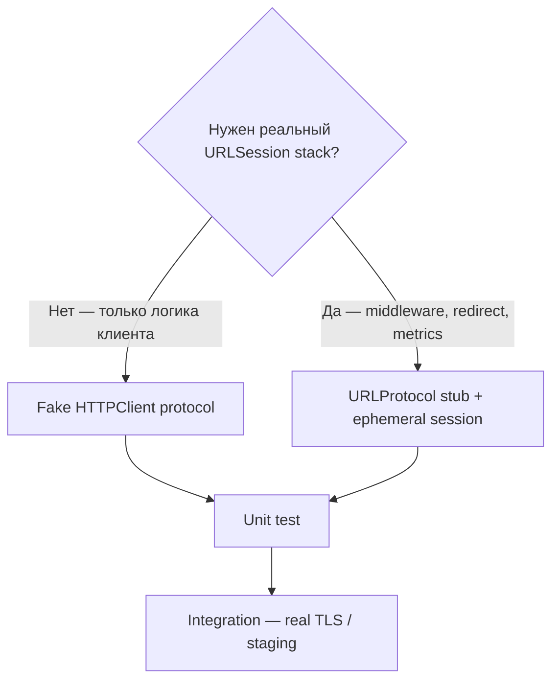

# Network unit tests without HTTP

**Назначение:** шлюз из темы Testing в networking — fake client vs `URLProtocol`. Полная Q-карточка: [Networking Q (H30)](../../../data-and-network/networking/README.md).

**Topic README:** [Testing](../README.md)

---

## TL;DR

_English summary — expand «По-русски» for full text (TL;DR)._

<details class="lang-ru">
<summary>По-русски</summary>

В **unit** не ходим в интернет. Два пути: **fake `HTTPClient`** (быстрее, чище) или **`URLProtocol`** в `protocolClasses` (прогоняет реальный `URLSession`). Не трогать `URLSession.shared`. Проверяем запрос, статус, декодинг, ошибки, retry, отмену.

---

</details>

## Choosing an approach

_English summary — expand «По-русски» for full text (Выбор подхода)._

<details class="lang-ru">
<summary>По-русски</summary>



| Подход | Плюсы | Минусы |
|--------|-------|--------|
| **Fake client** | Быстро, нет глобального состояния | Не ловит баги в URLSession-обвязке |
| **URLProtocol** | Реальный путь `data(for:)` | Больше кода stub protocol |

---

</details>

## Fake client (preferred)

_English summary — expand «По-русски» for full text (Fake client (предпочтительно))._

<details class="lang-ru">
<summary>По-русски</summary>

```swift
protocol HTTPClient {
    func data(for request: URLRequest) async throws -> (Data, URLResponse)
}

struct HTTPClientStub: HTTPClient {
    var result: Result<(Data, URLResponse), Error>

    func data(for request: URLRequest) async throws -> (Data, URLResponse) {
        try result.get()
    }
}
```

SUT получает `any HTTPClient` в `init` — тест подставляет stub.

---

</details>

## URLProtocol stub (brief)

_English summary — expand «По-русски» for full text (URLProtocol stub (кратко))._

<details class="lang-ru">
<summary>По-русски</summary>

1. Подкласс `URLProtocol`: в `canInit(with:)` — свой URL scheme или host prefix.
2. В `startLoading()` — отдать `HTTPURLResponse` + `Data` клиенту.
3. `URLSessionConfiguration.ephemeral.protocolClasses = [StubProtocol.self]` — **своя** сессия на тест.
4. `tearDown`: `URLProtocol.unregisterClass` если использовали `registerClass`.

**Не делать:** подмена `URLSession.shared` — гонки между параллельными тестами.

---

</details>

## JSON fixtures


Integration-friendly паттерн для mapper + decoder:

```swift
func loadFixture<T: Decodable>(_ name: String, as type: T.Type) throws -> T {
    let url = Bundle(for: BundleToken.self).url(forResource: name, withExtension: "json")!
    let data = try Data(contentsOf: url)
    return try JSONDecoder().decode(T.self, from: data)
}

private final class BundleToken {}
```

Файл `user_ok.json` в test bundle — unit/integration без сети.

---

## What to check in unit tests

_English summary — expand «По-русски» for full text (Что проверять в unit)._

<details class="lang-ru">
<summary>По-русски</summary>

- Сборка `URLRequest` (method, path, headers, body).
- 2xx + `Decodable`.
- 4xx/5xx → доменная ошибка.
- `URLError` + политика retry.
- Отмена `Task` / не вызывать retry на 401.

**Не unit:** реальный TLS, pinning end-to-end, latency.

---

</details>

## Interview Q&A

_English summary — expand «По-русски» for full text (Вопросы–ответы (собес))._

<details class="lang-ru">
<summary>По-русски</summary>

**Q. Fake vs URLProtocol?**  
**A.** Fake — для логики поверх абстракции; URLProtocol — когда тестируешь код, жёстко завязанный на `URLSession`.

**Q. Почему не реальная сеть в CI?**  
**A.** Флейки, таймауты, внешние простои — ломает FIRST.

---

</details>

## Next


- [Contract-Tests-OpenAPI-RU](Contract-Tests-OpenAPI.md) — фикстуры из спеки, OpenAPI codegen
- [Networking README — Q H30](../../../data-and-network/networking/README.md)
- [URLSession lifecycle note](../../../data-and-network/networking/notes/URLSession-Lifecycle-iOS-IQ.md)
- [URLProtocol](https://developer.apple.com/documentation/foundation/urlprotocol)
- **Playground:** [URLProtocol demo](../testing.playground/Contents.swift)

---

**Версия:** 1.0 · **Язык:** RU
