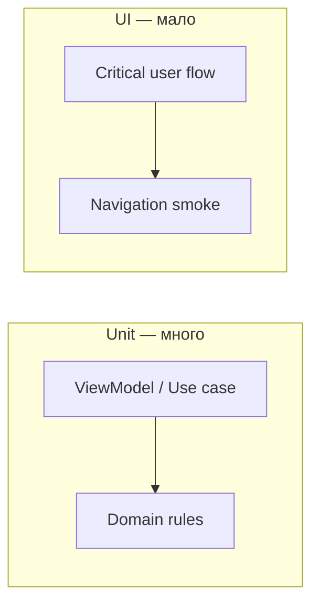

# XCUITest — essentials

**Назначение:** стабильные UI-тесты на критических потоках; граница с unit. Фундамент: [Testing-Fundamentals-RU](Testing-Fundamentals-RU.md).

**Topic README:** [Testing](../README.md)

---

## TL;DR

XCUITest — **black-box** через **accessibility tree**: запускает приложение, ищет элементы, симулирует тапы. Медленно и хрупко — **мало**, только критические потоки. Стабильность: `accessibilityIdentifier`, launch arguments, изоляция данных, `waitForExistence` вместо `sleep`.

---

## Что тестировать в UI vs unit

| UI (XCUITest) | Unit (VM / domain) |
|---------------|-------------------|
| Навигация A → B → C | Бизнес-правила, маппинг |
| Кнопка видна и тапабельна | Счётчик корзины после `add` |
| Deeplink открывает экран | Retry policy, валидация |
| Критический happy path оплаты | Ошибки API → состояние UI-модели |

**Правило:** если можно проверить без запуска UIKit/SwiftUI дерева — **unit**.



---

## Стабильные селекторы

| Способ | Когда |
|--------|--------|
| **`accessibilityIdentifier`** | Предпочтительно для тестов; не меняется при локализации |
| `accessibilityLabel` | Только если стабилен и осознан |
| Текст на экране | Хрупко: локализация, копирайт |

```swift
Button("Add") { }
    .accessibilityIdentifier("cart.addButton")
```

```swift
app.buttons["cart.addButton"].tap()
```

---

## Launch arguments и тестовый режим

Передача из UI-теста:

```swift
let app = XCUIApplication()
app.launchArguments += ["-UITesting", "YES"]
app.launchEnvironment["API_BASE_URL"] = "stub"
app.launch()
```

В `App` / `AppDelegate` — ветка: mock auth, in-memory store, отключить анимации.

**Зачем:** один билд, детерминированные данные, без прод-сервера.

---

## Ожидания без sleep

```swift
let button = app.buttons["cart.addButton"]
XCTAssertTrue(button.waitForExistence(timeout: 5))
button.tap()
```

- `waitForExistence` — элемент появился в дереве.
- `waitForNonExistence` — спиннер ушёл.
- **`sleep` в UI-тестах — антипаттерн** (флейки на медленном CI).

---

## Изоляция между тестами

- Каждый тест **не** рассчитывает на состояние предыдущего.
- `setUp`: `app.launch()` с чистыми args; сброс UserDefaults/Keychain в тестовом режиме.
- Не делить один логин между тестами без явного `tearDown`.

---

## Типичные антипаттерны

| Плохо | Лучше |
|-------|--------|
| Полный regression всего приложения в UI | Test Plan: 3–5 критических flow |
| Проверка пикселей | Snapshot отдельно или unit состояния |
| Зависимость от сети | Stub API / launch env |
| Хрупкий label «Оформить заказ» | `accessibilityIdentifier` |

---

## Вопросы–ответы (собес)

**Q. Почему не всё покрыть UI?**  
**A.** Медленно, дорого в поддержке, сложно локализовать падение. Пирамида — см. [Testing-Fundamentals-RU](Testing-Fundamentals-RU.md).

**Q. Как ускорить UI в CI?**  
**A.** Отдельный Nightly Test Plan; параллельные симуляторы; минимум тестов; stub backend.

**Q. UI test vs snapshot?**  
**A.** UI — поведение и навигация; snapshot — визуальный регресс компонента ([Snapshot-Testing-Discipline-RU](Snapshot-Testing-Discipline-RU.md)).

---

## Официально

- [UI Testing (XCUITest)](https://developer.apple.com/documentation/xcuiautomation)
- [Adding UI tests to your project](https://developer.apple.com/documentation/xcode/adding-ui-tests-to-your-project)

---

**Версия:** 1.0 · **Язык:** RU
