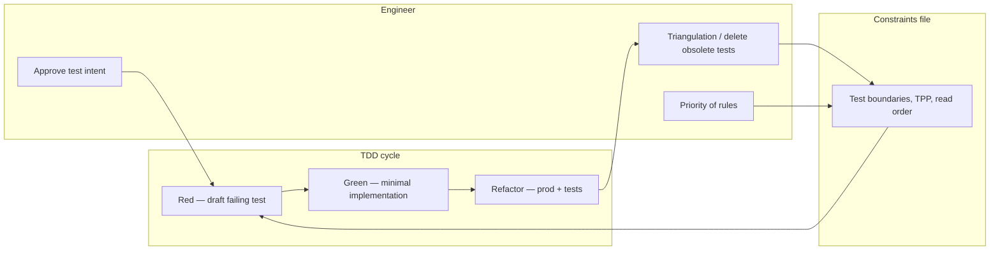

# AI-assisted TDD (Swift / iOS)

- **Sources:** *AI Driven Swift Architecture*; iOS unit testing practice (Jon Reid / Quality Coding lineage); [The Transformation Priority Premise](https://blog.cleancoder.com/uncle-bob/2013/05/27/TheTransformationPriorityPremise.html) — Robert C. Martin
- **Topic README:** [Testing](../README.md)
- **Related:** [TDD-Basics-RU](TDD-Basics.md) · [Evaluations](../../../ai-engineering/evaluations/README.md) — golden sets for **LLM features in the product**, not a substitute for unit tests on generated Swift code

---

## TL;DR

_English summary — expand «По-русски» for full text (TL;DR)._

<details class="lang-ru">
<summary>По-русски</summary>

Жизнь с AI не отменяет TDD — она меняет, **кто пишет** red/green и **кто владеет** refactor.

LLM хорошо генерирует читаемый код под «конвенциональные best practices», но плохо чувствует продвинутые TDD-эвристики: устаревший тест после триангуляции, когда более общий тест поглощает частные, когда refactor тестов нужен вместе с прод-кодом.

**Автотесты** — главный детерминированный фильтр для сгенерированного Swift. **Constraints-файл** (`CLAUDE.md`, `AGENTS.md`, `.cursor/rules`) — не документация, а правила TDD: TPP, границы unit, порядок чтения секций перед генерацией. Инженер апрувит тесты до применения, задаёт приоритет инструкций и держит качество сценариев выше их количества.

---

</details>

## LLM и TDD: разные оптимизации

_English summary — expand «По-русски» for full text (LLM и TDD: разные оптимизации)._

<details class="lang-ru">
<summary>По-русски</summary>

| LLM по умолчанию | TDD-дициплина (человек) |
|------------------|-------------------------|
| Корректность, читаемость, idiomatic Swift | Когда тест устарел и его удалить |
| Локальный green без «застревания» | Triangulation: входы уточняют поведение |
| «Добавить ещё тест» | Когда общий тест заменяет три частных |
| Рефактор по запросу «отрефактори» | Refactor с привязкой к теории (TPP), не к вкусу |

В хороших проектах AI **усиливает** плюсы дисциплины (быстрый red/green, шаблоны doubles). В плохих — **усиливает** минусы (много бессмысленных тестов, хрупкие снапшоты, «замороженная» архитектура в тестах).



---

</details>

## Constraints-файл: правила, не документация

_English summary — expand «По-русски» for full text (Constraints-файл: правила, не документация)._

<details class="lang-ru">
<summary>По-русски</summary>

`CLAUDE.md` / `AGENTS.md` / project rules — **контракт для ассистента**, не wiki проекта.

| Секция | Содержание |
|--------|------------|
| **Test scope** | Что unit, что integration; запрет на `sleep`, реальную сеть без stub |
| **Doubles** | Именование Spy/Stub/Fake; узкие протоколы |
| **TPP** | Предпочитать простые transformations; ссылка на ordered list |
| **Read order** | «Перед генерацией теста — прочитай секцию TPP» |
| **Refactor tests** | Тесты эволюционируют с архитектурой; не цементировать |
| **Show before apply** | Для нетривиальных изменений — diff до записи в файлы |

Пример фрагмента (English — как в реальном constraints-файле):

```markdown

</details>

## TDD with AI


Before writing or changing a test, read ## Transformation Priority Premise.

Unit tests: one behavior per test; inject dependencies via protocols.
Do not add tests only to raise coverage.

When refactoring tests: state the smell, cite TPP or triangulation, propose diff before applying.

Obsolete after triangulation: delete or merge into a more general test — do not keep as historical artifact.
```

---

## Transformation Priority Premise (TPP)

_English summary — expand «По-русски» for full text (Transformation Priority Premise (TPP))._

<details class="lang-ru">
<summary>По-русски</summary>

TPP ([Uncle Bob, 2013](https://blog.cleancoder.com/uncle-bob/2013/05/27/TheTransformationPriorityPremise.html)) упорядочивает **поведенческие** изменения в green-фазе: от простых (constant → variable) к сложным (if, loop, recursion). Связь с Kent Beck: fine-grained red–green–refactor и «make it work → right → fast»; TPP формализует **какой** минимальный шаг предпочтителен.

Для AI-assisted TDD TPP в constraints даёт ассистенту **явный критерий**, а не «сделай красиво». Человек решает, когда тест требует слишком тяжёлой transformation и пора сменить сценарий или удалить устаревший тест.

Краткий приоритет (верх — проще):

1. nil → constant  
2. constant → variable / argument  
3. unconditional → `if`  
4. scalar → collection  
5. `if` → loop / recursion  
6. expression → extracted function  

---

</details>

## Практики

_English summary — expand «По-русски» for full text (Практики)._

<details class="lang-ru">
<summary>По-русски</summary>

### Контракт и контроль

| # | Правило | Действие |
|---|---------|----------|
| 5 | Понимай, что тестируешь | Ревью теста как прод-кода: SUT, граница, один сценарий |
| 6 | Качество важнее количества | Цель — поведение и регрессии, не coverage % |
| 8 | Triangulation | Уточняй входы; осознанно удаляй или обобщай тесты |

**Triangulation:** несколько примеров с разными входами сужают допустимую реализацию. После обобщения прод-кода частный тест может стать шумом — его **убирают**, а не хранят «на память».

### Эволюция, не цемент

| # | Правило | Действие |
|---|---------|----------|
| 4 | Тесты не артефакты | При смене архитектуры меняй или удаляй тесты; не блокируй refactor |
| 3 | Рефакторить тесты осмысленно | Промпт: проблема → теория → учебная цель → рамка → diff до apply |

### Инструкции для ассистента

| # | Правило | Действие |
|---|---------|----------|
| 1 | Constraints ≠ documentation | Только actionable rules и порядок работы |
| 2 | TPP в constraints | Отдельная секция; читать перед green/refactor |
| 7 | Приоритет правил | Разработчик решает: system vs project vs user message |

Claude и аналоги **исполняют чёткие инструкции**; качество цикла определяется тем, **какие** инструкции вы закрепили и что стоит выше.

---

</details>

## Шаблон промпта: refactor тестов

_English summary — expand «По-русски» for full text (Шаблон промпта: refactor тестов)._

<details class="lang-ru">
<summary>По-русски</summary>

```
Problem: Two tests assert the same policy with different literals; after triangulation
the specific cases are covered by `test_retryPolicy_exhaustsAfterMaxAttempts`.

Theory: TPP — prefer deleting redundant specific tests when a general test holds (triangulation complete).

Learning goal: Keep one behavior per test; reader should see retry count + final error in one place.

Scope: Only RetryPolicyTests.swift and RetryPolicy.swift — no networking layer.

Show the proposed test deletions and merged test body before applying any file changes.
```

Плохой промпт: «отрефактори тесты» — нет критерия успеха.  
Хороший: smell + теория + граница + **show before apply**.

---

</details>

## Чем это не является

_English summary — expand «По-русски» for full text (Чем это не является)._

<details class="lang-ru">
<summary>По-русски</summary>

| Тема | Где в базе |
|------|------------|
| Eval LLM-ответов в приложении | [Evaluations](../../../ai-engineering/evaluations/README.md) |
| Пирамида, doubles, flaky tests | [Testing README](../README.md), [Senior unit testing](Senior-Unit-Testing-Mastery.md) |
| TDD vs test-after под дедлайн | Q37 в [Testing README](../README.md) |
| «100% coverage с AI» | Анти-паттерн; риск > метрика |

---

</details>

## Interview Q&A

_English summary — expand «По-русски» for full text (Interview Q&A)._

<details class="lang-ru">
<summary>По-русски</summary>

**Q (RU):** Как валидировать код, сгенерированный LLM в iOS-проекте?  
**A (RU):** Детерминированные **unit/integration** тесты на поведение и регрессии; **ревью человеком** до merge; constraints-файл с правилами TDD. Для **on-device LLM-фич** продукта — отдельно golden **evals**, не вместо unit-тестов домена.

**Q (EN):** How do you validate LLM-generated Swift?  
**A (EN):** Deterministic unit/integration tests, human review, and explicit TDD rules in project constraints. Product LLM features need eval suites separately.

**Follow-up:** Кто решает, что тест устарел?  
**Follow-up answer:** Инженер — по triangulation и смене архитектуры; LLM не заменяет это решение.

---

</details>

## External links


- [The Transformation Priority Premise](https://blog.cleancoder.com/uncle-bob/2013/05/27/TheTransformationPriorityPremise.html) — Robert C. Martin
- [The Cycles of TDD](https://blog.cleancoder.com/uncle-bob/2014/12/17/TheCyclesOfTDD.html) — red/green/refactor, getting stuck
- [Wikipedia — Transformation Priority Premise](https://en.wikipedia.org/wiki/Transformation_Priority_Premise)
- [Quality Coding](https://qualitycoding.org/) — iOS unit testing discipline (Jon Reid)
