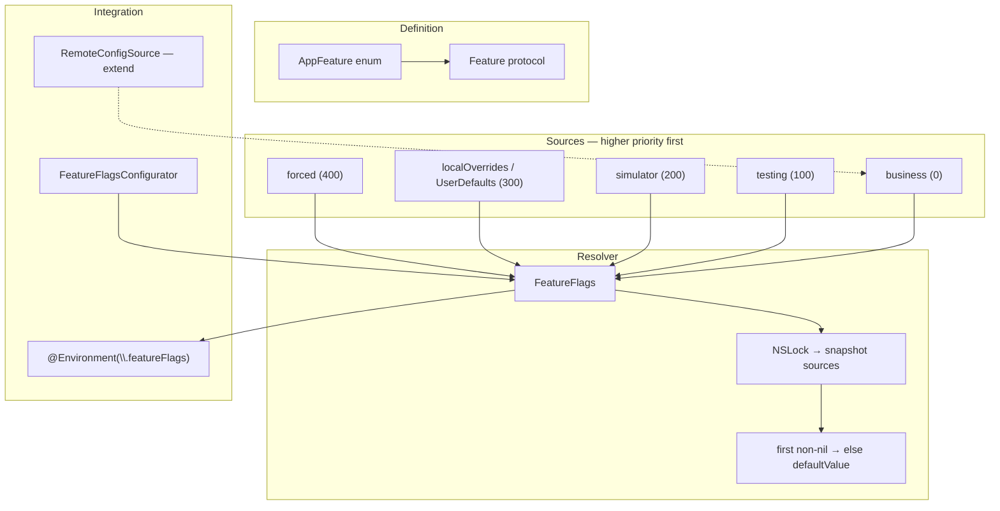

# Type-safe feature flag resolver (Swift)

- **Source:** [A Feature Flags System in Swift](https://livsycode.com/best-practices/a-feature-flags-system-in-swift/) — Livsy Code
- **Package:** [FeatureFlagsKit](https://github.com/Livsy90/FeatureFlagsKit)
- **Playground:** [feature_flags_resolver.playground](../feature_flags_resolver.playground/Contents.swift) — runnable resolver, sources, configurator
- **Topic README:** [Feature Flags](../README.md)

---

## TL;DR

Централизованный **type-safe** resolver: флаги — `String`-backed enum + `Feature` protocol; значения приходят из **источников с приоритетом**; первый non-`nil` побеждает, иначе `defaultValue`. `FeatureFlags` делает **snapshot** источников под `NSLock` и читает без lock — безопасно из UI. Non-production добавляет testing / simulator / `UserDefaults` overrides; production — только business (remote / bundled). Remote config подключается как ещё один `FeatureFlagSource`, не переписывая resolver.

---

## Архитектура



**Слои (separation of concerns):**

| Layer | Responsibility |
|-------|----------------|
| **Definition** | Какие флаги существуют, safe defaults |
| **Source** | Откуда пришло значение (CDN, QA toggle, test) |
| **Resolver** | Детерминированный merge по priority |
| **Composition** | Какие sources в prod vs debug |

---

## 1. Определение флагов

Строковые ключи живут **один раз** — в enum. Компилятор ловит typo и мёртвые case при cleanup.

```swift
public protocol Feature: Sendable {
    var key: String { get }
    var description: String { get }
    var defaultValue: Bool { get }
}

public extension Feature where Self: RawRepresentable, RawValue == String {
    var key: String { rawValue }
    var description: String { rawValue }
}

enum AppFeature: String, Feature {
    case newCheckout
    case debugMenu

    var defaultValue: Bool {
        switch self {
        case .newCheckout: false
        case .debugMenu: false
        }
    }
}
```

`defaultValue` — **safe fallback** когда ни один source не знает ключ (offline, новый флаг в коде, старый кэш).

---

## 2. Источники и приоритеты

```swift
public protocol FeatureFlagSource: Sendable {
    var priority: FeatureFlagPriority { get }
    func value(forKey key: String) -> Bool?
}

public enum FeatureFlagPriority: Int, Comparable {
    case business = 0
    case testing = 100
    case simulator = 200
    case localOverrides = 300
    case forced = 400
}
```

| Priority | Typical source | Use |
|----------|----------------|-----|
| `business` | Remote config, bundled JSON | Rollout %, kill switch from server |
| `testing` | Internal / TestFlight plist | QA defaults |
| `simulator` | `#if targetEnvironment(simulator)` | Dev-only behavior |
| `localOverrides` | `UserDefaults` | In-app toggle screen |
| `forced` | Emergency local off | Last-resort without network |

**Контракт:** `nil` = «не знаю» → resolver идёт дальше. Это отличается от «явно false».

---

## 3. Resolver и thread safety

```swift
public final class FeatureFlags {
    private let lock = NSLock()
    private var sources: [any FeatureFlagSource]

    public func isEnabled<FeatureType: Feature>(_ feature: FeatureType) -> Bool {
        let snapshot = snapshotSources()
        for source in snapshot {
            if let value = source.value(forKey: feature.key) {
                return value
            }
        }
        return feature.defaultValue
    }
}
```

**Почему snapshot:** UI читает флаги синхронно на main; короткий lock + копия массива sources избегает гонок при hot reload sources. Альтернатива — `actor`, но тогда каждый read `await` (лишняя сложность для boolean gate).

Полная реализация + `DictionaryFeatureFlagSource`, `PersistentOverrideFeatureFlagSource`, result builder — в [playground](../feature_flags_resolver.playground/Contents.swift).

---

## 4. DSL для конфигурации

```swift
@resultBuilder
public enum FeatureFlagBuilder { ... }

let config = FlagConfiguration<AppFeature> {
    enable(AppFeature.newCheckout)
    if isInternalBuild {
        enable(AppFeature.debugMenu)
    }
}
```

Удобно для unit tests и compile-time конфигов; remote values мапятся в `DictionaryFeatureFlagSource(states:priority:.business)`.

---

## 5. Environment composition

```swift
let flags = FeatureFlagsConfigurator(
    environment: .nonProduction,
    localOverridesSource: PersistentOverrideFeatureFlagSource(),
    businessConfiguration: businessConfig,
    testingConfiguration: testingConfig
).makeFeatureFlags()
```

| Environment | Sources |
|-------------|---------|
| **production** | `business` only |
| **nonProduction** | business + testing + (simulator) + localOverrides + forced |

Debug menu не попадает в prod, если composition централизован — не разбросанные `#if DEBUG` вокруг каждого `if`.

---

## 6. SwiftUI

```swift
struct ContentView: View {
    @Environment(\.featureFlags) private var featureFlags

    var body: some View {
        if featureFlags.isEnabled(AppFeature.newCheckout) {
            NewCheckoutView()
        } else {
            LegacyCheckoutView()
        }
    }
}
```

Injection на корне `App` / `Scene`: `.featureFlags(resolver)`. В [FeatureFlagsKit](https://github.com/Livsy90/FeatureFlagsKit) это уже в пакете; в playground — только resolver (без SwiftUI, чтобы гонять везде).

**QA toggle screen:** `Binding` get → `flags.isEnabled`, set → `overrideSource.setOverride(_:for:)`. Группировка technical vs business flags — только UI.

---

## 7. Remote config как source

README топика описывает rollout и kill switch на уровне продукта. Этот resolver — **клиентский слой чтения**:

```swift
final class RemoteConfigFeatureFlagSource: FeatureFlagSource {
    let priority: FeatureFlagPriority = .business
    private let snapshot: [String: Bool]

    init(snapshot: [String: Bool]) {
        self.snapshot = snapshot
    }

    func value(forKey key: String) -> Bool? {
        snapshot[key]
    }
}
```

Fetch + cache + etag — отдельный сервис; после fetch пересобираете `FeatureFlags(sources:)` или обновляете dictionary внутри source. **Paid / auth gates** — по-прежнему server-side (см. Q4 в topic README).

---

## Interview Q&A

### Q1: Зачем enum, если remote config отдаёт строки?

**RU:** Enum — **контракт в коде**: список флагов, defaults, рефакторинг. Remote mapится `key → Bool` один раз при fetch. Без enum ключи размазываются строками — flag spaghetti.

**EN:** The enum is the in-code contract; remote config maps string keys once at fetch time. Without it, keys scatter as string literals.

### Q2: Почему приоритеты, а не «последний write wins»?

**RU:** Предсказуемость: QA override (300) перебивает business (0), но не перебивает forced (400). Порядок merge **явный**, не зависит от порядка регистрации в массиве.

**EN:** Explicit precedence makes QA and emergency overrides predictable; merge order does not depend on registration order alone.

### Q3: NSLock vs actor для `FeatureFlags`?

**RU:** Hot path — синхронный `Bool` из UI. Snapshot под lock — микросекунды. Actor добавляет `await` на каждый read; оправдан, если resolver сам ходит в сеть (лучше не делать).

**EN:** Synchronous reads suit UI gating; actors add async overhead unless the resolver itself performs I/O (which it should not).

### Q4: Как тестировать?

**RU:** `DictionaryFeatureFlagSource(states:priority:)` в тестах — вкл/выкл без `UserDefaults`. Проверять цепочку: business off + testing on → on; override on top.

**EN:** Inject in-memory dictionary sources in tests; assert precedence chains without touching UserDefaults.

---

## Связь с базой

- [Feature Flags README](../README.md) — rollout, kill switch, client vs server
- [Analytics & Remote Config](/system-design/analytics/)
- [Scaling teams — trunk + flags](/system-design/scaling-teams/)
- Playground: [feature_flags_resolver.playground](../feature_flags_resolver.playground/Contents.swift)
